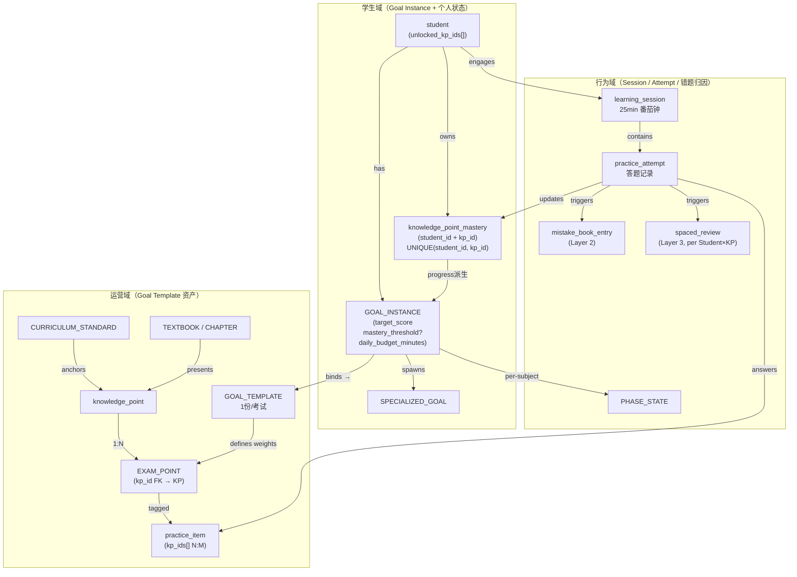

# 智能学习助手 PRD — §0 文档说明 / §1 产品定位与原则 / §2 顶层架构

---

## §0 文档说明

### §0.1 目的

本文档为智能学习助手产品需求规范（PRD）的正式版本，**取代** 以下所有 session 旧文档：

- `session1/outputs/entity_relationship_design.md`
- `session1/outputs/goal_template_design.md`
- 以及其他 session 衍生设计文档

所有与本 PRD 冲突的旧文档内容以本 PRD 为准。决议来源：`_decisions_briefing.md`（Q1-Q10 review 闭环简报）。

### §0.2 范围

- **产品**：智能学习助手（Smart Learning Assistant）
- **学科**：MVP 阶段数学单学科，实体设计兼容多学科扩展
- **场景**：高考备考，Web 网页端
- **版本边界**：v0.1 MVP（自家亲友试用，数–数十人）

### §0.3 维护规则

1. 修改任何已闭环决议（S1/S2/C1/C3）须更新 `_decisions_briefing.md` 并同步本 PRD。
2. 待澄清问题（C2/C4/B2-B8）在各章节以 ⏳ 标注，澄清后补写对应章节并标注版本号。
3. 延后决议（S3）在 §8 记录，不在正文展开实现细节。
4. 字段表变更须同时更新 §3 数据模型。

### §0.4 版本

| 版本 | 日期 | 变更说明 |
|------|------|----------|
| v1.0 | 2026-06-02 | 基于 Q1-Q10 review 闭环决议首次正式输出 |

---

## §1 产品定位与原则

### §1.1 一句话定义

> **AI native 学习助手，帮助高考备考学生达成理想分数目标。**

产品核心价值：用 AI 个性化驱动学习路径，替代"题海战术 + 被动补课"，让学生以最短路径达到目标分数。

### §1.2 核心原则

#### 原则 1：AI 优先（AI Native）

- 推荐器、诊断、复习调度均由 AI 驱动，非人工规则堆砌。
- 学生体验以 AI 能力为天花板设计，而非以传统教学工具为参照。
- UI 符合现代大众学生审美，交互简洁高效。

#### 原则 2：数据合规

- **监护人同意**：未成年用户注册须监护人授权确认。
- **不训练 AI**：用户学习数据不用于外部模型训练。
- **可导出删除**：学生数据支持完整导出与账号注销删除。

#### 原则 3：三层独立模型

学习生命周期拆分为三个独立状态机，互不耦合：

| 层级 | 名称 | 管理对象 | 触发源 |
|------|------|----------|--------|
| Layer 1 | KP 主状态机 | knowledge_point 学习状态 | 解锁/学习/掌握事件 |
| Layer 2 | mistake_book_entry 状态机 | 错题生命周期 | 答题诊断 |
| Layer 3 | spaced_review 间隔复习引擎 | 复习调度 | 答错/新学/讲述达标 |

三层分离设计确保各层可独立演进，避免耦合导致的状态混乱。[决议 S2]

### §1.3 用户角色

| 角色 | 类型 | 职责说明 |
|------|------|----------|
| 高中学生 | 主用户 | 使用学习功能，完成 Session、答题、查看掌握度 |
| 监护人 | 合规角色 | 授权未成年注册，可查阅学习报告（MVP 阶段只读） |
| 教研 / 运营 | 内部角色 | 维护 GOAL_TEMPLATE、题库、KP 权重；MVP 阶段 `recommendation_mix_override` 仅运营可改 [决议 C3-D3] |

---

## §2 顶层架构

### §2.1 三域分层

系统实体按职责分三个独立域，域间通过明确接口传递数据：

#### 运营域（Goal Template 资产）

- 由教研 / 运营维护，学生只读。
- 核心实体：`GOAL_TEMPLATE`、`knowledge_point`、`EXAM_POINT`、`practice_item`、`CURRICULUM_STANDARD`、`TEXTBOOK`。
- `GOAL_TEMPLATE` 语义：**1 份/考试**，代表某次高考的完整考试要求（如"2027 新课标 I 卷数学考试要求"）。[决议 C3-D1]
- `GOAL_TEMPLATE` 不含 `mastery_threshold` / `recommendation_mix_override`，这些字段下移到 `GOAL_INSTANCE`。[决议 C3]
- EP-KP 关系为 **1:N**（`EXAM_POINT.kp_id` 单值外键），跨 KP 题目通过 `practice_item.kp_ids[]` N:M 解决。[决议 C1-D1]

#### 学生域（Goal Instance + 个人状态）

- 每个学生的个人数据，与运营域通过 `GOAL_INSTANCE → GOAL_TEMPLATE` 绑定。
- 核心实体：`student`、`GOAL_INSTANCE`、`SPECIALIZED_GOAL`、`knowledge_point_mastery`。
- **Mastery 归属**：`knowledge_point_mastery` 外键为 `student_id + subject_id`，UNIQUE `(student_id, knowledge_point_id)`，**不挂在 GoalInstance 下**。[决议 S1]
- `GoalInstance` 进度为派生值：`progress = Σ(mastery × weight) / Σ(weight)`，不直接持有 mastery。[决议 S1]
- `student.unlocked_kp_ids[]` 字段化，管理已学范围约束。[决议 S2]
- `GoalInstance` 新增个性化字段：`target_score`、`mastery_threshold?`、`recommendation_mix_override?`、`daily_budget_minutes`。[决议 C3]

#### 行为域（Session / Attempt / 错题归因）

- 记录学生的所有学习行为，驱动 Layer 2 / Layer 3 状态变更。
- 核心实体：`learning_session`、`practice_attempt`、`mistake_book_entry`、`spaced_review`、`PHASE_STATE`。
- Session 时长 25 分钟番茄钟，硬截止；单 session 题量 8-15 道。

### §2.2 域间关系图

**域间传递说明：**

- 运营域 → 学生域：`GOAL_INSTANCE` 绑定 `GOAL_TEMPLATE`，继承 KP 权重与考试结构；学生个性化 override 在 `GOAL_INSTANCE` 层处理，不修改 Template。
- 学生域 → 行为域：`student` 发起 `learning_session`；`GOAL_INSTANCE.daily_budget_minutes` 控制 session 时长预算；`unlocked_kp_ids[]` 约束推荐池过滤。
- 行为域 → 学生域：`practice_attempt` 结果更新 `knowledge_point_mastery`（挂 Student 域）；`GoalInstance.progress` 从 `knowledge_point_mastery` 实时派生，无双写。[决议 S1]
