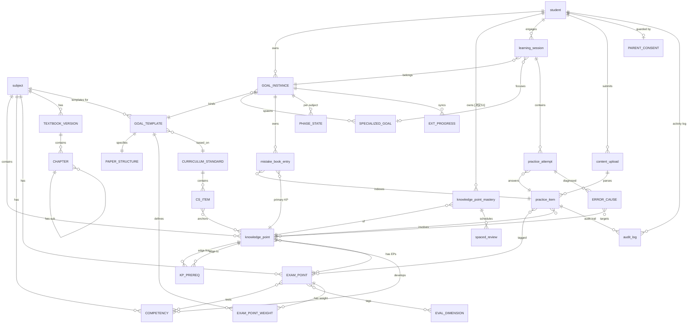

# §3 数据模型

> **权威源**：本节所有设计以 `_decisions_briefing.md` 决议为准，原 session 文档与决议冲突处以决议为准。
>
> MVP 范围：高考数学单学科，实体设计兼容多学科扩展。

---

## §3.1 ER 总图

**关键修正说明**：

| 关系 | 修正前 | 修正后 | 决议 |
|---|---|---|---|
| knowledge_point_mastery 持有者 | `GOAL_INSTANCE ||--o{ knowledge_point_mastery` | `student ||--o{ knowledge_point_mastery` | [决议 S1] |
| KP-EP 关系方向 | `knowledge_point }o--o{ EXAM_POINT`（N:M） | `knowledge_point ||--o{ EXAM_POINT`（1:N） | [决议 C1-D1] |
| EXAM_POINT_MASTERY | 独立实体存在 | **整张表删除** | [决议 C1-D3] |
| GOAL_TEMPLATE 个性化字段 | 含 mastery_threshold / recommendation_mix_override | **字段删除，移入 GoalInstance** | [决议 C3-D1] |

---

## §3.2 实体清单与分组

### 运营域（15 个实体 + 关联表）

| 实体 | 职责简述 |
|---|---|
| subject | 学科+学段元信息 |
| CURRICULUM_STANDARD | 课程标准版本元信息 |
| CS_ITEM | 课标具体条目（200-300 条/学科） |
| COMPETENCY | 核心素养+水平（6×3=18 条/数学） |
| EVAL_DIMENSION | 高考评价体系一核四层四翼 |
| knowledge_point | 知识点 DAG 节点（200-400 个/数学） |
| KP_PREREQ | KP DAG 边（400-800 条） |
| EXAM_POINT | 考点，单值 kp_id 外键 [决议 C1-D1] |
| EXAM_POINT_WEIGHT | 考点在 Template 下的权重统计 |
| practice_item | 题目（500-1000 道/数学） |
| audit_log | 题目状态变更审计日志 |
| GOAL_TEMPLATE | 考试要求底座（MVP 1 份/考试） |
| PAPER_STRUCTURE | 卷子结构（题型/分值/时长） |
| TEXTBOOK_VERSION | 教材版本（人教A/北师/苏教...） |
| CHAPTER | 章节（含节级，支持 parent_id 自关联） |

关联表：KP_CS_LINK、KP_COMP_LINK、ITEM_EP_LINK、ITEM_KP_LINK、ITEM_COMP_LINK、ITEM_EVAL_LINK、EP_COMP_LINK、EP_EVAL_LINK、SECTION_KP_LINK

### 学生域（8 个实体）

| 实体 | 职责简述 |
|---|---|
| student | 学生基本信息 + 已解锁 KP 列表 [决议 S2] |
| GOAL_INSTANCE | 学生个人目标实例 |
| SPECIALIZED_GOAL | 二层专项目标（单线程） |
| PHASE_STATE | 学习阶段状态（per student×subject×goal） |
| EXT_PROGRESS | 学校/辅导班外部进度上下文 |
| knowledge_point_mastery | 知识点掌握度（per student×KP，跨Goal共享） [决议 S1] |
| mistake_book_entry | 错题本条目（多生命周期状态） [决议 S2-D1] |
| spaced_review | 间隔复习调度（per student×KP） [决议 S2-衍生3] |

### 行为域（3 个实体）

| 实体 | 职责简述 |
|---|---|
| learning_session | 学习会话（25 分钟番茄钟） |
| practice_attempt | 单次答题记录 |
| ERROR_CAUSE | 答题错因诊断（AI 归因） |

### 合规/审计域（3 个实体）

| 实体 | 职责简述 |
|---|---|
| content_upload | 题目/试卷拍照上传记录 |
| PARENT_CONSENT | 监护人同意书记录 |
| audit_log | 通用操作审计日志 |

---

## §3.3 实体完整字段表

### 运营域

---

### subject（学科）

| 字段 | 类型 | 必选 | 说明 | 备注 |
|---|---|---|---|---|
| id | string PK | ✓ | math / physics / chemistry | 业务主键 |
| name | string | ✓ | "数学" | |
| stage | enum | ✓ | junior / senior | |
| competency_framework_ref | string | | 指向该学科核心素养清单 | |

---

### CURRICULUM_STANDARD（课程标准）

| 字段 | 类型 | 必选 | 说明 | 备注 |
|---|---|---|---|---|
| id | string PK | ✓ | std_math_2017_2020 | |
| subject_id | FK subject | ✓ | | |
| version | string | ✓ | "2017年版2020修订" | |
| publisher | string | ✓ | "教育部" | |
| issued_date | date | | | |
| pdf_url | string | | 原文 PDF | |

---

### CS_ITEM（课标条目）

| 字段 | 类型 | 必选 | 说明 | 备注 |
|---|---|---|---|---|
| id | string PK | ✓ | cs_math_4_2_1 | |
| standard_id | FK CURRICULUM_STANDARD | ✓ | | |
| theme | string | ✓ | "函数概念与性质" | |
| unit | string | | "一次函数" | |
| code | string | | "4.2.1" | |
| content_text | text | ✓ | 课标原文 | |
| academic_quality_level | string | | 学业质量水平描述 | |

---

### COMPETENCY（核心素养能力点）

| 字段 | 类型 | 必选 | 说明 | 备注 |
|---|---|---|---|---|
| id | string PK | ✓ | comp_math_logic_reasoning_l2 | |
| subject_id | FK subject | ✓ | | |
| name | string | ✓ | "逻辑推理" | |
| level | int | ✓ | 1/2/3 水平等级 | |
| description | text | | 课标原文描述 | |
| framework | enum | ✓ | core_competency | 区别于四层四翼 |

---

### EVAL_DIMENSION（高考评价体系维度）

| 字段 | 类型 | 必选 | 说明 | 备注 |
|---|---|---|---|---|
| id | string PK | ✓ | eval_layer_key_ability | |
| layer | enum | | core_value / subject_literacy / key_ability / essential_knowledge | 四层之一 |
| wing | enum | | foundation / comprehensive / application / innovation | 四翼之一 |
| description | text | | 评价体系解读 | layer 与 wing 可同时有值 |

---

### knowledge_point（知识点）

| 字段 | 类型 | 必选 | 说明 | 备注 |
|---|---|---|---|---|
| id | string PK | ✓ | kp_math_linear_func_concept | |
| subject_id | FK subject | ✓ | | |
| stage | enum | ✓ | junior / senior | |
| name | string | ✓ | "一次函数的概念" | |
| granularity_level | int | ✓ | 1 主干 / 2 子知识点 | |
| primary_cs_item_id | FK CS_ITEM | | 主关联课标条目 | |
| description | text | | 内涵描述，用于费曼判定 rubric | |
| feynman_rubric | json | | 费曼达标关键点清单 | |
| typical_study_minutes | int | | 预估学习分钟数 15-30 | |
| is_high_freq | bool | ✓ | 是否高频考点 | 影响推荐权重 |
| status | enum | ✓ | active / deprecated | AI 不可自动修改 |

---

### KP_PREREQ（知识点前置关系 DAG 边）

| 字段 | 类型 | 必选 | 说明 | 备注 |
|---|---|---|---|---|
| id | string PK | ✓ | | |
| from_kp_id | FK knowledge_point | ✓ | 前置知识点 | |
| to_kp_id | FK knowledge_point | ✓ | 后继知识点 | |
| strength | enum | ✓ | strong（必备）/ weak（推荐） | |
| reason | text | | 依赖说明 | 人审用 |

**约束**：图必须无环（系统启动时做环检测）。

---

### EXAM_POINT（考点）

> [决议 C1-D1]：EP-KP 关系改为 1:N，EXAM_POINT 持单值 `kp_id` 外键。跨 KP 的题目通过 `practice_item.kp_ids[] N:M` 解决。

| 字段 | 类型 | 必选 | 说明 | 备注 |
|---|---|---|---|---|
| id | string PK | ✓ | ep_math_recursive_seq_construct | |
| subject_id | FK subject | ✓ | | |
| kp_id | FK knowledge_point | ✓ | **单值外键，1:N** | [决议 C1-D1]，原多对多删除 |
| name | string | ✓ | "递推数列求通项（构造法场景）" | |
| primary_competency_id | FK COMPETENCY | | 主关联能力 | |
| item_type_scenario | text | | 场景描述 | |
| description | text | | 教研说明 | |
| created_by | string | | 教研专家 | |
| approved_at | datetime | | sign-off 时间 | |

**MVP 唯一价值**：真题权重统计单元（KP_weight = Σ EPs.weight）。

---

### EXAM_POINT_WEIGHT（考点权重）

| 字段 | 类型 | 必选 | 说明 | 备注 |
|---|---|---|---|---|
| id | string PK | ✓ | | |
| exam_point_id | FK EXAM_POINT | ✓ | | |
| template_id | FK GOAL_TEMPLATE | ✓ | 不同模板下同一考点权重不同 | |
| frequency_5y | int | | 近5年出现频次 | |
| avg_score | float | | 平均分值 | |
| score_ratio | float | ✓ | 占总分比 | 推荐权重核心字段 |
| difficulty_distribution | json | | {easy:0.2, mid:0.5, hard:0.3} | |

---

### practice_item（题目）

| 字段 | 类型 | 必选 | 说明 | 备注 |
|---|---|---|---|---|
| id | string PK | ✓ | | |
| subject_id | FK subject | ✓ | | |
| item_type | enum | ✓ | single_choice / fill_blank / short_answer | |
| source | enum | ✓ | gaokao_real / mock / lianlao / shengji / textbook / ai_generated | |
| source_year | int | | 2024 | |
| source_paper | string | | "新课标I卷" | |
| stem | text | ✓ | 题干 | |
| answer | text | ✓ | 标准答案 | |
| solution | text | | 详细解答 | |
| official_analysis | text | | 来自《高考试题分析》 | |
| scoring_detail | json | | 步骤分拆解 | |
| difficulty | float | ✓ | 0-1 | |
| estimated_minutes | int | | 推荐用时 | |
| score | int | | 题目分值 | |
| kp_ids | array FK | ✓ | 关联知识点（N:M） | 跨 KP 题目在此解决 [决议 C1] |
| exam_point_ids | array FK | | 关联考点 | |
| status | enum | ✓ | draft / pending_review / gray / published / under_review / deprecated | 6状态机 |
| version | int | ✓ | 版本号 | |
| created_by | enum | ✓ | human / ai | |
| reviewed_by | string | | 教研老师ID | ai_generated 必填 |
| reviewed_at | datetime | | | |
| created_at | datetime | ✓ | | |
| updated_at | datetime | ✓ | | |

**状态流转**：draft → pending_review → gray（LLM改写）/ published（真题）；published → under_review（举报≥3）→ published / draft / deprecated。

---

### audit_log（题目审计日志）

| 字段 | 类型 | 必选 | 说明 | 备注 |
|---|---|---|---|---|
| id | string PK | ✓ | | |
| item_id | FK practice_item | ✓ | | |
| from_status | enum | ✓ | | |
| to_status | enum | ✓ | | |
| actor_type | enum | ✓ | system / human | |
| actor_id | string | | 操作者ID | system 时为空 |
| reason | text | | 变更原因 | |
| payload | json | | 附加数据 | |
| created_at | datetime | ✓ | | |

**保留策略**：软删，永不硬删。关联 practice_item.status=deprecated 时仍保留日志。

---

### GOAL_TEMPLATE（目标模板）

> [决议 C3-D1]：Template = ExamRequirements 重量级语义（1份/考试）。**删除** `mastery_threshold` 和 `recommendation_mix_override`，个性化 override 进 GoalInstance。name 范例："2027 新课标 I 卷数学考试要求"。

| 字段 | 类型 | 必选 | 说明 | 备注 |
|---|---|---|---|---|
| id | string PK | ✓ | gt_2027_xkb1_math | |
| name | string | ✓ | "2027 新课标 I 卷数学考试要求" | [决议 C3] 命名改为考试要求语义 |
| year | int | ✓ | 2027 | |
| paper_type | string | ✓ | "新课标 I 卷" | |
| subject_id | FK subject | ✓ | | |
| stage | enum | ✓ | senior | |
| applicable_provinces | array string | ✓ | [安徽, 山东, 广东...] | |
| exam_mode | string | | "3+1+2" | |
| version | string | ✓ | "v1.0" | 模板版本管理 |
| based_on_standard_id | FK CURRICULUM_STANDARD | ✓ | | |
| eval_system_version | string | | "2019" | |
| kp_ids | array FK | ✓ | 关联 KP 集合 | |
| published_at | datetime | | | |
| approved_by | string | | 教研专家 | |
| status | enum | ✓ | draft / published / deprecated | |

**已删字段**（[决议 C3-D1]）：~~mastery_threshold~~、~~recommendation_mix_override~~。

---

### PAPER_STRUCTURE（卷子结构）

| 字段 | 类型 | 必选 | 说明 | 备注 |
|---|---|---|---|---|
| id | string PK | ✓ | | |
| template_id | FK GOAL_TEMPLATE | ✓ | 1:1 关系 | |
| total_score | int | ✓ | 150 | |
| duration_minutes | int | ✓ | 120 | |
| calculator_allowed | bool | ✓ | false | |
| sections | json | ✓ | [{type:单选, count:8, score_each:5}, ...] | |

---

### TEXTBOOK_VERSION（教材版本）

| 字段 | 类型 | 必选 | 说明 | 备注 |
|---|---|---|---|---|
| id | string PK | ✓ | tbv_rengjiao_a_2019 | |
| subject_id | FK subject | ✓ | | |
| publisher | string | ✓ | 人教A / 北师 / 苏教 | |
| edition | string | ✓ | "2019新版" | |
| stage | enum | ✓ | junior / senior | |
| issued_year | int | ✓ | | |

---

### CHAPTER（章节）

| 字段 | 类型 | 必选 | 说明 | 备注 |
|---|---|---|---|---|
| id | string PK | ✓ | | |
| tb_version_id | FK TEXTBOOK_VERSION | ✓ | | |
| parent_chapter_id | FK CHAPTER | | 自关联，null=章，有值=节 | |
| order_no | int | ✓ | 排序号 | |
| book_name | string | | "必修第一册" | |
| chapter_no | string | ✓ | "第三章" | |
| title | string | ✓ | "函数的概念与性质" | |

---

### 学生域

---

### student（学生）

> [决议 S2 主决议]：新增 `unlocked_kp_ids[]`；[决议 B7 待澄清]：补充 `textbook_version_id`；新增 `cold_start_mode`。

| 字段 | 类型 | 必选 | 说明 | 备注 |
|---|---|---|---|---|
| id | string PK | ✓ | | |
| name | string | ✓ | | |
| grade | int | ✓ | 7-12 年级 | |
| current_school | string | | | |
| province | string | ✓ | 决定可选模板范围 | |
| textbook_version_id | FK TEXTBOOK_VERSION | | 入驻时填写 | [待澄清 B7] |
| birthdate | date | | 推算年龄 | |
| unlocked_kp_ids | array FK | ✓ | **已学 KP 范围** | [决议 S2 主决议]，七池召回 5 个池的过滤基础 |
| cold_start_mode | bool | ✓ | 冷启动期标记 | 冷启动结束前不启用抗拒识别 [待澄清 B5] |
| guardian_consent | bool | ✓ | 监护人同意标记 | 未成年人合规前置条件 |
| created_at | datetime | ✓ | | |

---

### GOAL_INSTANCE（一层目标实例）

> [决议 S1]：删除 `completed_kp_ids[]`、`progress_pct`（改运行时派生）。
> [决议 C3-D1]：新增 `target_score`、`mastery_threshold?`、`recommendation_mix_override?`、`daily_budget_minutes`。

| 字段 | 类型 | 必选 | 说明 | 备注 |
|---|---|---|---|---|
| id | string PK | ✓ | | |
| student_id | FK student | ✓ | | |
| template_id | FK GOAL_TEMPLATE | ✓ | | |
| template_version | string | ✓ | **MVP 必须预留**，版本迁移用 | |
| target_score | int | ✓ | 目标分数，如 600 | [决议 C3-D1] 新增 |
| mastery_threshold | float | | 个人 override，null 则按 target_score 分档派生 | [决议 C3-D2]：600+→0.90, 500-600→0.85, <500→0.80 |
| recommendation_mix_override | json | | 个人推荐配比 override | [决议 C3-D3] MVP 仅运营可改；学生不开放 |
| daily_budget_minutes | int | ✓ | 每日预算（AI 建议，可手改） | [决议 C3-D1] 新增 |
| kp_scope_ids | array FK | ✓ | 从 Template 复制的 KP 集合 | |
| kp_weight_map | json | | 从 EXAM_POINT_WEIGHT 派生的 KP 权重 | |
| start_diagnosis_snapshot | json | | 冷启动诊断结果快照 | |
| deadline | date | ✓ | 截止日期（如 2027-06-07） | |
| status | enum | ✓ | active / paused / completed | |
| created_at | datetime | ✓ | | |
| last_synced_version_at | datetime | | 上次模板版本同步时间 | |

**已删字段**（[决议 S1]）：~~completed_kp_ids[]~~、~~progress_pct~~。
**进度派生**：`progress = Σ(mastery × weight) / Σ(weight) for kp ∈ kp_scope_ids`，运行时计算，不物化。

**约束**：一个学生同时只能有 1 个 `status=active` 的 GOAL_INSTANCE。

---

### SPECIALIZED_GOAL（二层专项目标）

| 字段 | 类型 | 必选 | 说明 | 备注 |
|---|---|---|---|---|
| id | string PK | ✓ | | |
| goal_instance_id | FK GOAL_INSTANCE | ✓ | 必须挂在一层下 | |
| name | string | ✓ | "函数专攻" | |
| focus_kp_ids | array FK | | 聚焦的 KP | |
| focus_ep_ids | array FK | | 聚焦的考点 | |
| triggered_by | enum | ✓ | student_manual / ai_recommendation | |
| target_deadline | date | ✓ | 强制有截止时间 | |
| status | enum | ✓ | active / completed / expired | |
| created_at | datetime | ✓ | | |

**约束**：一个 GOAL_INSTANCE 下同时只能有 1 个 `status=active` 的 SPECIALIZED_GOAL（平行赛道单线程）。

---

### PHASE_STATE（学习阶段状态）

| 字段 | 类型 | 必选 | 说明 | 备注 |
|---|---|---|---|---|
| id | string PK | ✓ | | |
| goal_instance_id | FK GOAL_INSTANCE | ✓ | | |
| subject_id | FK subject | ✓ | 学科独立 | |
| phase | enum | ✓ | new_term / consolidation / first_review / second_review / sprint | |
| urgency_score | float | | 0-1 内部连续值 | |
| updated_at | datetime | ✓ | | |
| set_by | enum | ✓ | student_manual / system_auto | |

---

### EXT_PROGRESS（外部学习上下文）

| 字段 | 类型 | 必选 | 说明 | 备注 |
|---|---|---|---|---|
| id | string PK | ✓ | | |
| goal_instance_id | FK GOAL_INSTANCE | ✓ | | |
| source | enum | ✓ | school / tutoring | |
| source_name | string | | "XX中学" | |
| subject_id | FK subject | ✓ | | |
| current_chapter_id | FK CHAPTER | | 当前讲到的章节 | |
| last_updated_at | datetime | ✓ | | |
| updated_by | enum | ✓ | student_manual / upload_inferred | |

---

### knowledge_point_mastery（知识点掌握度）

> [决议 S1]：持有者由 (GoalInstance × KP) 改为 **(Student × KP)**，跨 GoalInstance 共享。
> [决议 S2-衍生4]：删除被动衰减规则，全靠 Layer 3 spaced_review 主动召回。

| 字段 | 类型 | 必选 | 说明 | 备注 |
|---|---|---|---|---|
| id | string PK | ✓ | | |
| student_id | FK student | ✓ | **持有者改为 student** | [决议 S1] |
| subject_id | FK subject | ✓ | 学科隔离 | |
| knowledge_point_id | FK knowledge_point | ✓ | | |
| mastery_score | float | ✓ | 0-1 连续值 | 内部存储，对外显示枚举 |
| mastery_level | enum | ✓ | not_started / learning / familiar / mastered | 展示用枚举；阈值：[0,0.2)/[0.2,0.5)/[0.5,0.85)/[0.85,1] |
| confidence_count | int | ✓ | 累计答对数 | |
| failure_count | int | ✓ | 累计答错数 | |
| last_attempted_at | datetime | | | |
| feynman_verified | bool | ✓ | 是否通过费曼讲述验证 | 触发条件：mastery∈[0.6,0.85] + 距上次≥7天 |
| created_at | datetime | ✓ | 首次创建即触发 Layer 3 [决议 S2-衍生1] | |

**UNIQUE 约束**：`UNIQUE(student_id, knowledge_point_id)` [决议 S1]

**mastery 增量参考**（[决议 E]）：基础题 +0.05/-0.15，中等 +0.10/-0.08，难 +0.15/-0.03，讲述达标 +0.18。

**已删字段**（[决议 S2-衍生4]）：~~next_review_at~~（改由 spaced_review 管理）。

---

### mistake_book_entry（错题本条目）

> [决议 S2-D1]：conceptual 两阶段 `open_pending_material → open`；D2=永久 resolve；D3=长期 open 永远保留；N=2 连续变种做对自动 resolve。

| 字段 | 类型 | 必选 | 说明 | 备注 |
|---|---|---|---|---|
| id | string PK | ✓ | | |
| goal_instance_id | FK GOAL_INSTANCE | ✓ | | |
| item_id | FK practice_item | ✓ | 错的题目 | |
| primary_kp_id | FK knowledge_point | ✓ | 主要归因 KP | [决议 S2-D5]：一题多KP时仅主KP入错题本 |
| first_error_at | datetime | ✓ | 首次出错时间 | |
| error_count | int | ✓ | 累计错误次数 | |
| latest_attempt_id | FK practice_attempt | | 最近一次答题记录 | |
| root_cause_tags | array enum | | conceptual / methodological / comprehension / time_pressure | computational 不进错题本 |
| variant_correct_count | int | ✓ | 变种题连续做对计数 | [决议 S2] resolve 阈值 N=2 |
| material_read | bool | ✓ | 是否已读完关联学习材料 | conceptual 两阶段用 [决议 S2-D1] |
| status | enum | ✓ | open_pending_material / open / archived / resolved | [决议 S2-D1] 四态枚举 |
| resolved_at | datetime | | | D2：永久 resolve，不 reopen |

**注意**：careless/computational 根因**不入 mistake_book_entry**，只在 practice_attempt 计数。

**召回优先级**（[决议 S2-D4]）：conceptual > methodological > comprehension > time_pressure，同根因内按 error_count 倒序。

---

### spaced_review（间隔复习调度）

> [决议 S2-衍生3]：每个 (student_id, kp_id) 仅一条 spaced_review。
> Layer 3 升级为间隔复习引擎，4 类触发器。

| 字段 | 类型 | 必选 | 说明 | 备注 |
|---|---|---|---|---|
| id | string PK | ✓ | | |
| student_id | FK student | ✓ | | |
| knowledge_point_id | FK knowledge_point | ✓ | | |
| idx | int | ✓ | 当前间隔档位 0-5 | 对应 intervals=[1,3,7,15,30,60]天 |
| next_review_at | datetime | ✓ | 下次应复习时间 | |
| source_trigger | enum | ✓ | answer_wrong / new_mastery / feynman_pass / long_term | 4类触发器 [决议 S2] |
| status | enum | ✓ | pending / done / overdue | |
| created_at | datetime | ✓ | | |
| updated_at | datetime | ✓ | | |

**UNIQUE 约束**：`UNIQUE(student_id, knowledge_point_id)` [决议 S2-衍生3]

**idx 说明**：触发器A/B 创建/重置 idx=0；触发器C 讲述达标 idx+1；触发器D mastery≥0.85+长idx→long_term。临考期≤30天：间隔×0.5。

---

### 行为域

---

### learning_session（学习会话）

| 字段 | 类型 | 必选 | 说明 | 备注 |
|---|---|---|---|---|
| id | string PK | ✓ | | |
| student_id | FK student | ✓ | | |
| goal_instance_id | FK GOAL_INSTANCE | ✓ | | |
| specialized_goal_id | FK SPECIALIZED_GOAL | | 专项 session 时填写 | |
| mode | enum | ✓ | mainline / specialized / upload_analysis | |
| planned_duration_minutes | int | ✓ | 25（番茄）| 硬截止 |
| actual_duration_minutes | int | | | |
| started_at | datetime | ✓ | | |
| ended_at | datetime | | | |
| status | enum | ✓ | running / completed / abandoned | |
| item_composition | json | | 题目构成快照 {layer1:3, layer2:5, layer3:2, ...} | |

---

### practice_attempt（答题记录）

| 字段 | 类型 | 必选 | 说明 | 备注 |
|---|---|---|---|---|
| id | string PK | ✓ | | |
| session_id | FK learning_session | ✓ | | |
| item_id | FK practice_item | ✓ | | |
| student_id | FK student | ✓ | 冗余，便于查询 | |
| answer_submitted | text | | 提交答案 | |
| answer_steps | json | | 分步骤作答 | |
| answer_image_url | string | | 拍照上传 | |
| is_correct | bool | ✓ | | |
| partial_score | float | | 0-1 部分得分 | 解答题用 |
| time_spent_seconds | int | | | |
| feynman_explanation | text | | 费曼讲述内容 | |
| feynman_score | float | | AI 对讲述的打分 | |
| source | enum | | mainline / specialized | [决议 S1-衍生1]：专项标签，mastery 增量不降权 |
| invalidated | bool | ✓ | 题目下架后标记 | 不硬删，软标记 |
| submitted_at | datetime | ✓ | | |

---

### ERROR_CAUSE（错因诊断）

| 字段 | 类型 | 必选 | 说明 | 备注 |
|---|---|---|---|---|
| id | string PK | ✓ | | |
| attempt_id | FK practice_attempt | ✓ | | |
| cause_type | enum | ✓ | conceptual / methodological / comprehension / computational / time_pressure / out_of_scope | |
| confidence | float | ✓ | AI 判断置信度 | |
| evidence | text | | 判断依据 | |
| inferred_by | enum | ✓ | ai / student_confirmed / teacher | |
| target_kp_id | FK knowledge_point | | 归因到具体 KP | |

**处理逻辑**：cause_type=computational → 只计数，不触发 mistake_book_entry；其余类型→ 触发 mistake_book_entry 创建/更新。

---

### 合规/审计域

---

### content_upload（上传记录）

| 字段 | 类型 | 必选 | 说明 | 备注 |
|---|---|---|---|---|
| id | string PK | ✓ | | |
| student_id | FK student | ✓ | | |
| upload_type | enum | ✓ | error_item / paper / homework / tutoring_material | |
| file_url | string | ✓ | | |
| ocr_result | text | | OCR 识别结果 | |
| parsed_items | array FK | | 解析出的题目 | 可能新增 practice_item |
| analysis_result | json | | AI 分析结果 | |
| uploaded_at | datetime | ✓ | | |

---

### PARENT_CONSENT（监护人同意书）

| 字段 | 类型 | 必选 | 说明 | 备注 |
|---|---|---|---|---|
| id | string PK | ✓ | | |
| student_id | FK student | ✓ | | |
| consent_version | string | ✓ | 同意书版本号 | |
| consented_at | datetime | ✓ | | |
| guardian_name | string | ✓ | | |
| guardian_relation | enum | ✓ | parent / legal_guardian | |
| ip_address | string | | 签署 IP | 合规存档 |
| revoked_at | datetime | | 撤销时间（如适用） | |

---

### audit_log（通用审计日志）

| 字段 | 类型 | 必选 | 说明 | 备注 |
|---|---|---|---|---|
| id | string PK | ✓ | | |
| actor_id | string | ✓ | 操作者（student/ops/system） | |
| actor_type | enum | ✓ | student / ops_user / system | |
| action | string | ✓ | "goal_instance.create" | 动词.资源格式 |
| resource_type | string | ✓ | 旧字段，等同 target_type | |
| resource_id | string | ✓ | 旧字段，等同 target_id | |
| payload | json | | 变更前后快照 | |
| created_at | datetime | ✓ | | |

---

## §3.4 关键约束

### 派生字段（不入表，运行时计算）

| 派生字段 | 计算方式 | 说明 |
|---|---|---|
| GoalInstance.progress | `Σ(mastery_score × weight) / Σ(weight)` for kp ∈ kp_scope_ids | [决议 S1]，progress_pct 字段已删 |
| EP 粒度 mastery | `Σ(关联 KP mastery × KP权重)` | EXAM_POINT_MASTERY 表已删 [决议 C1-D3]，运行时算 |
| mastery_threshold（未 override 时） | target_score 分档：600+→0.90, 500-600→0.85, <500→0.80 | [决议 C3-D2] |

### UNIQUE 约束

| 约束 | 实体 | 字段 | 决议 |
|---|---|---|---|
| 学生对 KP 唯一 mastery | knowledge_point_mastery | `(student_id, knowledge_point_id)` | [决议 S1] |
| 学生对 KP 唯一调度 | spaced_review | `(student_id, knowledge_point_id)` | [决议 S2-衍生3] |
| 学生对题目单次举报 | ITEM_REPORT | `(student_id, item_id)` | Q10 规则 |
| KP DAG 边唯一 | KP_PREREQ | `(from_kp_id, to_kp_id)` | 数据一致性 |

### 软删 vs 硬删

| 实体/字段 | 策略 | 理由 |
|---|---|---|
| practice_item（deprecated） | 软删（status=deprecated） | 审计、历史 attempt 关联 |
| practice_attempt.invalidated | 软标记（bool=true）| 题目下架后不删历史答题 |
| audit_log | 永不删除 | 合规审计 |
| mistake_book_entry（resolved） | 软标记（status=resolved）| D2：永久 resolve，不 reopen；D3：long-term open 永久保留 |
| knowledge_point_mastery | 永不删除 | 学习历史不可篡改 |

### 状态机约束

| 状态机 | 规则 |
|---|---|
| practice_item 6状态 | 单向流转为主；published → under_review → published/draft/deprecated 可回流 |
| mistake_book_entry 4态 | open_pending_material → open（材料已读后）；open → resolved（N=2变种连续做对）；archived 为运营手动操作；已 resolved 不 reopen |
| spaced_review idx | 触发A/B 重置 idx=0；触发C idx+1（上限5）；触发D 进入 long_term 保鲜 |
| GOAL_INSTANCE 活跃唯一 | 同一 student 同时只能有 1 个 active GOAL_INSTANCE |
| SPECIALIZED_GOAL 活跃唯一 | 同一 GOAL_INSTANCE 同时只能有 1 个 active SPECIALIZED_GOAL |
