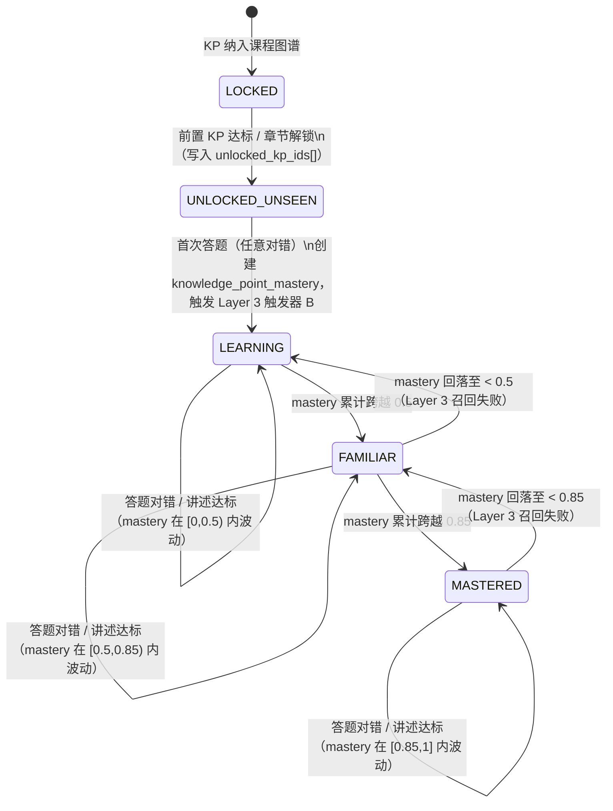
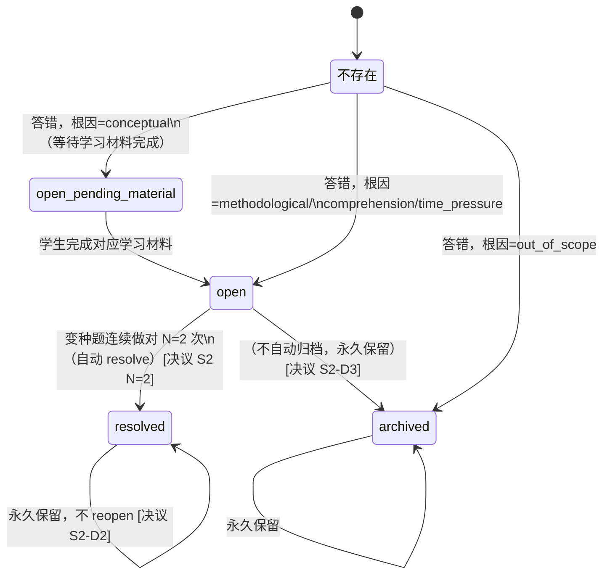
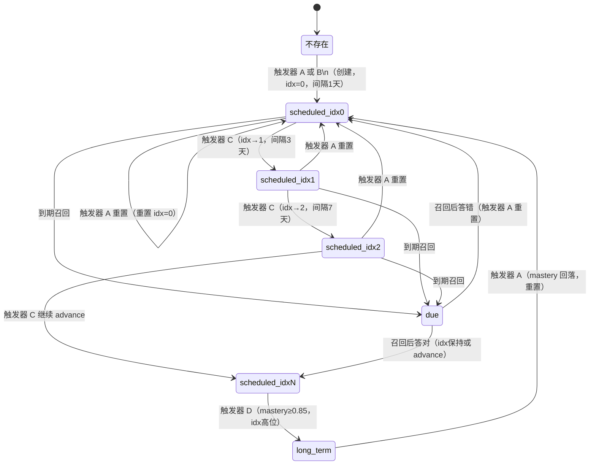
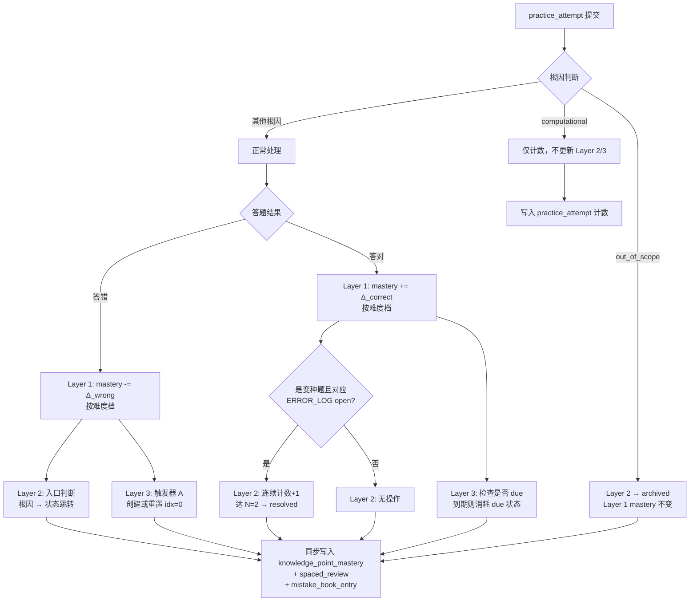

# §4 三层学习生命周期模型

## §4.1 总览

系统将学习行为抽象为三条独立运转、彼此触发但互不替代的状态链：

| 层级 | 实体粒度 | 职责 |
|---|---|---|
| Layer 1 | per Student × KP | KP 主掌握度状态机：从未解锁到已掌握 |
| Layer 2 | per Student × practice_item | 错题本生命周期：从发现错误到攻克关闭 |
| Layer 3 | per Student × KP | 间隔复习引擎：主动召回防遗忘 |

**三层独立 + 互相触发不互相替代** [决议 S2]：
- Layer 1 状态机驱动 mastery 演化；Layer 2 捕获具体出错的题目；Layer 3 安排主动复习时机。
- 一次答题 practice_attempt 可同时更新三层，但每层有独立的入口规则和退出条件。
- Layer 1 进入 MASTERED 不自动关闭 Layer 2 open 条目；Layer 2 resolved 后 Layer 3 仍按计划运转。

---

## §4.2 Layer 1：KP 主状态机

### 状态定义

| 状态 | 含义 |
|---|---|
| `LOCKED` | KP 在课程图谱中存在，但学生尚未解锁（前置未达标或章节未到） |
| `UNLOCKED_UNSEEN` | KP 已解锁，学生从未作答任何相关题目 |
| `LEARNING` | 已有 knowledge_point_mastery 记录，mastery ∈ [0, 0.5) |
| `FAMILIAR` | mastery ∈ [0.5, 0.85) |
| `MASTERED` | mastery ∈ [0.85, 1] |

### 状态机图

### 触发事件类型（共 4 类）

| 事件类型 | 说明 |
|---|---|
| 答题答对 | mastery 按难度档上调（见 §5.1） |
| 答题答错 | mastery 按难度档下调，同时触发 Layer 2 入口判断 |
| 讲述达标 | mastery +0.18，打 `feynman_verified` 标记，触发 Layer 3 触发器 C |
| 题目下架 | v1.5+ 实现，MVP 阶段不触发 [决议 S3 延后] |

> 注：被动时间衰减规则已删除。[决议 S2-衍生4] 防遗忘完全由 Layer 3 主动召回承担。

---

## §4.3 Layer 2：mistake_book_entry 状态机

### 入口规则（per Student × practice_item）

答错后按根因决定是否入错题本：

| 根因 | 入口行为 |
|---|---|
| `conceptual` | 进入 `open_pending_material`（两阶段：先看材料，看完转 `open`） [决议 S2-D1] |
| `methodological` | 直接进入 `open` |
| `comprehension` | 直接进入 `open` |
| `time_pressure` | 直接进入 `open`（标记限时场景） |
| `computational` | 不进错题本，仅计数 |
| `out_of_scope` | 进入 `archived`（旁路，不参与复习调度） |

一题多 KP 时仅主 KP 入错题本，副 KP 按权重扣 mastery。[决议 S2 D5=a]

### 状态机图

### Resolve 阈值与规则

- **N=2**：变种题连续做对 2 次自动 resolve。[决议 S2 N=2]
- 变种题定义：同 KP、同题型场景、参数/表述变化。
- resolved 后永久保留记录，不因后续答错而 reopen。[决议 S2-D2]
- long-term open 条目永久保留，不自动归档。[决议 S2-D3]
- 同 KP 多条 open 召回顺序：根因优先级 `conceptual > methodological > comprehension > time_pressure`，同根因内按 `error_count` 倒序。[决议 D4=b+c]

---

## §4.4 Layer 3：spaced_review 间隔复习引擎

### 基础规则

- 每个 (Student, KP) 仅维护**唯一一条** spaced_review 记录。[决议 S2-衍生3]
- 间隔系数：`intervals = [1, 3, 7, 15, 30, 60]` 天，下标 `idx` 从 0 递增。
- 临考压缩：距考试 ≤30 天时，间隔 × 0.5（即 1/2/4/8/15/30 天）。[决议 E 临考期]

### 4 类触发器

| 触发器 | 触发时机 | 对 spaced_review 的操作 |
|---|---|---|
| **A** | 学生答错某 KP 题（根因非 computational/out_of_scope） | 创建或重置 idx=0，next_review = now + 1天 |
| **B** | knowledge_point_mastery 首次创建（新 KP 第一次答题） | 创建 idx=0，next_review = now + 1天 [决议 S2-衍生1] |
| **C** | 讲述题达标 | idx +1（advance），next_review = now + intervals[idx] |
| **D** | mastery ≥ 0.85 且当前 idx 已达高位 | 进入 long_term 模式，使用 intervals 末尾系数保鲜 |

### 状态机图

---

## §4.5 三层交互：原子事件包

每次 practice_attempt 完成时，系统以如下顺序同步更新三层：

---

## §4.6 Case 1：完美学生（全对）时间线

> KP 示例：等差数列通项公式。难度全部为基础题（+0.05/次）。初始 mastery=0。

| 时间点 | 动作 | Layer 1 mastery | Layer 1 状态 | Layer 2 错题本 | Layer 3 队列 |
|---|---|---|---|---|---|
| **T0** | 解锁 KP | — | UNLOCKED_UNSEEN | 空 | 空 |
| **T1** | 首次答对基础题 | 0→0.05 | LEARNING | 无条目 | 触发器 B → idx=0，due T2 |
| **T4** | 复习答对，掌握扎实，idx advance | 0.05→0.10 | LEARNING | 无条目 | idx=1，due T7 |
| **T11** | 复习答对，继续 advance | 0.10→0.15 | LEARNING | 无条目 | idx=2，due T18 |
| **T26** | 多次答对累计，mastery 跨越 0.5 | 0.50+ | FAMILIAR | 无条目 | idx=3，due T41 |
| **T56** | 多次答对累计，mastery 跨越 0.85 | 0.85+ | MASTERED | 无条目 | 触发器 D → long_term，idx=5，due T116 |
| **T116** | long_term 复习，答对维持 | 维持 ≥0.85 | MASTERED | 无条目 | long_term 续期，due T176 |

---

## §4.7 Case 2：有错误学生（3 题 2 对 1 错）时间线

> KP 示例：等差数列通项公式。T1 答错 1 题，根因 methodological。N=2 于 T4 达成 resolve。

| 时间点 | 动作 | Layer 1 mastery | Layer 1 状态 | Layer 2 错题本 | Layer 3 队列 |
|---|---|---|---|---|---|
| **T0** | 解锁 KP | — | UNLOCKED_UNSEEN | 空 | 空 |
| **T1** | 3 题：2 对 1 错（基础题），错因 methodological | 0→(+0.05×2)-(0.15×1)=−0.05→clamp 0 | LEARNING | `open`（1条） | 触发器 B 创建；触发器 A 重置 idx=0，due T2 |
| **T4** | 变种题答对（第1次），未达 N=2 | 0→0.05 | LEARNING | open，连续计数=1 | idx 维持 0 或触发 advance |
| **T4** | 再做变种题答对（第2次），达 N=2 | 0.05→0.10 | LEARNING | `resolved`（攻克）[决议 S2 N=2] | 触发器 C → idx+1 |
| **T11** | 复习答对，正常 advance | 0.10→0.20 | LEARNING | resolved（永久保留）| idx=2，due T18 |
| **T26** | 多次答对，mastery 跨越 0.5 | 0.50+ | FAMILIAR | resolved（永久保留）| idx=3，due T41 |
| **T86** | 多次答对，mastery 跨越 0.85 | 0.85+ | MASTERED | resolved（永久保留）| 触发器 D → long_term，due T146 |
| **T146** | long_term 复习维持 | 维持 ≥0.85 | MASTERED | resolved（永久保留）| long_term 续期 |

---

# §5 Mastery 演化规则

## §5.1 分难度增减量

| 事件 | 基础题 | 中等题 | 难题 |
|---|---|---|---|
| 答对 | +0.05 | +0.10 | +0.15 |
| 答错 | −0.15 | −0.08 | −0.03 |

> 难题答错不重罚（−0.03）：鼓励学生挑战难题，降低冒险成本。
> 所有变化后 clamp 至 [0, 1]。

## §5.2 4 档阈值映射

| mastery_score（内部值） | mastery_level（对外展示） | 含义 |
|---|---|---|
| [0, 0.2) | 未开始 | 从未触达或全错 |
| [0.2, 0.5) | 学习中 | 偶尔做对，不稳定 |
| [0.5, 0.85) | 熟悉 | 大部分做对，有薄弱环节 |
| [0.85, 1] | 已掌握 | 稳定做对，进入长间隔复习 |

阈值为 MVP 初始值，上线后根据真实数据调整。

## §5.3 衰减规则

**被动时间衰减已删除。** [决议 S2-衍生4]

原 q3 §3.4 中"N 天不练按艾宾浩斯曲线衰减"规则废弃。防遗忘完全依赖 Layer 3 间隔复习引擎主动召回：
- 学生按时完成 Layer 3 排期 → mastery 通过答题正常演化（升或降）。
- 学生未按时复习 → spaced_review 标记为 overdue，下次打开系统时优先弹出；mastery 本身不因时间流逝自动下滑。

这样做的理由：被动衰减与主动复习双轨并行会产生"按时复习反而被扣分"的悖论，并使 mastery 数值对学生失去可解释性。

## §5.4 讲述题加成

讲述题（`ITEM_TYPE = concept_explanation`）达标后：
- mastery **+0.18**（决议阶段统一为 +0.18）[决议 E 讲述达标加成]
- 同时在 knowledge_point_mastery 上打 `feynman_verified = true`，记录 `feynman_verified_at`。
- `feynman_verified` 是推荐引擎独立可用的强信号，即使后续 mastery 回落，该标记依然留存（不自动清除）。
- 触发条件：mastery ∈ [0.6, 0.85] + 距上次讲述 ≥7 天 + 未 `feynman_verified`。[决议 E 讲述题触发]

## §5.5 mastery=0 二义性消解

mastery 数值为 0 存在两种完全不同的语义，系统必须在数据层和 UI 层同时区分：[决议 S2-衍生1] [Q1=c]

| 场景 | 数据状态 | UI 文案 |
|---|---|---|
| 学生从未接触该 KP | knowledge_point_mastery 记录**不存在** | "从未开始" |
| 学生接触过但 mastery 因答错 clamp 到 0 | knowledge_point_mastery 记录**存在**，`mastery_score=0` | "需要加强"（曾掌握后回落）|

实现要点：
- `mastery=0` 且有 knowledge_point_mastery 记录 → 显示"需要加强"，可附加"曾达到 XX 档"的历史峰值提示（激励学生）。
- knowledge_point_mastery 不存在 → 显示"从未开始"或不显示掌握度区域。
- 推荐引擎区分两种状态：前者优先推复习题，后者先推学习材料。
