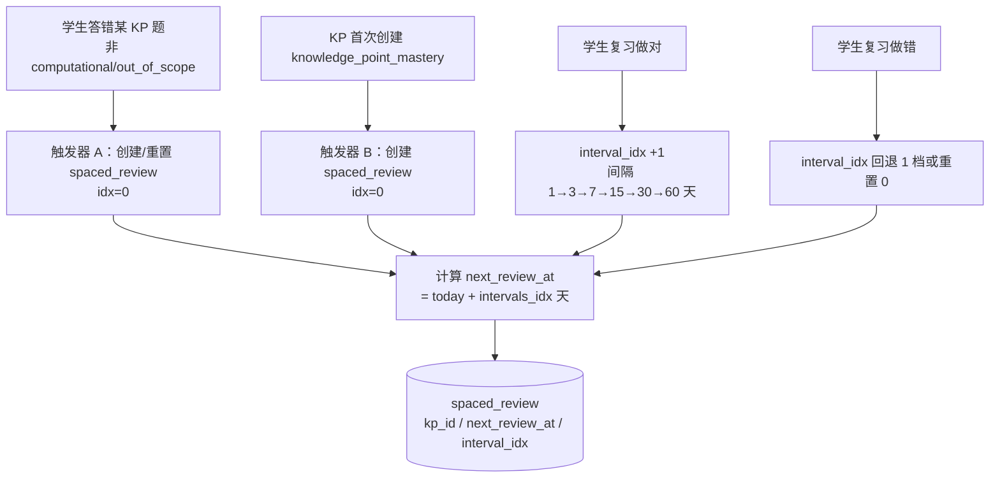
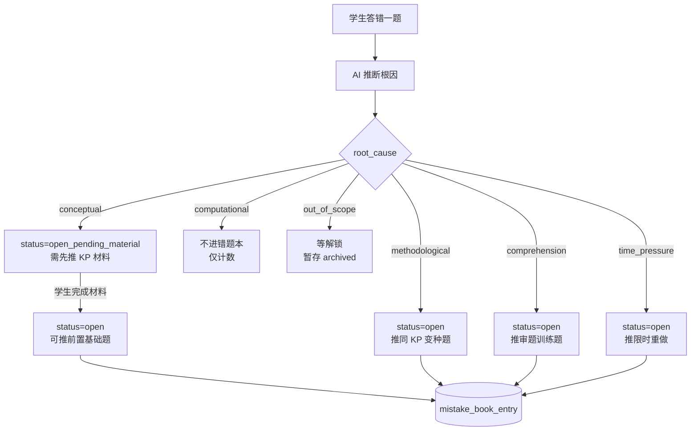
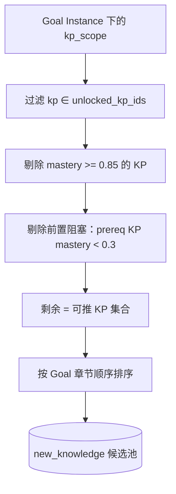
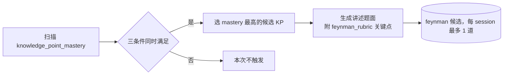
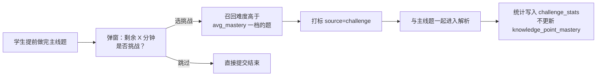
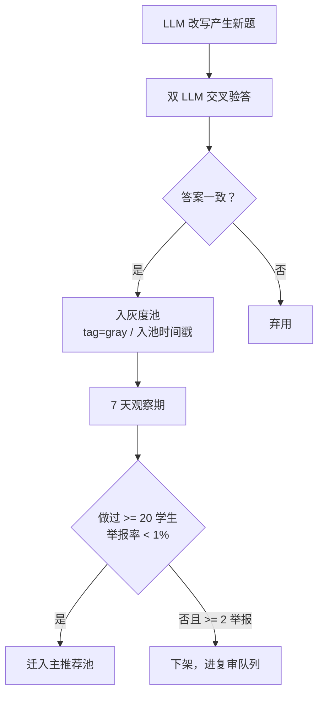

# §6 推荐器（7 池设计）

> 权威来源：`_decisions_briefing.md`（S2 主决议 / S2-衍生2 / S2-D4）、q7_recommender_mindmap、q8_cold_start_and_chapter_progress

---

## §6.1 池总览表

| # | 池名 | 内部 ID | 优先级 | 触发条件 | MVP 是否做 | 是否受 unlocked_kp_ids 约束 |
|---|---|---|---|---|---|---|
| 1 | 艾宾浩斯到期池 | `ebbinghaus_due` | 最高（总有） | `next_review_at <= today`，spaced_review 非空 | 是 | 是 |
| 2 | 错题本变种池 | `error_book_variant` | 高 | mistake_book_entry 存在 `status=open` 或 `open_pending_material` 的记录 | 是 | 是 |
| 3 | 新知识点池 | `new_knowledge` | 中 | Goal 范围内还有未覆盖 KP（mastery < 0.85） | 是 | 是 |
| 4 | 讲述题池 | `feynman` | 中（条件触发） | mastery∈[0.6,0.85] + 距上次≥7天 + 未 feynman_verified | 是 | 是 |
| 5 | 综合题池 | `comprehensive` | 中-低 | 多 KP mastery≥0.75 + 临考期 ≤60 天 | **否（v1.5）** | 是 |
| 6 | 挑战题池 | `challenge` | 选用（学生主动） | 学生本 session 提前做完主线，弹窗触发 | 是 | **豁免（不受约束）** |
| 7 | 灰度试用池 | `gray_pool` | 横向叠加 | 新改写题 7 天观察期，叠加于其他主池 | 是 | 遵循所属主池约束 |

**说明**：
- 池 1-5 均需过滤 `kp_id ∈ student.unlocked_kp_ids`（[决议 S2 主]）。
- 池 6 挑战题豁免 unlocked_kp_ids，可推超出已学范围的题，但不计入 mastery 演化。
- 池 7 灰度池横向叠加，不占主配比份额，其 unlocked_kp_ids 约束由所叠加的主池决定。

---

## §6.2 池 1-7 详细规则

### §6.2.1 池 1：艾宾浩斯到期池 `ebbinghaus_due`

**触发条件**：spaced_review 中存在 `next_review_at <= today` 的记录，每 session 必参与（最高优先级）。

**写入路径**：

**召回过滤**：
- `kp_id ∈ student.unlocked_kp_ids`（[决议 S2 主]，[决议 S2-衍生3=P] 每个 (Student, KP) 仅一条 spaced_review）

**排序逻辑**：`next_review_at` 越早越优先；同日内按 `error_count` 倒序。

**关键参数**：

| 参数 | 值 |
|---|---|
| 间隔系数 intervals[idx] | 1 / 3 / 7 / 15 / 30 / 60 天 |
| 临考期 ≤30 天 | 间隔 × 0.5 → 1/2/4/8/15 天 |
| 冲刺期 ≤7 天 | 仅复习 mastery≥0.85 的 KP，不推新知识点 |
| 每 session 上限 | 配比 30%（默认期），60%（临考期） |

---

### §6.2.2 池 2：错题本变种池 `error_book_variant`

**触发条件**：mistake_book_entry 存在 `status=open` 或 `status=open_pending_material` 的记录。

**写入路径**：

**召回过滤**：
- `status IN (open, open_pending_material)`
- `kp_id ∈ student.unlocked_kp_ids`（[决议 S2 主]）
- `out_of_scope` 记录不参与召回，等待对应 KP 解锁后再激活

**排序逻辑**（[决议 S2-D4=b+c]）：
1. 根因优先级：`conceptual > methodological > comprehension > time_pressure`
2. 同根因内：`error_count DESC`（最多失败的先做）

**5 路根因分流**：

| 根因 | 召回动作 |
|---|---|
| conceptual | 推前置 KP 基础题 + KP 学习材料（先材料后题） |
| methodological | 召回同 `scenario_tag` 变种题（非原题重做） |
| comprehension | 召回同题型审题专项题 |
| time_pressure | 原题打限时标记重推 |
| out_of_scope | 暂不召回，等 kp 进入 unlocked_kp_ids 后激活 |

**Resolve 条件**：连续 N=2 道变种做对自动 resolve；讲述题达标也触发 resolve（[决议 S2 N=2]）。

---

### §6.2.3 池 3：新知识点池 `new_knowledge`

**触发条件**：Goal 范围内存在 mastery < 0.85 的未掌握 KP。

**写入路径**：

**召回过滤**：
- **显式过滤 `kp_id ∈ student.unlocked_kp_ids`**（[决议 S2 主]，硬约束，未学章节 KP 不进任何池）
- 剔除 `mastery >= 0.85`（已掌握 KP 不重推）
- 剔除前置阻塞：`prereq_kp mastery < 0.3`（v1.5 字段启用后生效；MVP 按章节顺序兜底）

**排序逻辑**：按 Goal 章节顺序；同章节内按 `mastery ASC`（最弱的优先补）。

**难度自适应**：

| mastery 区间 | 推题难度 |
|---|---|
| [0, 0.2) | 难度 1-2 基础题 |
| [0.2, 0.5) | 难度 2-3 标准题 |
| [0.5, 0.85) | 难度 3-4 进阶+变种题 |

---

### §6.2.4 池 4：讲述题池 `feynman`

**触发条件**（三个同时满足）：
1. `mastery ∈ [0.6, 0.85]`
2. 距上次该 KP 讲述 `≥ 7 天`
3. 该 KP `feynman_verified = false`

**写入路径**：

**召回过滤**：
- `kp_id ∈ student.unlocked_kp_ids`（[决议 S2 主]）
- 冷启动期（cold_start_mode=true）不触发讲述题

**排序逻辑**：每 session 选 mastery 最高的 1 个候选 KP，最多 1 道。

**关键参数**：

| 参数 | 值 |
|---|---|
| 触发 mastery 区间 | [0.6, 0.85] |
| 最小间隔 | 7 天 |
| 每 session 上限 | 1 道 |
| 达标加成 | mastery +0.18（[决议 E]） |
| Layer 3 效果 | 讲述达标 → interval_idx +1（触发器 C，[决议 S2]） |
| 题型配比 | feynman=0.05（默认期），一道题固定插入 session 末尾 |

**AI 评判**：LLM 对照 `feynman_rubric` 关键点清单评分，覆盖一半以上算达标（+0.18），准确完整为优秀（+0.18 + feynman_verified=true）。

---

### §6.2.5 池 5：综合题池 `comprehensive`（v1.5，MVP 不做）

**触发条件**：本 Goal 下相关 KP ≥ 3 个且 mastery 均 ≥ 0.75，且距高考 ≤ 60 天。

**MVP 状态**：v1.5 实现，当前文档仅占位。召回时仍需过滤 `kp_id ∈ student.unlocked_kp_ids`（[决议 S2 主]）。

---

### §6.2.6 池 6：挑战题池 `challenge`

**触发条件**：学生本 session 提前完成主线题，系统弹窗询问是否选择挑战。

**写入路径**：

**召回过滤**：
- **豁免 `unlocked_kp_ids` 约束**（[决议任务书]，学生主动选择，可超出已学范围）
- 难度高于当前 `avg_mastery` 对应档位一档

**排序逻辑**：按难度升序，避免一上来即最高难度。

**关键规则**：
- **不计入 mastery 演化**，保护主线数据纯净（[决议任务书]）
- 答题数据写入独立 `challenge_stats` 表，用于个性化推荐参考
- 用于满足学有余力学生的进阶需求，不强制

---

### §6.2.7 池 7：灰度试用池 `gray_pool`

**触发条件**：LLM 改写产生的新题，经双 LLM 交叉验答通过，进入 7 天灰度观察期。

**写入路径**：

**叠加方式**（横向叠加）：
- 不占主配比份额，在其他主池召回时以 5% 比例替换候选
- 灰度组学生比例默认 5%，可配置

**召回过滤**：
- 遵循所叠加主池的 `kp_id ∈ student.unlocked_kp_ids` 约束（[决议 S2 主]）
- 灰度题对学生无感知，正常呈现

**关键参数**：

| 参数 | 值 |
|---|---|
| 灰度期长度 | 7 天 |
| 毕业条件 | ≥20 学生做过 + 举报率 < 1% |
| 下架条件 | ≥2 举报 |
| 叠加比例 | 5%（可配置） |

---

## §6.3 多池合并规则

> [决议 S2-衍生2=X]：同 KP 在多个池都有候选时，合并出题，避免同一天出现两道相同 KP 的题。

**合并逻辑**：

1. 各池独立召回候选列表（含 kp_id 标注）
2. Session 装配器对候选去重：同 `kp_id` 的多池候选，选优先级最高池的候选题
3. 优先级顺序：`ebbinghaus_due > error_book_variant > new_knowledge > feynman`
4. 被合并掉的低优先级候选从本次 session 排除（不延期到下次）
5. 灰度池按叠加逻辑独立处理，不参与此合并

**示例**：KP「等差数列通项公式」同时出现在 ebbinghaus_due 和 error_book_variant → 保留 ebbinghaus_due 的候选题，error_book_variant 的候选题本次不出。

---

## §6.4 池间配比表达式（阶段化）

| 阶段 | 触发条件 | ebbinghaus | error_book | new_knowledge | feynman | challenge |
|---|---|---|---|---|---|---|
| **冷启动第 1 周** | cold_start_mode=true，≤7天 | — | — | **1.0** | — | — |
| **冷启动第 2 周** | cold_start_mode=true，8-14天 | 0.2 | 0.3 | **0.5** | — | — |
| **默认配比** | 正常学习期 | 0.3 | 0.3 | 0.3 | 0.05 | 0.05 |
| **临考期 ≤30天** | Goal deadline ≤30天 | **0.6** | 0.3 | 0.05 | 0.05 | — |
| **冲刺期 ≤7天** | Goal deadline ≤7天 | **1.0**（仅 mastery≥0.85 KP） | — | — | — | — |

**说明**：
- 冷启动第 1 周不触发讲述题（mastery 数据不足）、不触发综合题（v1.5 之后才有）。
- challenge 池不计入配比分母，仅在学生提前完成主线时弹窗触发。
- 灰度池（gray_pool）横向叠加，不占配比份额。
- 冷启动结束条件：完成 ≥5 个正式 session，或入驻满 7 天，或学生手动跳过（[Q8 决议5]）。

---

## §6.5 信号到决策对应表

| 输入信号 | 数据来源 | 影响的池 / 决策 |
|---|---|---|
| **Mastery 向量** | knowledge_point_mastery（student_id + kp_id） | 池3 剔除 mastery≥0.85；池4 触发区间 [0.6,0.85]；池1 艾宾浩斯间隔升降档；全池难度自适应 |
| **错题本** | mistake_book_entry（status=open / open_pending_material） | 池2 全部输入；触发 5 路根因分流 |
| **艾宾浩斯队列** | spaced_review（next_review_at） | 池1 全部输入；临考期触发间隔×0.5 |
| **Goal Instance** | GoalInstance（deadline / kp_scope / target_score） | 池3 章节顺序排序；临考期阶段切换；配比阶段判断 |
| **最近表现** | practice_attempt 历史（最近 N session 正确率/用时/根因分布） | 调节难度（连续失败降难度）；触发疲劳保护；冷启动结束判定 |
| **讲述题历史** | knowledge_point_mastery.feynman_verified + spaced_review 讲述时间戳 | 池4 触发条件（距上次≥7天 + 未 verified） |
| **画像偏好** | student.preference（抗拒题型 / 偏好难度） | 各池召回后二次筛选（如抗拒拍照题降权）；持续跳过讲述题则暂停池4 |
| **今日时长** | GoalInstance.daily_budget_minutes | 决定总题量（25min≈10-15道，15min≈6-8道）；按配比分配各池配额 |
