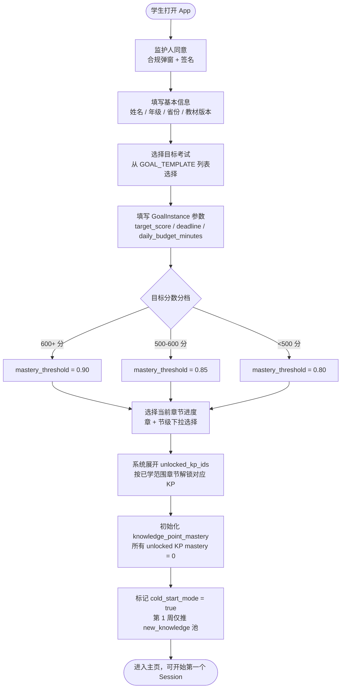
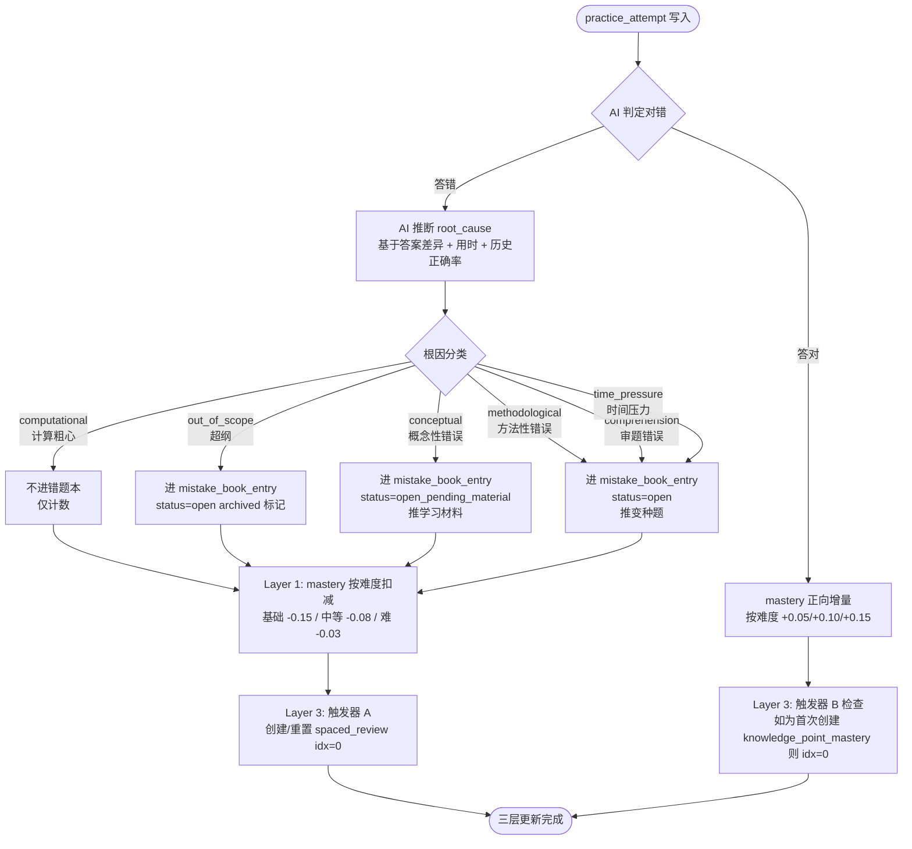
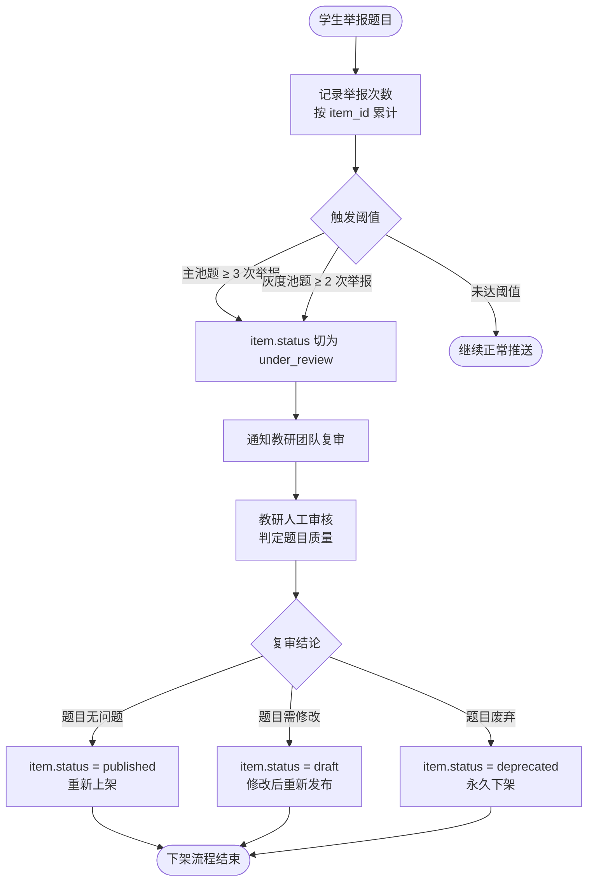

# §7 核心流程

> 本章展示学生视角的关键产品流程。所有流程以 mermaid `flowchart` 表达，权威决议来源为 `_decisions_briefing.md`。

## 流程总览

| 编号 | 流程名称 | 触发时机 | MVP 状态 |
|---|---|---|---|
| §7.1 | 学生入驻流程 | 首次注册 | 必须实现 |
| §7.2 | 学习 Session 流程 | 学生点击"开始学习" | 必须实现 |
| §7.3 | 答题 + 错题诊断流程 | Session 提交后 | 必须实现 |
| §7.4 | 错题修复流程 | 错题进入 mistake_book_entry 后 | 必须实现 |
| §7.5 | 间隔复习召回流程 | 每日 daily 定时扫描 | 必须实现 |
| §7.6 | 讲述题流程 | Session 启动时检查候选 KP | 必须实现 |
| §7.7 | 题目下架流程 | 学生举报达阈值 | v1.5+ 实现 |

---

## §7.1 学生入驻流程



**关键约束：**

MVP 不做摸底卷（[q8 决议]）。所有 mastery 从 0 出发，依靠正式答题数据自然建立学习画像。GoalInstance 字段 `target_score` / `mastery_threshold` / `daily_budget_minutes` 均在入驻时创建（[决议 C3-D3]），GOAL_TEMPLATE 本身不存这些字段。`unlocked_kp_ids` 由章节进度决定，学生可主动勾选超前解锁未学章节，但系统会弹窗提醒。

GOAL_TEMPLATE 语义为"1 份/考试"的重量级考试要求描述（如"2027 新课标 I 卷数学考试要求"），个性化参数全部进 GoalInstance。mastery_threshold 按 target_score 自动分档派生：600+→0.90 / 500-600→0.85 / <500→0.80（[决议 C3-D2]）。MVP 教材版本仅支持人教版高中数学，其他版本 v2 扩展。

待澄清：student.textbook_version_id 字段在入驻表单必填但 ER 模型中缺失（B7 待澄清）。

---

## §7.2 学习 Session 流程

```mermaid
flowchart TD
    A([学生点击"开始学习"]) --> B[系统装配题目\n按池间配比 + 多池同 KP 合并过滤]
    B --> C[时长换算题量\ndaily_budget ÷ avg_expected_time → 8-15 道]
    C --> D[25 分钟番茄钟启动\n硬截止计时]
    D --> E[学生答题\n不允许跳题]
    E --> F{番茄钟到时\n或学生提前提交}
    F -->|到时强制提交| G[整批答案一次性提交]
    F -->|提前完成| G
    G --> H[上传拍照答案\nOCR 识别 + 学生逐题确认\n番茄钟外约 3-5 分钟]
    H --> I[AI 批量分析\n30-60 秒等待]
    I --> J[解析页展示\n对错 + 答案 + 解析 + 错因诊断 + 整体建议]
    J --> K[写入 practice_attempt 记录\n含 source 标签]
    K --> L[三层原子更新]
    L --> L1[Layer 1\nMAST ERY_STATE 增减]
    L --> L2[Layer 2\nERROR_LOG 写入/更新]
    L --> L3[Layer 3\nREVIEW_SCHEDULE 创建/重置]
    L1 & L2 & L3 --> M([Session 结束])
```

**关键约束：**

同一 KP 在多个推荐池中均出现时，合并取一道，避免同 session 出现两道相同 KP 的题（[决议 S2-衍生2]）。题量范围 8-15 道由 `daily_budget_minutes` 除以题目 `expected_time` 动态计算。番茄钟 25 分钟为硬截止，不强制等满，提前完成可立即提交。

OCR 确认和解析环节不计入番茄钟计时，总耗时约 35-40 分钟。解答题走手写拍照 + AI 多模态识别路径，学生需逐题确认 OCR 结果（[q5 决议]）。OCR 修正 chat 仅允许修正识别错误，不准直接覆盖最终答案，超 N 次修正触发"疑似刷分"锁定。

三层更新独立生命周期（[决议 S2 三层]），Layer 1/2/3 并发执行，任意一层失败不影响其他层。practice_attempt 记录的 `source` 字段标记来源类型：`mainline` / `specialized_drill` / `specialized`，确保不同来源数据可溯源。

---

## §7.3 答题 + 错题诊断流程



**关键约束：**

`computational` 根因不进错题本，但 mastery 照常按难度扣减。`out_of_scope` 进错题本但标记 archived，不参与后续变种题召回。`conceptual` 走两阶段：先 `open_pending_material`，推送学习材料后学生确认学完，再切为 `open` 进入变种题召回队列（[决议 D1=A]）。

AI 推断根因准确率预期 70-85%，学生可在解析页修正（`inferred_by=student_confirmed`）。一题多 KP 时，仅主 KP 进错题本，副 KP 按权重扣减 mastery（[决议 D5=a]）。Layer 3 触发器 A 在学生答错非 computational/out_of_scope 根因时触发，创建或重置 spaced_review idx=0（[决议 S2 触发器A]）。

**C4 待澄清**：不同根因的 mastery 扣减系数是否应区分（如 comprehension / time_pressure 属于"临场失误"而非"知识缺漏"，是否弱扣或不扣 KP mastery），当前 MVP 版本各根因同等扣分，待 §9 进一步澄清并决策。

---

## §7.4 错题修复流程

```mermaid
flowchart TD
    A([mistake_book_entry.status = open]) --> B{根因分类}
    B -->|conceptual| C[status = open_pending_material\n推送知识点学习材料]
    C --> D{学生确认学完材料?}
    D -->|否| C
    D -->|是| E[status 切为 open\n进入变种题召回队列]
    B -->|methodological / comprehension\n/ time_pressure / out_of_scope| E
    E --> F[下一个 Session 中\n池2 error_book_variant 召回变种题]
    F --> G[学生作答变种题 #1]
    G --> H{答对?}
    H -->|答错| I[连续计数重置\n继续留在池2 队列]
    I --> F
    H -->|答对 1 次| J[连续正确计数 = 1\n继续召回变种题 #2]
    J --> K{变种题 #2 答对?}
    K -->|答错| I
    K -->|答对| L[连续正确 N=2 达标\n[决议 S2-D1 N=2]]
    L --> M[mistake_book_entry.status = resolved\nresolved_at 写入\nresolved_method = variant_done]
    M --> N([错题攻克完成])
```

**关键约束：**

错题 resolve 阈值为连续做对变种题 N=2 次（[决议 S2-D1, N=2]）。连续性指"相邻两道变种题均正确"，中间插入其他 KP 的题不中断计数，但答错同 KP 任何题目则重置计数。resolved 后永久不 reopen（[决议 D2=a]）。长期 open 的错题永久保留，不自动归档（[决议 D3=a]）。

同一 KP 有多条 open 错题时，召回顺序按根因优先级排列：conceptual > methodological > comprehension > time_pressure，同根因内按 `error_count` 倒序（[决议 D4=b+c]），确保最顽固的错误优先被处理。一题多 KP 时仅主 KP 进错题本，副 KP 按权重扣 mastery（[决议 D5=a]）。

conceptual 两阶段的学习材料由推荐引擎根据 KP 关联的知识点讲解内容推送，学生完成后手动确认"我已学完"，系统才切换 status 进入变种题队列。

---

## §7.5 间隔复习召回流程

```mermaid
flowchart TD
    A([每日 daily 扫描任务]) --> B[查询 spaced_review\nnext_review_at <= today]
    B --> C{有到期记录?}
    C -->|否| Z([无操作])
    C -->|是| D[加入下一个 Session\n池1 ebbinghaus_due 候选]
    D --> E[Session 中学生作答该 KP 题目]
    E --> F{答对?}
    F -->|答对| G[spaced_review idx + 1\n下次间隔变长\nintervals = 1/3/7/15/30/60 天]
    F -->|答错| H[spaced_review idx 重置 = 0\n下次间隔 = 1 天]
    G --> I{mastery >= 0.85\n且 idx 已达长间隔?}
    I -->|否| J[更新 next_review_at\n= today + intervals[new_idx]]
    I -->|是| K[进入 long_term 长间隔保鲜\n每 60+ 天一次 [决议 S2 触发器D]]
    H --> J
    J --> L([等待下次到期])
    K --> L
```

**关键约束：**

每个 (Student, KP) 仅维护一条 spaced_review 记录（[决议 S2-衍生3]），避免重复调度。knowledge_point_mastery 首次创建时即触发 Layer 3，创建 idx=0 的复习计划（[决议 S2-衍生1]），实现"新学保鲜"——即使学生第一次接触某 KP 就答对，也会在 1 天后被复习召回。

全局 mastery 被动衰减规则已删除（[决议 S2-衍生4]），复习保鲜完全依赖 Layer 3 主动召回驱动。这意味着学生长期不练习时 mastery 数值不会自动下降，但下次遇到该 KP 题目时若答错，mastery 会按正常扣减规则更新。

临考期（距 deadline ≤30 天）间隔缩短为 ×0.5，即 1/2/4/8/15 天（[决议 E 关键数值]）。间隔系数数组 `intervals[idx] = [1, 3, 7, 15, 30, 60]` 天，idx 上限为 5（60 天），之后进入 long_term 保鲜模式每 60+ 天一次。

---

## §7.6 讲述题流程

```mermaid
flowchart TD
    A([Session 启动时检查]) --> B[扫描候选 KP\nmastery ∈ 0.6,0.85 且距上次讲述 ≥ 7 天\n且 feynman_verified = false]
    B --> C{有候选 KP\n且非冷启动期?}
    C -->|否| Z([本 Session 不插入讲述题])
    C -->|是| D[插入 1 道讲述题\n至 Session 题目序列中]
    D --> E[学生看到讲述题\n题干："请用自己的话解释……"]
    E --> F{学生选择}
    F -->|跳过| G[跳过计数 + 1\nmastery 不变]
    F -->|作答 打字输入| H[学生提交文本\n≥ 50 字建议]
    H --> I[LLM 评判\n对比知识点 rubric 关键点清单]
    I --> J{三档评定}
    J -->|未达标\n字数 <30 或内容无关| K[不算过\n建议重讲\nmastery 不变]
    J -->|达标\n内容相关覆盖关键概念| L[算过\nmastery 维持\nfeynman_verified = true\n给出补充建议]
    J -->|优秀\n准确完整有自己表达| M[算过\nmastery + 0.18\nfeynman_verified = true\nLayer 3 idx + 1 [决议 Q3=a]]
    K --> N([返回解析页])
    L --> N
    M --> N
    G --> O{连续跳过 ≥ N 次?}
    O -->|是| P[暂停对该学生触发讲述题]
    O -->|否| N
```

**关键约束：**

讲述题作为一种题型（`ITEM_TYPE = concept_explanation`）插入主线 Session，不是独立模式。每个 Session 最多 1 道讲述题。冷启动期（第 1 周 / 前 5 个 Session）不触发讲述题（[q8 决议]），因为 mastery 数据量不足以可靠判断触发条件。

触发条件三合一：mastery ∈ [0.6, 0.85]（接近掌握但未过线）+ 距上次该 KP 讲述 ≥7 天（避免反复打扰）+ feynman_verified = false（已通过的 KP 不重复触发）。讲述达标加成 +0.18（[决议 E 关键数值]），优秀档同时推进 Layer 3 idx +1（[决议 Q3=a]），相当于讲述题"消耗"了一次间隔复习机会。

讲述内容为未成年人原创文字，需监护人同意存储，不用于 AI 训练，保留 ≤1 学年（合规约束）。MVP 输入方式为打字，语音输入列入路线图。LLM 评判 rubric 由教研老师为每个 KP 写定关键点清单（5-10 条），覆盖一半要点算达标，AI 可出 70% 草稿，剩 30% 人审。

---

## §7.7 题目下架流程（v1.5+）



**关键约束：**

题目下架回滚事务模型（含 INVALIDATION_JOB + REPLAY_TASK 重放引擎）在 MVP 阶段不实现（[决议 S3 延后 ⏸]）。MVP 阶段 `under_review` 期间题目暂停推送，但已产生的 practice_attempt 历史数据不做回滚处理，等 MVP 后收集到真实错题率数据再设计完整回滚方案。

v1.5 实装时需补充 5 种下架原因（答案错 / 题干歧义 / 解析错 / 超纲 / 其他）的分级处理规则。已分析的 5 个待决策点 D1-D5 及重放引擎方案（INVALIDATION_JOB + REPLAY_TASK）在决议 S3 中有详细记录，实装时参考。

---

> **图例说明**：矩形 `[]` = 系统/用户动作；菱形 `{}` = 判断分支；圆角 `([])` = 流程起止点。决议标签格式 `[决议 XY]` 对应 `_decisions_briefing.md` 中的具体决议编号。

## 跨流程约束

**三层更新一致性**：§7.2 Session 流程和 §7.3 诊断流程均会触发三层更新。三层独立生命周期，不互相阻塞。Layer 1 控制 KP 主状态（LOCKED → UNLOCKED_UNSEEN → LEARNING → FAMILIAR → MASTERED），Layer 2 控制单道题错误记录，Layer 3 控制复习调度。

**cold_start_mode 保护**：入驻后第 1 周（或前 5 个 Session）处于 cold_start_mode，期间不触发讲述题（§7.6）、不推综合题，仅 new_knowledge 池出题，难度自适应敏感度调高（错 1 道降难度 / 对 2 道升难度）。

**knowledge_point_mastery 外键**：mastery 归属于 `student_id + knowledge_point_id`（[决议 S1]），不归属于 GoalInstance。多个 GoalInstance 共享同一套 mastery 数据，进度由运行时 `Σ(mastery × weight) / Σ(weight)` 派生计算。

**unlocked_kp_ids 边界**：七池中受约束的 5 个池（new_knowledge / error_book_variant / ebbinghaus_due / feynman / comprehensive）统一加 `kp_id ∈ unlocked_kp_ids` 过滤（[决议 S2 主决议]），未解锁 KP 的题目不会出现在任何推荐池中。

