# 智能学习助手 PRD — §0 文档说明 / §1 产品定位与原则 / §2 顶层架构

---

## §0 文档说明

### §0.1 目的

本文档为智能学习助手产品需求规范（PRD）的正式版本，**取代** 以下所有 session 旧文档：

- `session1/outputs/entity_relationship_design.md`
- `session1/outputs/goal_template_design.md`
- 以及其他 session 衍生设计文档

所有与本 PRD 冲突的旧文档内容以本 PRD 为准。决议来源：`_decisions_briefing.md`（Q1-Q10 review 闭环简报）。

### §0.2 范围

- **产品**：智能学习助手（Smart Learning Assistant）
- **学科**：MVP 阶段数学单学科，实体设计兼容多学科扩展
- **场景**：高考备考，Web 网页端
- **版本边界**：v0.1 MVP（自家亲友试用，数–数十人）

### §0.3 维护规则

1. 修改任何已闭环决议（S1/S2/C1/C3）须更新 `_decisions_briefing.md` 并同步本 PRD。
2. 待澄清问题（C2/C4/B2-B8）在各章节以 ⏳ 标注，澄清后补写对应章节并标注版本号。
3. 延后决议（S3）在 §8 记录，不在正文展开实现细节。
4. 字段表变更须同时更新 §3 数据模型。

### §0.4 版本

| 版本 | 日期 | 变更说明 |
|------|------|----------|
| v1.0 | 2026-06-02 | 基于 Q1-Q10 review 闭环决议首次正式输出 |
| v1.1 | 2026-06-03 | §10.5 启动确认事项更新：D1–D5 技术栈决策落地，链接至 [Tech Stack v0.1](../Tech_Stack_MVP_v0.1.md) |

---

## §1 产品定位与原则

### §1.1 一句话定义

> **AI native 学习助手，帮助高考备考学生达成理想分数目标。**

产品核心价值：用 AI 个性化驱动学习路径，替代"题海战术 + 被动补课"，让学生以最短路径达到目标分数。

### §1.2 核心原则

#### 原则 1：AI 优先（AI Native）

- 推荐器、诊断、复习调度均由 AI 驱动，非人工规则堆砌。
- 学生体验以 AI 能力为天花板设计，而非以传统教学工具为参照。
- UI 符合现代大众学生审美，交互简洁高效。

#### 原则 2：数据合规

- **监护人同意**：未成年用户注册须监护人授权确认。
- **不训练 AI**：用户学习数据不用于外部模型训练。
- **可导出删除**：学生数据支持完整导出与账号注销删除。

#### 原则 3：三层独立模型

学习生命周期拆分为三个独立状态机，互不耦合：

| 层级 | 名称 | 管理对象 | 触发源 |
|------|------|----------|--------|
| Layer 1 | KP 主状态机 | knowledge_point 学习状态 | 解锁/学习/掌握事件 |
| Layer 2 | mistake_book_entry 状态机 | 错题生命周期 | 答题诊断 |
| Layer 3 | spaced_review 间隔复习引擎 | 复习调度 | 答错/新学/讲述达标 |

三层分离设计确保各层可独立演进，避免耦合导致的状态混乱。[决议 S2]

### §1.3 用户角色

| 角色 | 类型 | 职责说明 |
|------|------|----------|
| 高中学生 | 主用户 | 使用学习功能，完成 Session、答题、查看掌握度 |
| 监护人 | 合规角色 | 授权未成年注册，可查阅学习报告（MVP 阶段只读） |
| 教研 / 运营 | 内部角色 | 维护 GOAL_TEMPLATE、题库、KP 权重；MVP 阶段 `recommendation_mix_override` 仅运营可改 [决议 C3-D3] |

---

## §2 顶层架构

### §2.1 三域分层

系统实体按职责分三个独立域，域间通过明确接口传递数据：

#### 运营域（Goal Template 资产）

- 由教研 / 运营维护，学生只读。
- 核心实体：`GOAL_TEMPLATE`、`knowledge_point`、`EXAM_POINT`、`question`、`CURRICULUM_STANDARD`、`TEXTBOOK`。
- `GOAL_TEMPLATE` 语义：**1 份/考试**，代表某次高考的完整考试要求（如"2027 新课标 I 卷数学考试要求"）。[决议 C3-D1]
- `GOAL_TEMPLATE` 不含 `mastery_threshold` / `recommendation_mix_override`，这些字段下移到 `GOAL_INSTANCE`。[决议 C3]
- EP-KP 关系为 **1:N**（`EXAM_POINT.kp_id` 单值外键），跨 KP 题目通过 `question.kp_ids[]` N:M 解决。[决议 C1-D1]

#### 学生域（Goal Instance + 个人状态）

- 每个学生的个人数据，与运营域通过 `GOAL_INSTANCE → GOAL_TEMPLATE` 绑定。
- 核心实体：`student`、`GOAL_INSTANCE`、`SPECIALIZED_GOAL`、`knowledge_point_mastery`。
- **Mastery 归属**：`knowledge_point_mastery` 外键为 `student_id + subject_id`，UNIQUE `(student_id, knowledge_point_id)`，**不挂在 GoalInstance 下**。[决议 S1]
- `GoalInstance` 进度为派生值：`progress = Σ(mastery × weight) / Σ(weight)`，不直接持有 mastery。[决议 S1]
- `student.unlocked_kp_ids[]` 字段化，管理已学范围约束。[决议 S2]
- `GoalInstance` 新增个性化字段：`target_score`、`mastery_threshold?`、`recommendation_mix_override?`、`daily_budget_minutes`。[决议 C3]

#### 行为域（Session / Attempt / 错题归因）

- 记录学生的所有学习行为，驱动 Layer 2 / Layer 3 状态变更。
- 核心实体：`learning_session`、`question_attempt`、`mistake_book_entry`、`spaced_review`、`PHASE_STATE`。
- Session 时长 25 分钟番茄钟，硬截止；单 session 题量 8-15 道。

### §2.2 域间关系图

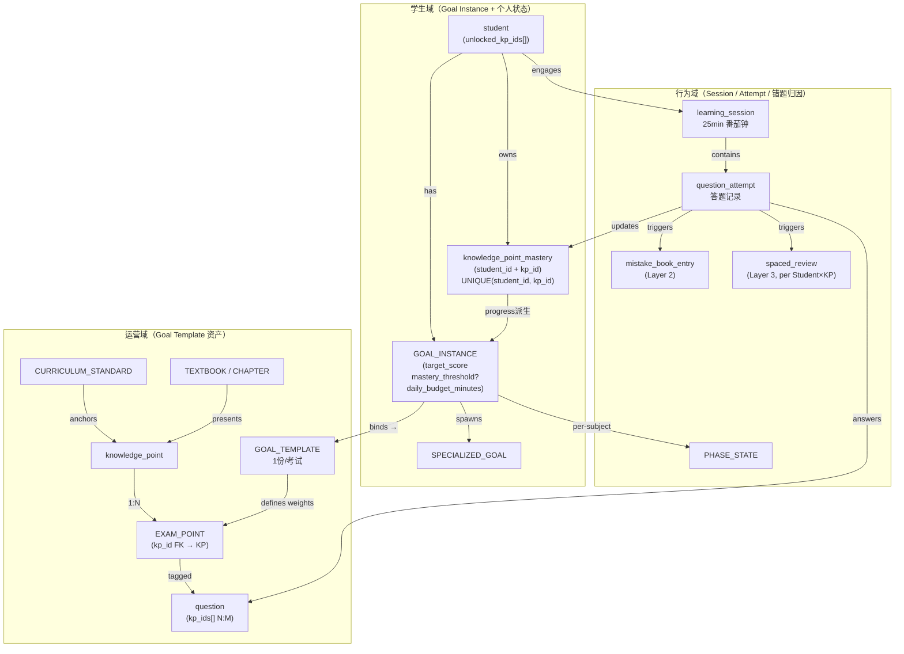

**域间传递说明：**

- 运营域 → 学生域：`GOAL_INSTANCE` 绑定 `GOAL_TEMPLATE`，继承 KP 权重与考试结构；学生个性化 override 在 `GOAL_INSTANCE` 层处理，不修改 Template。
- 学生域 → 行为域：`student` 发起 `learning_session`；`GOAL_INSTANCE.daily_budget_minutes` 控制 session 时长预算；`unlocked_kp_ids[]` 约束推荐池过滤。
- 行为域 → 学生域：`question_attempt` 结果更新 `knowledge_point_mastery`（挂 Student 域）；`GoalInstance.progress` 从 `knowledge_point_mastery` 实时派生，无双写。[决议 S1]


---

# §3 数据模型

> **权威源**：本节所有设计以 `_decisions_briefing.md` 决议为准，原 session 文档与决议冲突处以决议为准。
>
> MVP 范围：高考数学单学科，实体设计兼容多学科扩展。

---

## §3.1 ER 总图

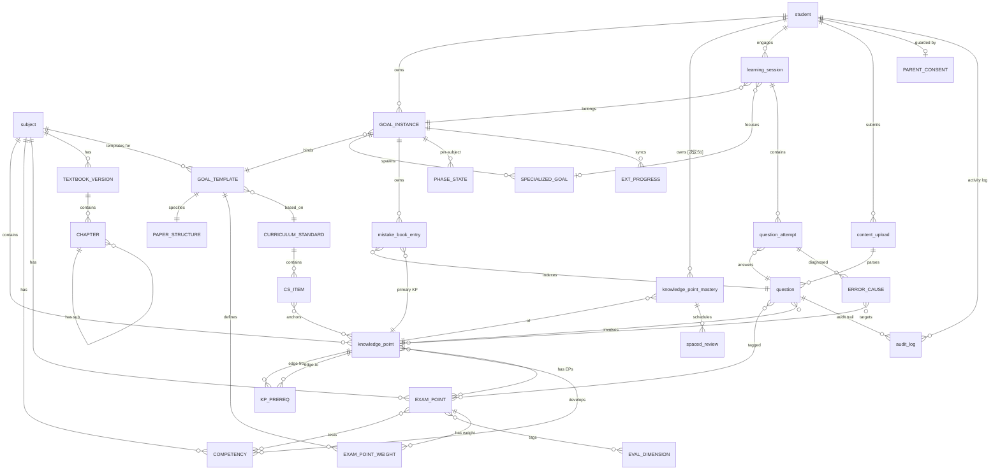

**关键修正说明**：

| 关系 | 修正前 | 修正后 | 决议 |
|---|---|---|---|
| knowledge_point_mastery 持有者 | `GOAL_INSTANCE ||--o{ knowledge_point_mastery` | `student ||--o{ knowledge_point_mastery` | [决议 S1] |
| KP-EP 关系方向 | `knowledge_point }o--o{ EXAM_POINT`（N:M） | `knowledge_point ||--o{ EXAM_POINT`（1:N） | [决议 C1-D1] |
| EXAM_POINT_MASTERY | 独立实体存在 | **整张表删除** | [决议 C1-D3] |
| GOAL_TEMPLATE 个性化字段 | 含 mastery_threshold / recommendation_mix_override | **字段删除，移入 GoalInstance** | [决议 C3-D1] |

---

## §3.2 实体清单与分组

### 运营域（15 个实体 + 关联表）

| 实体 | 职责简述 |
|---|---|
| subject | 学科+学段元信息 |
| CURRICULUM_STANDARD | 课程标准版本元信息 |
| CS_ITEM | 课标具体条目（200-300 条/学科） |
| COMPETENCY | 核心素养+水平（6×3=18 条/数学） |
| EVAL_DIMENSION | 高考评价体系一核四层四翼 |
| knowledge_point | 知识点 DAG 节点（200-400 个/数学） |
| KP_PREREQ | KP DAG 边（400-800 条） |
| EXAM_POINT | 考点，单值 kp_id 外键 [决议 C1-D1] |
| EXAM_POINT_WEIGHT | 考点在 Template 下的权重统计 |
| question | 题目（500-1000 道/数学），状态变更审计统一走 `audit_log`（target_type=`question`） |
| GOAL_TEMPLATE | 考试要求底座（MVP 1 份/考试） |
| PAPER_STRUCTURE | 卷子结构（题型/分值/时长） |
| TEXTBOOK_VERSION | 教材版本（人教A/北师/苏教...） |
| CHAPTER | 章节（含节级，支持 parent_id 自关联） |

关联表：KP_CS_LINK、KP_COMP_LINK、ITEM_EP_LINK、ITEM_KP_LINK、ITEM_COMP_LINK、ITEM_EVAL_LINK、EP_COMP_LINK、EP_EVAL_LINK、SECTION_KP_LINK

### 学生域（8 个实体）

| 实体 | 职责简述 |
|---|---|
| student | 学生基本信息 + 已解锁 KP 列表 [决议 S2] |
| GOAL_INSTANCE | 学生个人目标实例 |
| SPECIALIZED_GOAL | 二层专项目标（单线程） |
| PHASE_STATE | 学习阶段状态（per student×subject×goal） |
| EXT_PROGRESS | 学校/辅导班外部进度上下文 |
| knowledge_point_mastery | 知识点掌握度（per student×KP，跨Goal共享） [决议 S1] |
| mistake_book_entry | 错题本条目（多生命周期状态） [决议 S2-D1] |
| spaced_review | 间隔复习调度（per student×KP） [决议 S2-衍生3] |

### 行为域（3 个实体）

| 实体 | 职责简述 |
|---|---|
| learning_session | 学习会话（25 分钟番茄钟） |
| question_attempt | 单次答题记录 |
| ERROR_CAUSE | 答题错因诊断（AI 归因） |

### 合规/审计域（3 个实体）

| 实体 | 职责简述 |
|---|---|
| content_upload | 题目/试卷拍照上传记录 |
| PARENT_CONSENT | 监护人同意书记录 |
| audit_log | 通用操作 + 题目状态变更统一审计日志（按 target_type 区分） |

---

## §3.3 实体完整字段表

### 运营域

---

### subject（学科）

| 字段 | 类型 | 必选 | 说明 | 备注 |
|---|---|---|---|---|
| id | string PK | ✓ | math / physics / chemistry | 业务主键 |
| name | string | ✓ | "数学" | |
| stage | enum | ✓ | junior / senior | |
| competency_framework_ref | string | | 指向该学科核心素养清单 | |

---

### CURRICULUM_STANDARD（课程标准）

| 字段 | 类型 | 必选 | 说明 | 备注 |
|---|---|---|---|---|
| id | string PK | ✓ | std_math_2017_2020 | |
| subject_id | FK subject | ✓ | | |
| version | string | ✓ | "2017年版2020修订" | |
| publisher | string | ✓ | "教育部" | |
| issued_date | date | | | |
| pdf_url | string | | 原文 PDF | |

---

### CS_ITEM（课标条目）

| 字段 | 类型 | 必选 | 说明 | 备注 |
|---|---|---|---|---|
| id | string PK | ✓ | cs_math_4_2_1 | |
| standard_id | FK CURRICULUM_STANDARD | ✓ | | |
| theme | string | ✓ | "函数概念与性质" | |
| unit | string | | "一次函数" | |
| code | string | | "4.2.1" | |
| content_text | text | ✓ | 课标原文 | |
| academic_quality_level | string | | 学业质量水平描述 | |

---

### COMPETENCY（核心素养能力点）

| 字段 | 类型 | 必选 | 说明 | 备注 |
|---|---|---|---|---|
| id | string PK | ✓ | comp_math_logic_reasoning_l2 | |
| subject_id | FK subject | ✓ | | |
| name | string | ✓ | "逻辑推理" | |
| level | int | ✓ | 1/2/3 水平等级 | |
| description | text | | 课标原文描述 | |
| framework | enum | ✓ | core_competency | 区别于四层四翼 |

---

### EVAL_DIMENSION（高考评价体系维度）

| 字段 | 类型 | 必选 | 说明 | 备注 |
|---|---|---|---|---|
| id | string PK | ✓ | eval_layer_key_ability | |
| layer | enum | | core_value / subject_literacy / key_ability / essential_knowledge | 四层之一 |
| wing | enum | | foundation / comprehensive / application / innovation | 四翼之一 |
| description | text | | 评价体系解读 | layer 与 wing 可同时有值 |

---

### knowledge_point（知识点）

| 字段 | 类型 | 必选 | 说明 | 备注 |
|---|---|---|---|---|
| id | string PK | ✓ | kp_math_linear_func_concept | |
| subject_id | FK subject | ✓ | | |
| stage | enum | ✓ | junior / senior | |
| name | string | ✓ | "一次函数的概念" | |
| granularity_level | int | ✓ | 1 主干 / 2 子知识点 | |
| primary_cs_question_id | FK CS_ITEM | | 主关联课标条目 | |
| description | text | | 内涵描述，用于费曼判定 rubric | |
| feynman_rubric | json | | 费曼达标关键点清单 | |
| typical_study_minutes | int | | 预估学习分钟数 15-30 | |
| is_high_freq | bool | ✓ | 是否高频考点 | 影响推荐权重 |
| status | enum | ✓ | active / deprecated | AI 不可自动修改 |

---

### KP_PREREQ（知识点前置关系 DAG 边）

| 字段 | 类型 | 必选 | 说明 | 备注 |
|---|---|---|---|---|
| id | string PK | ✓ | | |
| from_kp_id | FK knowledge_point | ✓ | 前置知识点 | |
| to_kp_id | FK knowledge_point | ✓ | 后继知识点 | |
| strength | enum | ✓ | strong（必备）/ weak（推荐） | |
| reason | text | | 依赖说明 | 人审用 |

**约束**：图必须无环（系统启动时做环检测）。

---

### EXAM_POINT（考点）

> [决议 C1-D1]：EP-KP 关系改为 1:N，EXAM_POINT 持单值 `kp_id` 外键。跨 KP 的题目通过 `question.kp_ids[] N:M` 解决。

| 字段 | 类型 | 必选 | 说明 | 备注 |
|---|---|---|---|---|
| id | string PK | ✓ | ep_math_recursive_seq_construct | |
| subject_id | FK subject | ✓ | | |
| kp_id | FK knowledge_point | ✓ | **单值外键，1:N** | [决议 C1-D1]，原多对多删除 |
| name | string | ✓ | "递推数列求通项（构造法场景）" | |
| primary_competency_id | FK COMPETENCY | | 主关联能力 | |
| question_type_scenario | text | | 场景描述 | |
| description | text | | 教研说明 | |
| created_by | string | | 教研专家 | |
| approved_at | datetime | | sign-off 时间 | |

**MVP 唯一价值**：真题权重统计单元（KP_weight = Σ EPs.weight）。

---

### EXAM_POINT_WEIGHT（考点权重）

| 字段 | 类型 | 必选 | 说明 | 备注 |
|---|---|---|---|---|
| id | string PK | ✓ | | |
| exam_point_id | FK EXAM_POINT | ✓ | | |
| template_id | FK GOAL_TEMPLATE | ✓ | 不同模板下同一考点权重不同 | |
| frequency_5y | int | | 近5年出现频次 | |
| avg_score | float | | 平均分值 | |
| score_ratio | float | ✓ | 占总分比 | 推荐权重核心字段 |
| difficulty_distribution | json | | {easy:0.2, mid:0.5, hard:0.3} | |

---

### question（题目）

| 字段 | 类型 | 必选 | 说明 | 备注 |
|---|---|---|---|---|
| id | string PK | ✓ | | |
| subject_id | FK subject | ✓ | | |
| question_type | enum | ✓ | choice / fill_in | v0.1 不收 essay |
| source | enum | ✓ | gaokao_real / mock / lianlao / shengji / textbook / ai_generated | |
| source_year | int | | 2024 | |
| source_paper | string | | "新课标I卷" | |
| stem | text | ✓ | 题干 | |
| answer | text | ✓ | 标准答案 | |
| solution | text | | 详细解答 | |
| official_analysis | text | | 来自《高考试题分析》 | |
| scoring_detail | json | | 步骤分拆解 | |
| difficulty | float | ✓ | 0-1 | |
| estimated_minutes | int | | 推荐用时 | |
| score | int | | 题目分值 | |
| kp_ids | array FK | ✓ | 关联知识点（N:M） | 跨 KP 题目在此解决 [决议 C1] |
| exam_point_ids | array FK | | 关联考点 | |
| status | enum | ✓ | draft / pending_review / gray / published / under_review / deprecated | 6状态机 |
| version | int | ✓ | 版本号 | |
| created_by | enum | ✓ | human / ai | |
| reviewed_by | string | | 教研老师ID | ai_generated 必填 |
| reviewed_at | datetime | | | |
| created_at | datetime | ✓ | | |
| updated_at | datetime | ✓ | | |

**状态流转**：draft → pending_review → gray（LLM改写）/ published（真题）；published → under_review（举报≥3）→ published / draft / deprecated。

---

> 题目状态变更审计日志已统一并入通用 `audit_log`（详见本节后部 §3.3 末尾）。题目状态流转通过 `audit_log` 落盘：`target_type='question'`，`action='question.status_change'`，`payload` 内携带 `from_status / to_status / reason` 等历史字段。

---

### GOAL_TEMPLATE（目标模板）

> [决议 C3-D1]：Template = ExamRequirements 重量级语义（1份/考试）。**删除** `mastery_threshold` 和 `recommendation_mix_override`，个性化 override 进 GoalInstance。name 范例："2027 新课标 I 卷数学考试要求"。

| 字段 | 类型 | 必选 | 说明 | 备注 |
|---|---|---|---|---|
| id | string PK | ✓ | gt_2027_xkb1_math | |
| name | string | ✓ | "2027 新课标 I 卷数学考试要求" | [决议 C3] 命名改为考试要求语义 |
| year | int | ✓ | 2027 | |
| paper_type | string | ✓ | "新课标 I 卷" | |
| subject_id | FK subject | ✓ | | |
| stage | enum | ✓ | senior | |
| applicable_provinces | array string | ✓ | [安徽, 山东, 广东...] | |
| exam_mode | string | | "3+1+2" | |
| version | string | ✓ | "v1.0" | 模板版本管理 |
| based_on_standard_id | FK CURRICULUM_STANDARD | ✓ | | |
| eval_system_version | string | | "2019" | |
| kp_ids | array FK | ✓ | 关联 KP 集合 | |
| published_at | datetime | | | |
| approved_by | string | | 教研专家 | |
| status | enum | ✓ | draft / published / deprecated | |

**已删字段**（[决议 C3-D1]）：~~mastery_threshold~~、~~recommendation_mix_override~~。

---

### PAPER_STRUCTURE（卷子结构）

| 字段 | 类型 | 必选 | 说明 | 备注 |
|---|---|---|---|---|
| id | string PK | ✓ | | |
| template_id | FK GOAL_TEMPLATE | ✓ | 1:1 关系 | |
| total_score | int | ✓ | 150 | |
| duration_minutes | int | ✓ | 120 | |
| calculator_allowed | bool | ✓ | false | |
| sections | json | ✓ | [{type:单选, count:8, score_each:5}, ...] | |

---

### TEXTBOOK_VERSION（教材版本）

| 字段 | 类型 | 必选 | 说明 | 备注 |
|---|---|---|---|---|
| id | string PK | ✓ | tbv_rengjiao_a_2019 | |
| subject_id | FK subject | ✓ | | |
| publisher | string | ✓ | 人教A / 北师 / 苏教 | |
| edition | string | ✓ | "2019新版" | |
| stage | enum | ✓ | junior / senior | |
| issued_year | int | ✓ | | |

---

### CHAPTER（章节）

| 字段 | 类型 | 必选 | 说明 | 备注 |
|---|---|---|---|---|
| id | string PK | ✓ | | |
| tb_version_id | FK TEXTBOOK_VERSION | ✓ | | |
| parent_chapter_id | FK CHAPTER | | 自关联，null=章，有值=节 | |
| order_no | int | ✓ | 排序号 | |
| book_name | string | | "必修第一册" | |
| chapter_no | string | ✓ | "第三章" | |
| title | string | ✓ | "函数的概念与性质" | |

---

### 学生域

---

### student（学生）

> [决议 S2 主决议]：新增 `unlocked_kp_ids[]`；[决议 B7 待澄清]：补充 `textbook_version_id`；新增 `cold_start_mode`。

| 字段 | 类型 | 必选 | 说明 | 备注 |
|---|---|---|---|---|
| id | string PK | ✓ | | |
| name | string | ✓ | | |
| grade | int | ✓ | 7-12 年级 | |
| current_school | string | | | |
| province | string | ✓ | 决定可选模板范围 | |
| textbook_version_id | FK TEXTBOOK_VERSION | | 入驻时填写 | [待澄清 B7] |
| birthdate | date | | 推算年龄 | |
| unlocked_kp_ids | array FK | ✓ | **已学 KP 范围** | [决议 S2 主决议]，七池召回 5 个池的过滤基础 |
| cold_start_mode | bool | ✓ | 冷启动期标记 | 冷启动结束前不启用抗拒识别 [待澄清 B5] |
| guardian_consent | bool | ✓ | 监护人同意标记 | 未成年人合规前置条件 |
| created_at | datetime | ✓ | | |

---

### GOAL_INSTANCE（一层目标实例）

> [决议 S1]：删除 `completed_kp_ids[]`、`progress_pct`（改运行时派生）。
> [决议 C3-D1]：新增 `target_score`、`mastery_threshold?`、`recommendation_mix_override?`、`daily_budget_minutes`。

| 字段 | 类型 | 必选 | 说明 | 备注 |
|---|---|---|---|---|
| id | string PK | ✓ | | |
| student_id | FK student | ✓ | | |
| template_id | FK GOAL_TEMPLATE | ✓ | | |
| template_version | string | ✓ | **MVP 必须预留**，版本迁移用 | |
| target_score | int | ✓ | 目标分数，如 600 | [决议 C3-D1] 新增 |
| mastery_threshold | float | | 个人 override，null 则按 target_score 分档派生 | [决议 C3-D2]：600+→0.90, 500-600→0.85, <500→0.80 |
| recommendation_mix_override | json | | 个人推荐配比 override | [决议 C3-D3] MVP 仅运营可改；学生不开放 |
| daily_budget_minutes | int | ✓ | 每日预算（AI 建议，可手改） | [决议 C3-D1] 新增 |
| kp_scope_ids | array FK | ✓ | 从 Template 复制的 KP 集合 | |
| kp_weight_map | json | | 从 EXAM_POINT_WEIGHT 派生的 KP 权重 | |
| start_diagnosis_snapshot | json | | 冷启动诊断结果快照 | |
| deadline | date | ✓ | 截止日期（如 2027-06-07） | |
| status | enum | ✓ | active / paused / completed | |
| created_at | datetime | ✓ | | |
| last_synced_version_at | datetime | | 上次模板版本同步时间 | |

**已删字段**（[决议 S1]）：~~completed_kp_ids[]~~、~~progress_pct~~。
**进度派生**：`progress = Σ(mastery × weight) / Σ(weight) for kp ∈ kp_scope_ids`，运行时计算，不物化。

**约束**：一个学生同时只能有 1 个 `status=active` 的 GOAL_INSTANCE。

---

### SPECIALIZED_GOAL（二层专项目标）

| 字段 | 类型 | 必选 | 说明 | 备注 |
|---|---|---|---|---|
| id | string PK | ✓ | | |
| goal_instance_id | FK GOAL_INSTANCE | ✓ | 必须挂在一层下 | |
| name | string | ✓ | "函数专攻" | |
| focus_kp_ids | array FK | | 聚焦的 KP | |
| focus_ep_ids | array FK | | 聚焦的考点 | |
| triggered_by | enum | ✓ | student_manual / ai_recommendation | |
| target_deadline | date | ✓ | 强制有截止时间 | |
| status | enum | ✓ | active / completed / expired | |
| created_at | datetime | ✓ | | |

**约束**：一个 GOAL_INSTANCE 下同时只能有 1 个 `status=active` 的 SPECIALIZED_GOAL（平行赛道单线程）。

---

### PHASE_STATE（学习阶段状态）

| 字段 | 类型 | 必选 | 说明 | 备注 |
|---|---|---|---|---|
| id | string PK | ✓ | | |
| goal_instance_id | FK GOAL_INSTANCE | ✓ | | |
| subject_id | FK subject | ✓ | 学科独立 | |
| phase | enum | ✓ | new_term / consolidation / first_review / second_review / sprint | |
| urgency_score | float | | 0-1 内部连续值 | |
| updated_at | datetime | ✓ | | |
| set_by | enum | ✓ | student_manual / system_auto | |

---

### EXT_PROGRESS（外部学习上下文）

| 字段 | 类型 | 必选 | 说明 | 备注 |
|---|---|---|---|---|
| id | string PK | ✓ | | |
| goal_instance_id | FK GOAL_INSTANCE | ✓ | | |
| source | enum | ✓ | school / tutoring | |
| source_name | string | | "XX中学" | |
| subject_id | FK subject | ✓ | | |
| current_chapter_id | FK CHAPTER | | 当前讲到的章节 | |
| last_updated_at | datetime | ✓ | | |
| updated_by | enum | ✓ | student_manual / upload_inferred | |

---

### knowledge_point_mastery（知识点掌握度）

> [决议 S1]：持有者由 (GoalInstance × KP) 改为 **(Student × KP)**，跨 GoalInstance 共享。
> [决议 S2-衍生4]：删除被动衰减规则，全靠 Layer 3 spaced_review 主动召回。

| 字段 | 类型 | 必选 | 说明 | 备注 |
|---|---|---|---|---|
| id | string PK | ✓ | | |
| student_id | FK student | ✓ | **持有者改为 student** | [决议 S1] |
| subject_id | FK subject | ✓ | 学科隔离 | |
| knowledge_point_id | FK knowledge_point | ✓ | | |
| mastery_score | float | ✓ | 0-1 连续值 | 内部存储，对外显示枚举 |
| mastery_level | enum | ✓ | not_started / learning / familiar / mastered | 展示用枚举；阈值：[0,0.2)/[0.2,0.5)/[0.5,0.85)/[0.85,1] |
| confidence_count | int | ✓ | 累计答对数 | |
| failure_count | int | ✓ | 累计答错数 | |
| last_attempted_at | datetime | | | |
| feynman_verified | bool | ✓ | 是否通过费曼讲述验证 | 触发条件：mastery∈[0.6,0.85] + 距上次≥7天 |
| created_at | datetime | ✓ | 首次创建即触发 Layer 3 [决议 S2-衍生1] | |

**UNIQUE 约束**：`UNIQUE(student_id, knowledge_point_id)` [决议 S1]

**mastery 增量参考**（[决议 E]）：基础题 +0.05/-0.15，中等 +0.10/-0.08，难 +0.15/-0.03，讲述达标 +0.18。

**已删字段**（[决议 S2-衍生4]）：~~next_review_at~~（改由 spaced_review 管理）。

---

### mistake_book_entry（错题本条目）

> [决议 S2-D1]：conceptual 两阶段 `open_pending_material → open`；D2=永久 resolve；D3=长期 open 永远保留；N=2 连续变种做对自动 resolve。

| 字段 | 类型 | 必选 | 说明 | 备注 |
|---|---|---|---|---|
| id | string PK | ✓ | | |
| goal_instance_id | FK GOAL_INSTANCE | ✓ | | |
| question_id | FK question | ✓ | 错的题目 | |
| primary_kp_id | FK knowledge_point | ✓ | 主要归因 KP | [决议 S2-D5]：一题多KP时仅主KP入错题本 |
| first_error_at | datetime | ✓ | 首次出错时间 | |
| error_count | int | ✓ | 累计错误次数 | |
| latest_attempt_id | FK question_attempt | | 最近一次答题记录 | |
| root_cause_tags | array enum | | conceptual / methodological / comprehension / time_pressure | computational 不进错题本 |
| variant_correct_count | int | ✓ | 变种题连续做对计数 | [决议 S2] resolve 阈值 N=2 |
| material_read | bool | ✓ | 是否已读完关联学习材料 | conceptual 两阶段用 [决议 S2-D1] |
| status | enum | ✓ | open_pending_material / open / archived / resolved | [决议 S2-D1] 四态枚举 |
| resolved_at | datetime | | | D2：永久 resolve，不 reopen |

**注意**：careless/computational 根因**不入 mistake_book_entry**，只在 question_attempt 计数。

**召回优先级**（[决议 S2-D4]）：conceptual > methodological > comprehension > time_pressure，同根因内按 error_count 倒序。

---

### spaced_review（间隔复习调度）

> [决议 S2-衍生3]：每个 (student_id, kp_id) 仅一条 spaced_review。
> Layer 3 升级为间隔复习引擎，4 类触发器。

| 字段 | 类型 | 必选 | 说明 | 备注 |
|---|---|---|---|---|
| id | string PK | ✓ | | |
| student_id | FK student | ✓ | | |
| knowledge_point_id | FK knowledge_point | ✓ | | |
| idx | int | ✓ | 当前间隔档位 0-5 | 对应 intervals=[1,3,7,15,30,60]天 |
| next_review_at | datetime | ✓ | 下次应复习时间 | |
| source_trigger | enum | ✓ | answer_wrong / new_mastery / feynman_pass / long_term | 4类触发器 [决议 S2] |
| status | enum | ✓ | pending / done / overdue | |
| created_at | datetime | ✓ | | |
| updated_at | datetime | ✓ | | |

**UNIQUE 约束**：`UNIQUE(student_id, knowledge_point_id)` [决议 S2-衍生3]

**idx 说明**：触发器A/B 创建/重置 idx=0；触发器C 讲述达标 idx+1；触发器D mastery≥0.85+长idx→long_term。临考期≤30天：间隔×0.5。

---

### 行为域

---

### learning_session（学习会话）

| 字段 | 类型 | 必选 | 说明 | 备注 |
|---|---|---|---|---|
| id | string PK | ✓ | | |
| student_id | FK student | ✓ | | |
| goal_instance_id | FK GOAL_INSTANCE | ✓ | | |
| specialized_goal_id | FK SPECIALIZED_GOAL | | 专项 session 时填写 | |
| mode | enum | ✓ | mainline / specialized / upload_analysis | |
| planned_duration_minutes | int | ✓ | 25（番茄）| 硬截止 |
| actual_duration_minutes | int | | | |
| started_at | datetime | ✓ | | |
| ended_at | datetime | | | |
| status | enum | ✓ | running / completed / abandoned | |
| item_composition | json | | 题目构成快照 {layer1:3, layer2:5, layer3:2, ...} | |

---

### question_attempt（答题记录）

| 字段 | 类型 | 必选 | 说明 | 备注 |
|---|---|---|---|---|
| id | string PK | ✓ | | |
| session_id | FK learning_session | ✓ | | |
| question_id | FK question | ✓ | | |
| student_id | FK student | ✓ | 冗余，便于查询 | |
| answer_submitted | text | | 提交答案 | |
| answer_steps | json | | 分步骤作答 | |
| answer_image_url | string | | 拍照上传 | |
| is_correct | bool | ✓ | | |
| partial_score | float | | 0-1 部分得分 | 解答题用 |
| time_spent_seconds | int | | | |
| feynman_explanation | text | | 费曼讲述内容 | |
| feynman_score | float | | AI 对讲述的打分 | |
| source | enum | | mainline / specialized | [决议 S1-衍生1]：专项标签，mastery 增量不降权 |
| invalidated | bool | ✓ | 题目下架后标记 | 不硬删，软标记 |
| submitted_at | datetime | ✓ | | |

---

### ERROR_CAUSE（错因诊断）

| 字段 | 类型 | 必选 | 说明 | 备注 |
|---|---|---|---|---|
| id | string PK | ✓ | | |
| attempt_id | FK question_attempt | ✓ | | |
| cause_type | enum | ✓ | conceptual / methodological / comprehension / computational / time_pressure / out_of_scope | |
| confidence | float | ✓ | AI 判断置信度 | |
| evidence | text | | 判断依据 | |
| inferred_by | enum | ✓ | ai / student_confirmed / teacher | |
| target_kp_id | FK knowledge_point | | 归因到具体 KP | |

**处理逻辑**：cause_type=computational → 只计数，不触发 mistake_book_entry；其余类型→ 触发 mistake_book_entry 创建/更新。

---

### 合规/审计域

---

### content_upload（上传记录）

| 字段 | 类型 | 必选 | 说明 | 备注 |
|---|---|---|---|---|
| id | string PK | ✓ | | |
| student_id | FK student | ✓ | | |
| upload_type | enum | ✓ | error_item / paper / homework / tutoring_material | |
| file_url | string | ✓ | | |
| ocr_result | text | | OCR 识别结果 | |
| parsed_questions | array FK | | 解析出的题目 | 可能新增 question |
| analysis_result | json | | AI 分析结果 | |
| uploaded_at | datetime | ✓ | | |

---

### PARENT_CONSENT（监护人同意书）

| 字段 | 类型 | 必选 | 说明 | 备注 |
|---|---|---|---|---|
| id | string PK | ✓ | | |
| student_id | FK student | ✓ | | |
| consent_version | string | ✓ | 同意书版本号 | |
| consented_at | datetime | ✓ | | |
| guardian_name | string | ✓ | | |
| guardian_relation | enum | ✓ | parent / legal_guardian | |
| ip_address | string | | 签署 IP | 合规存档 |
| revoked_at | datetime | | 撤销时间（如适用） | |

---

### audit_log（通用审计日志）

> 题目状态审计、合规审计（注销/导出/同意确认）、运营操作审计**统一收口在此一张表**，通过 `target_type` 区分领域。字段与 `packages/db/prisma/schema.prisma` 对齐。

| 字段 | 类型 | 必选 | 说明 | 备注 |
|---|---|---|---|---|
| id | string PK | ✓ | | UUID |
| actor_id | string | ✓ | 操作发起者 ID | 学生注销 = 学生 UUID 字符串；运营操作 = 管理员 username；双角色统一存 text |
| action | string | ✓ | 受控集合 | `consent_confirmed` / `export_data_self` / `export_data` / `delete_self` / `delete_student` / `consent_withdraw`(v0.2+) / `question.status_change` |
| target_type | string | ✓ | 目标对象类型 | `student` / `question` / ... |
| target_id | string | ✓ | 目标对象 ID | |
| payload | json | | 附加信息 | IP、User-Agent、删除前快照摘要、`from_status/to_status/reason`（题目场景）等 |
| created_at | datetime | ✓ | | |

**索引**：`(actor_id, created_at)`、`(action, created_at)`。

**保留策略**：永不硬删。关联 `question.status=deprecated` 时仍保留日志。

**典型 action 与 payload 约定**：

| 场景 | action | target_type | payload 关键字段 |
|---|---|---|---|
| 题目状态流转（draft→pending→...→deprecated） | `question.status_change` | `question` | `from_status`, `to_status`, `reason` |
| 学生自助注销 | `delete_self` | `student` | 删除前快照摘要 |
| 运营代注销 | `delete_student` | `student` | `ops_user`, `reason`, 快照 |
| 学生自助导出 | `export_data_self` | `student` | `export_files[]` |
| 运营代导出 | `export_data` | `student` | `ops_user`, `export_files[]` |
| 监护人同意确认 | `consent_confirmed` | `student` | `consent_method`, IP/UA |

---

## §3.4 关键约束

### 派生字段（不入表，运行时计算）

| 派生字段 | 计算方式 | 说明 |
|---|---|---|
| GoalInstance.progress | `Σ(mastery_score × weight) / Σ(weight)` for kp ∈ kp_scope_ids | [决议 S1]，progress_pct 字段已删 |
| EP 粒度 mastery | `Σ(关联 KP mastery × KP权重)` | EXAM_POINT_MASTERY 表已删 [决议 C1-D3]，运行时算 |
| mastery_threshold（未 override 时） | target_score 分档：600+→0.90, 500-600→0.85, <500→0.80 | [决议 C3-D2] |

### UNIQUE 约束

| 约束 | 实体 | 字段 | 决议 |
|---|---|---|---|
| 学生对 KP 唯一 mastery | knowledge_point_mastery | `(student_id, knowledge_point_id)` | [决议 S1] |
| 学生对 KP 唯一调度 | spaced_review | `(student_id, knowledge_point_id)` | [决议 S2-衍生3] |
| 学生对题目单次举报 | ITEM_REPORT | `(student_id, question_id)` | Q10 规则 |
| KP DAG 边唯一 | KP_PREREQ | `(from_kp_id, to_kp_id)` | 数据一致性 |

### 软删 vs 硬删

| 实体/字段 | 策略 | 理由 |
|---|---|---|
| question（deprecated） | 软删（status=deprecated） | 审计、历史 attempt 关联 |
| question_attempt.invalidated | 软标记（bool=true）| 题目下架后不删历史答题 |
| audit_log | 永不删除 | 合规审计 |
| mistake_book_entry（resolved） | 软标记（status=resolved）| D2：永久 resolve，不 reopen；D3：long-term open 永久保留 |
| knowledge_point_mastery | 永不删除 | 学习历史不可篡改 |

### 状态机约束

| 状态机 | 规则 |
|---|---|
| question 6状态 | 单向流转为主；published → under_review → published/draft/deprecated 可回流 |
| mistake_book_entry 4态 | open_pending_material → open（材料已读后）；open → resolved（N=2变种连续做对）；archived 为运营手动操作；已 resolved 不 reopen |
| spaced_review idx | 触发A/B 重置 idx=0；触发C idx+1（上限5）；触发D 进入 long_term 保鲜 |
| GOAL_INSTANCE 活跃唯一 | 同一 student 同时只能有 1 个 active GOAL_INSTANCE |
| SPECIALIZED_GOAL 活跃唯一 | 同一 GOAL_INSTANCE 同时只能有 1 个 active SPECIALIZED_GOAL |


---

# §4 三层学习生命周期模型

## §4.1 总览

系统将学习行为抽象为三条独立运转、彼此触发但互不替代的状态链：

| 层级 | 实体粒度 | 职责 |
|---|---|---|
| Layer 1 | per Student × KP | KP 主掌握度状态机：从未解锁到已掌握 |
| Layer 2 | per Student × question | 错题本生命周期：从发现错误到攻克关闭 |
| Layer 3 | per Student × KP | 间隔复习引擎：主动召回防遗忘 |

**三层独立 + 互相触发不互相替代** [决议 S2]：
- Layer 1 状态机驱动 mastery 演化；Layer 2 捕获具体出错的题目；Layer 3 安排主动复习时机。
- 一次答题 question_attempt 可同时更新三层，但每层有独立的入口规则和退出条件。
- Layer 1 进入 MASTERED 不自动关闭 Layer 2 open 条目；Layer 2 resolved 后 Layer 3 仍按计划运转。

---

## §4.2 Layer 1：KP 主状态机

### 状态定义

| 状态 | 含义 |
|---|---|
| `LOCKED` | KP 在课程图谱中存在，但学生尚未解锁（前置未达标或章节未到） |
| `UNLOCKED_UNSEEN` | KP 已解锁，学生从未作答任何相关题目 |
| `LEARNING` | 已有 knowledge_point_mastery 记录，mastery ∈ [0, 0.5) |
| `FAMILIAR` | mastery ∈ [0.5, 0.85) |
| `MASTERED` | mastery ∈ [0.85, 1] |

### 状态机图

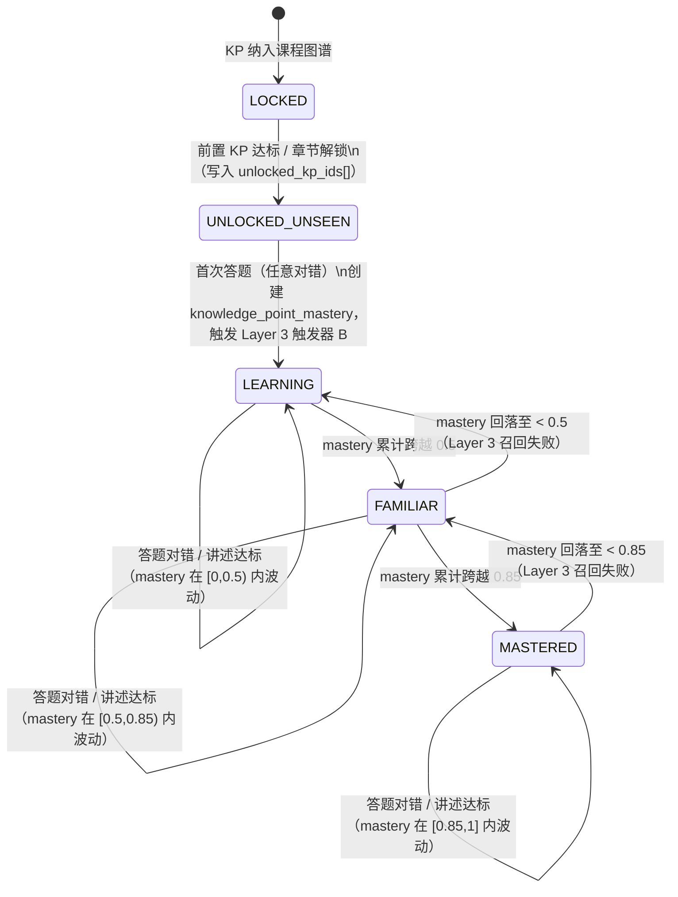

### 触发事件类型（共 4 类）

| 事件类型 | 说明 |
|---|---|
| 答题答对 | mastery 按难度档上调（见 §5.1） |
| 答题答错 | mastery 按难度档下调，同时触发 Layer 2 入口判断 |
| 讲述达标 | mastery +0.18，打 `feynman_verified` 标记，触发 Layer 3 触发器 C |
| 题目下架 | v1.5+ 实现，MVP 阶段不触发 [决议 S3 延后] |

> 注：被动时间衰减规则已删除。[决议 S2-衍生4] 防遗忘完全由 Layer 3 主动召回承担。

---

## §4.3 Layer 2：mistake_book_entry 状态机

### 入口规则（per Student × question）

答错后按根因决定是否入错题本：

| 根因 | 入口行为 |
|---|---|
| `conceptual` | 进入 `open_pending_material`（两阶段：先看材料，看完转 `open`） [决议 S2-D1] |
| `methodological` | 直接进入 `open` |
| `comprehension` | 直接进入 `open` |
| `time_pressure` | 直接进入 `open`（标记限时场景） |
| `computational` | 不进错题本，仅计数 |
| `out_of_scope` | 进入 `archived`（旁路，不参与复习调度） |

一题多 KP 时仅主 KP 入错题本，副 KP 按权重扣 mastery。[决议 S2 D5=a]

### 状态机图

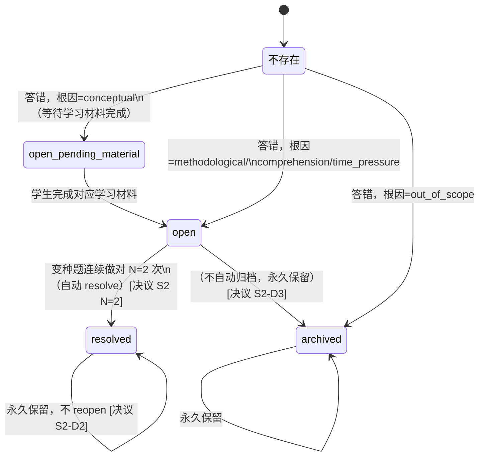

### Resolve 阈值与规则

- **N=2**：变种题连续做对 2 次自动 resolve。[决议 S2 N=2]
- 变种题定义：同 KP、同题型场景、参数/表述变化。
- resolved 后永久保留记录，不因后续答错而 reopen。[决议 S2-D2]
- long-term open 条目永久保留，不自动归档。[决议 S2-D3]
- 同 KP 多条 open 召回顺序：根因优先级 `conceptual > methodological > comprehension > time_pressure`，同根因内按 `error_count` 倒序。[决议 D4=b+c]

---

## §4.4 Layer 3：spaced_review 间隔复习引擎

### 基础规则

- 每个 (Student, KP) 仅维护**唯一一条** spaced_review 记录。[决议 S2-衍生3]
- 间隔系数：`intervals = [1, 3, 7, 15, 30, 60]` 天，下标 `idx` 从 0 递增。
- 临考压缩：距考试 ≤30 天时，间隔 × 0.5（即 1/2/4/8/15/30 天）。[决议 E 临考期]

### 4 类触发器

| 触发器 | 触发时机 | 对 spaced_review 的操作 |
|---|---|---|
| **A** | 学生答错某 KP 题（根因非 computational/out_of_scope） | 创建或重置 idx=0，next_review = now + 1天 |
| **B** | knowledge_point_mastery 首次创建（新 KP 第一次答题） | 创建 idx=0，next_review = now + 1天 [决议 S2-衍生1] |
| **C** | 讲述题达标 | idx +1（advance），next_review = now + intervals[idx] |
| **D** | mastery ≥ 0.85 且当前 idx 已达高位 | 进入 long_term 模式，使用 intervals 末尾系数保鲜 |

### 状态机图

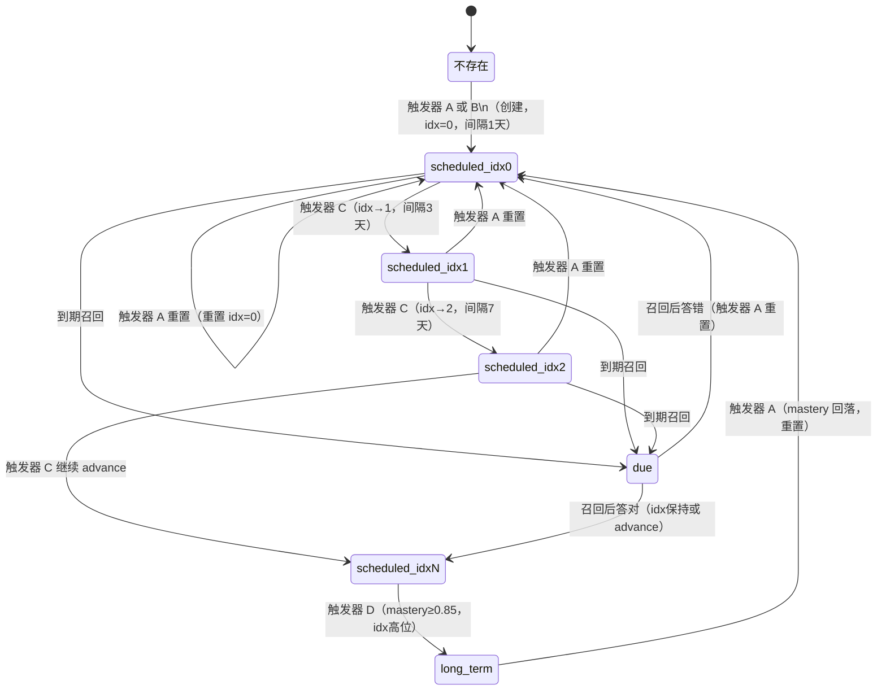

---

## §4.5 三层交互：原子事件包

每次 question_attempt 完成时，系统以如下顺序同步更新三层：

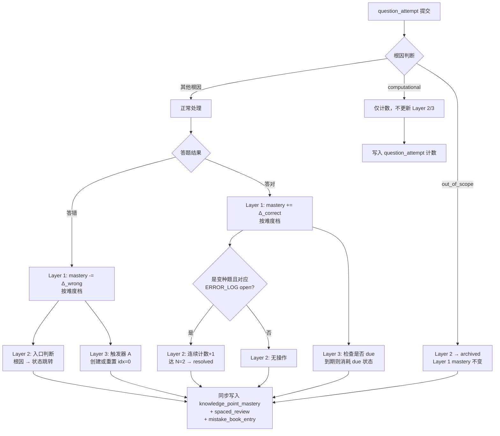

---

## §4.6 Case 1：完美学生（全对）时间线

> KP 示例：等差数列通项公式。难度全部为基础题（+0.05/次）。初始 mastery=0。

| 时间点 | 动作 | Layer 1 mastery | Layer 1 状态 | Layer 2 错题本 | Layer 3 队列 |
|---|---|---|---|---|---|
| **T0** | 解锁 KP | — | UNLOCKED_UNSEEN | 空 | 空 |
| **T1** | 首次答对基础题 | 0→0.05 | LEARNING | 无条目 | 触发器 B → idx=0，due T2 |
| **T4** | 复习答对，掌握扎实，idx advance | 0.05→0.10 | LEARNING | 无条目 | idx=1，due T7 |
| **T11** | 复习答对，继续 advance | 0.10→0.15 | LEARNING | 无条目 | idx=2，due T18 |
| **T26** | 多次答对累计，mastery 跨越 0.5 | 0.50+ | FAMILIAR | 无条目 | idx=3，due T41 |
| **T56** | 多次答对累计，mastery 跨越 0.85 | 0.85+ | MASTERED | 无条目 | 触发器 D → long_term，idx=5，due T116 |
| **T116** | long_term 复习，答对维持 | 维持 ≥0.85 | MASTERED | 无条目 | long_term 续期，due T176 |

---

## §4.7 Case 2：有错误学生（3 题 2 对 1 错）时间线

> KP 示例：等差数列通项公式。T1 答错 1 题，根因 methodological。N=2 于 T4 达成 resolve。

| 时间点 | 动作 | Layer 1 mastery | Layer 1 状态 | Layer 2 错题本 | Layer 3 队列 |
|---|---|---|---|---|---|
| **T0** | 解锁 KP | — | UNLOCKED_UNSEEN | 空 | 空 |
| **T1** | 3 题：2 对 1 错（基础题），错因 methodological | 0→(+0.05×2)-(0.15×1)=−0.05→clamp 0 | LEARNING | `open`（1条） | 触发器 B 创建；触发器 A 重置 idx=0，due T2 |
| **T4** | 变种题答对（第1次），未达 N=2 | 0→0.05 | LEARNING | open，连续计数=1 | idx 维持 0 或触发 advance |
| **T4** | 再做变种题答对（第2次），达 N=2 | 0.05→0.10 | LEARNING | `resolved`（攻克）[决议 S2 N=2] | 触发器 C → idx+1 |
| **T11** | 复习答对，正常 advance | 0.10→0.20 | LEARNING | resolved（永久保留）| idx=2，due T18 |
| **T26** | 多次答对，mastery 跨越 0.5 | 0.50+ | FAMILIAR | resolved（永久保留）| idx=3，due T41 |
| **T86** | 多次答对，mastery 跨越 0.85 | 0.85+ | MASTERED | resolved（永久保留）| 触发器 D → long_term，due T146 |
| **T146** | long_term 复习维持 | 维持 ≥0.85 | MASTERED | resolved（永久保留）| long_term 续期 |

---

# §5 Mastery 演化规则

## §5.1 分难度增减量

| 事件 | 基础题 | 中等题 | 难题 |
|---|---|---|---|
| 答对 | +0.05 | +0.10 | +0.15 |
| 答错 | −0.15 | −0.08 | −0.03 |

> 难题答错不重罚（−0.03）：鼓励学生挑战难题，降低冒险成本。
> 所有变化后 clamp 至 [0, 1]。

## §5.2 4 档阈值映射

| mastery_score（内部值） | mastery_level（对外展示） | 含义 |
|---|---|---|
| [0, 0.2) | 未开始 | 从未触达或全错 |
| [0.2, 0.5) | 学习中 | 偶尔做对，不稳定 |
| [0.5, 0.85) | 熟悉 | 大部分做对，有薄弱环节 |
| [0.85, 1] | 已掌握 | 稳定做对，进入长间隔复习 |

阈值为 MVP 初始值，上线后根据真实数据调整。

## §5.3 衰减规则

**被动时间衰减已删除。** [决议 S2-衍生4]

原 q3 §3.4 中"N 天不练按艾宾浩斯曲线衰减"规则废弃。防遗忘完全依赖 Layer 3 间隔复习引擎主动召回：
- 学生按时完成 Layer 3 排期 → mastery 通过答题正常演化（升或降）。
- 学生未按时复习 → spaced_review 标记为 overdue，下次打开系统时优先弹出；mastery 本身不因时间流逝自动下滑。

这样做的理由：被动衰减与主动复习双轨并行会产生"按时复习反而被扣分"的悖论，并使 mastery 数值对学生失去可解释性。

## §5.4 讲述题加成

讲述题（`ITEM_TYPE = concept_explanation`）达标后：
- mastery **+0.18**（决议阶段统一为 +0.18）[决议 E 讲述达标加成]
- 同时在 knowledge_point_mastery 上打 `feynman_verified = true`，记录 `feynman_verified_at`。
- `feynman_verified` 是推荐引擎独立可用的强信号，即使后续 mastery 回落，该标记依然留存（不自动清除）。
- 触发条件：mastery ∈ [0.6, 0.85] + 距上次讲述 ≥7 天 + 未 `feynman_verified`。[决议 E 讲述题触发]

## §5.5 mastery=0 二义性消解

mastery 数值为 0 存在两种完全不同的语义，系统必须在数据层和 UI 层同时区分：[决议 S2-衍生1] [Q1=c]

| 场景 | 数据状态 | UI 文案 |
|---|---|---|
| 学生从未接触该 KP | knowledge_point_mastery 记录**不存在** | "从未开始" |
| 学生接触过但 mastery 因答错 clamp 到 0 | knowledge_point_mastery 记录**存在**，`mastery_score=0` | "需要加强"（曾掌握后回落）|

实现要点：
- `mastery=0` 且有 knowledge_point_mastery 记录 → 显示"需要加强"，可附加"曾达到 XX 档"的历史峰值提示（激励学生）。
- knowledge_point_mastery 不存在 → 显示"从未开始"或不显示掌握度区域。
- 推荐引擎区分两种状态：前者优先推复习题，后者先推学习材料。


---

# §6 推荐器（7 池设计）

> 权威来源：`_decisions_briefing.md`（S2 主决议 / S2-衍生2 / S2-D4）、q7_recommender_mindmap、q8_cold_start_and_chapter_progress

---

## §6.1 池总览表

| # | 池名 | 内部 ID | 优先级 | 触发条件 | MVP 是否做 | 是否受 unlocked_kp_ids 约束 |
|---|---|---|---|---|---|---|
| 1 | 艾宾浩斯到期池 | `ebbinghaus_due` | 最高（总有） | `next_review_at <= today`，spaced_review 非空 | 是 | 是 |
| 2 | 错题本变种池 | `error_book_variant` | 高 | mistake_book_entry 存在 `status=open` 或 `open_pending_material` 的记录 | 是 | 是 |
| 3 | 新知识点池 | `new_knowledge` | 中 | Goal 范围内还有未覆盖 KP（mastery < 0.85） | 是 | 是 |
| 4 | 讲述题池 | `feynman` | 中（条件触发） | mastery∈[0.6,0.85] + 距上次≥7天 + 未 feynman_verified | 是 | 是 |
| 5 | 综合题池 | `comprehensive` | 中-低 | 多 KP mastery≥0.75 + 临考期 ≤60 天 | **否（v1.5）** | 是 |
| 6 | 挑战题池 | `challenge` | 选用（学生主动） | 学生本 session 提前做完主线，弹窗触发 | 是 | **豁免（不受约束）** |
| 7 | 灰度试用池 | `gray_pool` | 横向叠加 | 新改写题 7 天观察期，叠加于其他主池 | 是 | 遵循所属主池约束 |

**说明**：
- 池 1-5 均需过滤 `kp_id ∈ student.unlocked_kp_ids`（[决议 S2 主]）。
- 池 6 挑战题豁免 unlocked_kp_ids，可推超出已学范围的题，但不计入 mastery 演化。
- 池 7 灰度池横向叠加，不占主配比份额，其 unlocked_kp_ids 约束由所叠加的主池决定。

---

## §6.2 池 1-7 详细规则

### §6.2.1 池 1：艾宾浩斯到期池 `ebbinghaus_due`

**触发条件**：spaced_review 中存在 `next_review_at <= today` 的记录，每 session 必参与（最高优先级）。

**写入路径**：

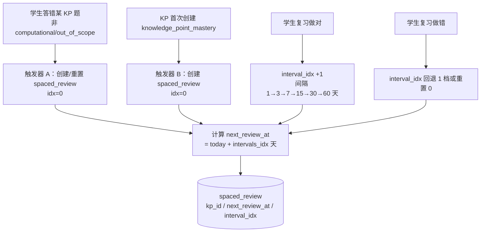

**召回过滤**：
- `kp_id ∈ student.unlocked_kp_ids`（[决议 S2 主]，[决议 S2-衍生3=P] 每个 (Student, KP) 仅一条 spaced_review）

**排序逻辑**：`next_review_at` 越早越优先；同日内按 `error_count` 倒序。

**关键参数**：

| 参数 | 值 |
|---|---|
| 间隔系数 intervals[idx] | 1 / 3 / 7 / 15 / 30 / 60 天 |
| 临考期 ≤30 天 | 间隔 × 0.5 → 1/2/4/8/15 天 |
| 冲刺期 ≤7 天 | 仅复习 mastery≥0.85 的 KP，不推新知识点 |
| 每 session 上限 | 配比 30%（默认期），60%（临考期） |

---

### §6.2.2 池 2：错题本变种池 `error_book_variant`

**触发条件**：mistake_book_entry 存在 `status=open` 或 `status=open_pending_material` 的记录。

**写入路径**：

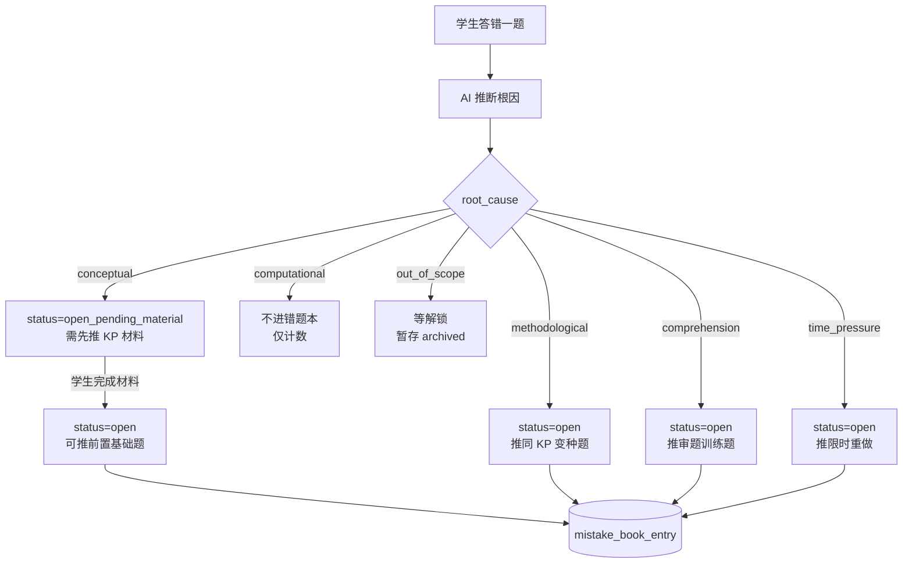

**召回过滤**：
- `status IN (open, open_pending_material)`
- `kp_id ∈ student.unlocked_kp_ids`（[决议 S2 主]）
- `out_of_scope` 记录不参与召回，等待对应 KP 解锁后再激活

**排序逻辑**（[决议 S2-D4=b+c]）：
1. 根因优先级：`conceptual > methodological > comprehension > time_pressure`
2. 同根因内：`error_count DESC`（最多失败的先做）

**5 路根因分流**：

| 根因 | 召回动作 |
|---|---|
| conceptual | 推前置 KP 基础题 + KP 学习材料（先材料后题） |
| methodological | 召回同 `scenario_tag` 变种题（非原题重做） |
| comprehension | 召回同题型审题专项题 |
| time_pressure | 原题打限时标记重推 |
| out_of_scope | 暂不召回，等 kp 进入 unlocked_kp_ids 后激活 |

**Resolve 条件**：连续 N=2 道变种做对自动 resolve；讲述题达标也触发 resolve（[决议 S2 N=2]）。

---

### §6.2.3 池 3：新知识点池 `new_knowledge`

**触发条件**：Goal 范围内存在 mastery < 0.85 的未掌握 KP。

**写入路径**：

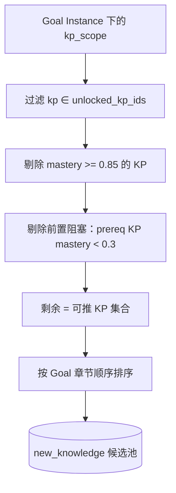

**召回过滤**：
- **显式过滤 `kp_id ∈ student.unlocked_kp_ids`**（[决议 S2 主]，硬约束，未学章节 KP 不进任何池）
- 剔除 `mastery >= 0.85`（已掌握 KP 不重推）
- 剔除前置阻塞：`prereq_kp mastery < 0.3`（v1.5 字段启用后生效；MVP 按章节顺序兜底）

**排序逻辑**：按 Goal 章节顺序；同章节内按 `mastery ASC`（最弱的优先补）。

**难度自适应**：

| mastery 区间 | 推题难度 |
|---|---|
| [0, 0.2) | 难度 1-2 基础题 |
| [0.2, 0.5) | 难度 2-3 标准题 |
| [0.5, 0.85) | 难度 3-4 进阶+变种题 |

---

### §6.2.4 池 4：讲述题池 `feynman`

**触发条件**（三个同时满足）：
1. `mastery ∈ [0.6, 0.85]`
2. 距上次该 KP 讲述 `≥ 7 天`
3. 该 KP `feynman_verified = false`

**写入路径**：

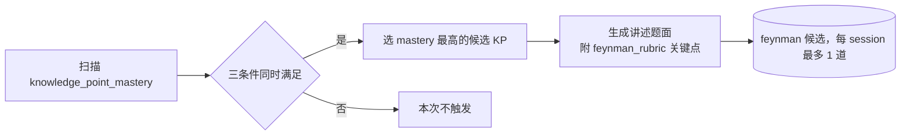

**召回过滤**：
- `kp_id ∈ student.unlocked_kp_ids`（[决议 S2 主]）
- 冷启动期（cold_start_mode=true）不触发讲述题

**排序逻辑**：每 session 选 mastery 最高的 1 个候选 KP，最多 1 道。

**关键参数**：

| 参数 | 值 |
|---|---|
| 触发 mastery 区间 | [0.6, 0.85] |
| 最小间隔 | 7 天 |
| 每 session 上限 | 1 道 |
| 达标加成 | mastery +0.18（[决议 E]） |
| Layer 3 效果 | 讲述达标 → interval_idx +1（触发器 C，[决议 S2]） |
| 题型配比 | feynman=0.05（默认期），一道题固定插入 session 末尾 |

**AI 评判**：LLM 对照 `feynman_rubric` 关键点清单评分，覆盖一半以上算达标（+0.18），准确完整为优秀（+0.18 + feynman_verified=true）。

---

### §6.2.5 池 5：综合题池 `comprehensive`（v1.5，MVP 不做）

**触发条件**：本 Goal 下相关 KP ≥ 3 个且 mastery 均 ≥ 0.75，且距高考 ≤ 60 天。

**MVP 状态**：v1.5 实现，当前文档仅占位。召回时仍需过滤 `kp_id ∈ student.unlocked_kp_ids`（[决议 S2 主]）。

---

### §6.2.6 池 6：挑战题池 `challenge`

**触发条件**：学生本 session 提前完成主线题，系统弹窗询问是否选择挑战。

**写入路径**：

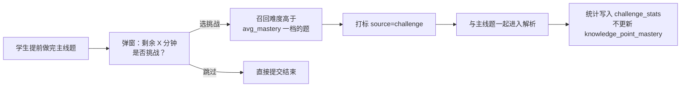

**召回过滤**：
- **豁免 `unlocked_kp_ids` 约束**（[决议任务书]，学生主动选择，可超出已学范围）
- 难度高于当前 `avg_mastery` 对应档位一档

**排序逻辑**：按难度升序，避免一上来即最高难度。

**关键规则**：
- **不计入 mastery 演化**，保护主线数据纯净（[决议任务书]）
- 答题数据写入独立 `challenge_stats` 表，用于个性化推荐参考
- 用于满足学有余力学生的进阶需求，不强制

---

### §6.2.7 池 7：灰度试用池 `gray_pool`

**触发条件**：LLM 改写产生的新题，经双 LLM 交叉验答通过，进入 7 天灰度观察期。

**写入路径**：

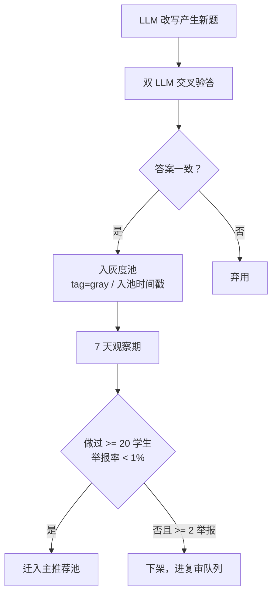

**叠加方式**（横向叠加）：
- 不占主配比份额，在其他主池召回时以 5% 比例替换候选
- 灰度组学生比例默认 5%，可配置

**召回过滤**：
- 遵循所叠加主池的 `kp_id ∈ student.unlocked_kp_ids` 约束（[决议 S2 主]）
- 灰度题对学生无感知，正常呈现

**关键参数**：

| 参数 | 值 |
|---|---|
| 灰度期长度 | 7 天 |
| 毕业条件 | ≥20 学生做过 + 举报率 < 1% |
| 下架条件 | ≥2 举报 |
| 叠加比例 | 5%（可配置） |

---

## §6.3 多池合并规则

> [决议 S2-衍生2=X]：同 KP 在多个池都有候选时，合并出题，避免同一天出现两道相同 KP 的题。

**合并逻辑**：

1. 各池独立召回候选列表（含 kp_id 标注）
2. Session 装配器对候选去重：同 `kp_id` 的多池候选，选优先级最高池的候选题
3. 优先级顺序：`ebbinghaus_due > error_book_variant > new_knowledge > feynman`
4. 被合并掉的低优先级候选从本次 session 排除（不延期到下次）
5. 灰度池按叠加逻辑独立处理，不参与此合并

**示例**：KP「等差数列通项公式」同时出现在 ebbinghaus_due 和 error_book_variant → 保留 ebbinghaus_due 的候选题，error_book_variant 的候选题本次不出。

---

## §6.4 池间配比表达式（阶段化）

| 阶段 | 触发条件 | ebbinghaus | error_book | new_knowledge | feynman | challenge |
|---|---|---|---|---|---|---|
| **冷启动第 1 周** | cold_start_mode=true，≤7天 | — | — | **1.0** | — | — |
| **冷启动第 2 周** | cold_start_mode=true，8-14天 | 0.2 | 0.3 | **0.5** | — | — |
| **默认配比** | 正常学习期 | 0.3 | 0.3 | 0.3 | 0.05 | 0.05 |
| **临考期 ≤30天** | Goal deadline ≤30天 | **0.6** | 0.3 | 0.05 | 0.05 | — |
| **冲刺期 ≤7天** | Goal deadline ≤7天 | **1.0**（仅 mastery≥0.85 KP） | — | — | — | — |

**说明**：
- 冷启动第 1 周不触发讲述题（mastery 数据不足）、不触发综合题（v1.5 之后才有）。
- challenge 池不计入配比分母，仅在学生提前完成主线时弹窗触发。
- 灰度池（gray_pool）横向叠加，不占配比份额。
- 冷启动结束条件：完成 ≥5 个正式 session，或入驻满 7 天，或学生手动跳过（[Q8 决议5]）。

---

## §6.5 信号到决策对应表

| 输入信号 | 数据来源 | 影响的池 / 决策 |
|---|---|---|
| **Mastery 向量** | knowledge_point_mastery（student_id + kp_id） | 池3 剔除 mastery≥0.85；池4 触发区间 [0.6,0.85]；池1 艾宾浩斯间隔升降档；全池难度自适应 |
| **错题本** | mistake_book_entry（status=open / open_pending_material） | 池2 全部输入；触发 5 路根因分流 |
| **艾宾浩斯队列** | spaced_review（next_review_at） | 池1 全部输入；临考期触发间隔×0.5 |
| **Goal Instance** | GoalInstance（deadline / kp_scope / target_score） | 池3 章节顺序排序；临考期阶段切换；配比阶段判断 |
| **最近表现** | question_attempt 历史（最近 N session 正确率/用时/根因分布） | 调节难度（连续失败降难度）；触发疲劳保护；冷启动结束判定 |
| **讲述题历史** | knowledge_point_mastery.feynman_verified + spaced_review 讲述时间戳 | 池4 触发条件（距上次≥7天 + 未 verified） |
| **画像偏好** | student.preference（抗拒题型 / 偏好难度） | 各池召回后二次筛选（如抗拒拍照题降权）；持续跳过讲述题则暂停池4 |
| **今日时长** | GoalInstance.daily_budget_minutes | 决定总题量（25min≈10-15道，15min≈6-8道）；按配比分配各池配额 |


---

# §7 核心流程

> 本章展示学生视角的关键产品流程。所有流程以 mermaid `flowchart` 表达，权威决议来源为 `_decisions_briefing.md`。

## 流程总览

| 编号 | 流程名称 | 触发时机 | MVP 状态 |
|---|---|---|---|
| §7.1 | 学生入驻流程 | 首次注册 | 必须实现 |
| §7.2 | 学习 Session 流程 | 学生点击"开始学习" | 必须实现 |
| §7.3 | 答题 + 错题诊断流程 | Session 提交后 | 必须实现 |
| §7.4 | 错题修复流程 | 错题进入 mistake_book_entry 后 | 必须实现 |
| §7.5 | 间隔复习召回流程 | 每日 daily 定时扫描 | 必须实现 |
| §7.6 | 讲述题流程 | Session 启动时检查候选 KP | 必须实现 |
| §7.7 | 题目下架流程 | 学生举报达阈值 | v1.5+ 实现 |

---

## §7.1 学生入驻流程

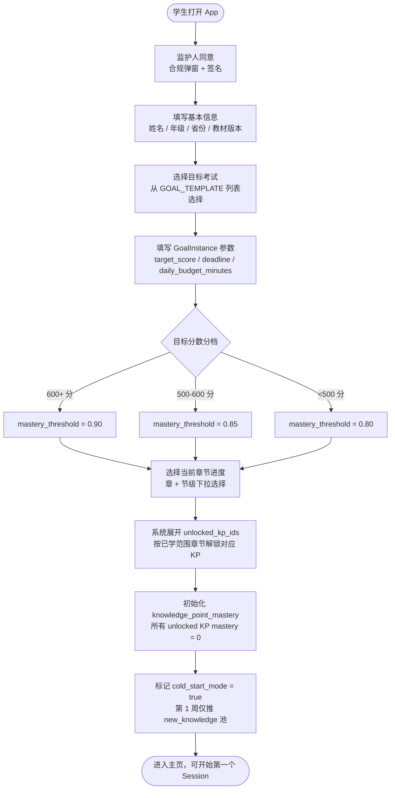

**关键约束：**

MVP 不做摸底卷（[q8 决议]）。所有 mastery 从 0 出发，依靠正式答题数据自然建立学习画像。GoalInstance 字段 `target_score` / `mastery_threshold` / `daily_budget_minutes` 均在入驻时创建（[决议 C3-D3]），GOAL_TEMPLATE 本身不存这些字段。`unlocked_kp_ids` 由章节进度决定，学生可主动勾选超前解锁未学章节，但系统会弹窗提醒。

GOAL_TEMPLATE 语义为"1 份/考试"的重量级考试要求描述（如"2027 新课标 I 卷数学考试要求"），个性化参数全部进 GoalInstance。mastery_threshold 按 target_score 自动分档派生：600+→0.90 / 500-600→0.85 / <500→0.80（[决议 C3-D2]）。MVP 教材版本仅支持人教版高中数学，其他版本 v2 扩展。

待澄清：student.textbook_version_id 字段在入驻表单必填但 ER 模型中缺失（B7 待澄清）。

---

## §7.2 学习 Session 流程

```mermaid
flowchart TD
    A([学生点击"开始学习"]) --> B[系统装配题目\n按池间配比 + 多池同 KP 合并过滤]
    B --> C[时长换算题量\ndaily_budget ÷ avg_expected_time → 8-15 道]
    C --> D[25 分钟番茄钟启动\n硬截止计时]
    D --> E[学生答题\n不允许跳题]
    E --> F{番茄钟到时\n或学生提前提交}
    F -->|到时强制提交| G[整批答案一次性提交]
    F -->|提前完成| G
    G --> H[上传拍照答案\nOCR 识别 + 学生逐题确认\n番茄钟外约 3-5 分钟]
    H --> I[AI 批量分析\n30-60 秒等待]
    I --> J[解析页展示\n对错 + 答案 + 解析 + 错因诊断 + 整体建议]
    J --> K[写入 question_attempt 记录\n含 source 标签]
    K --> L[三层原子更新]
    L --> L1[Layer 1\nMAST ERY_STATE 增减]
    L --> L2[Layer 2\nERROR_LOG 写入/更新]
    L --> L3[Layer 3\nREVIEW_SCHEDULE 创建/重置]
    L1 & L2 & L3 --> M([Session 结束])
```

**关键约束：**

同一 KP 在多个推荐池中均出现时，合并取一道，避免同 session 出现两道相同 KP 的题（[决议 S2-衍生2]）。题量范围 8-15 道由 `daily_budget_minutes` 除以题目 `expected_time` 动态计算。番茄钟 25 分钟为硬截止，不强制等满，提前完成可立即提交。

OCR 确认和解析环节不计入番茄钟计时，总耗时约 35-40 分钟。解答题走手写拍照 + AI 多模态识别路径，学生需逐题确认 OCR 结果（[q5 决议]）。OCR 修正 chat 仅允许修正识别错误，不准直接覆盖最终答案，超 N 次修正触发"疑似刷分"锁定。

三层更新独立生命周期（[决议 S2 三层]），Layer 1/2/3 并发执行，任意一层失败不影响其他层。question_attempt 记录的 `source` 字段标记来源类型：`mainline` / `specialized_drill` / `specialized`，确保不同来源数据可溯源。

---

## §7.3 答题 + 错题诊断流程

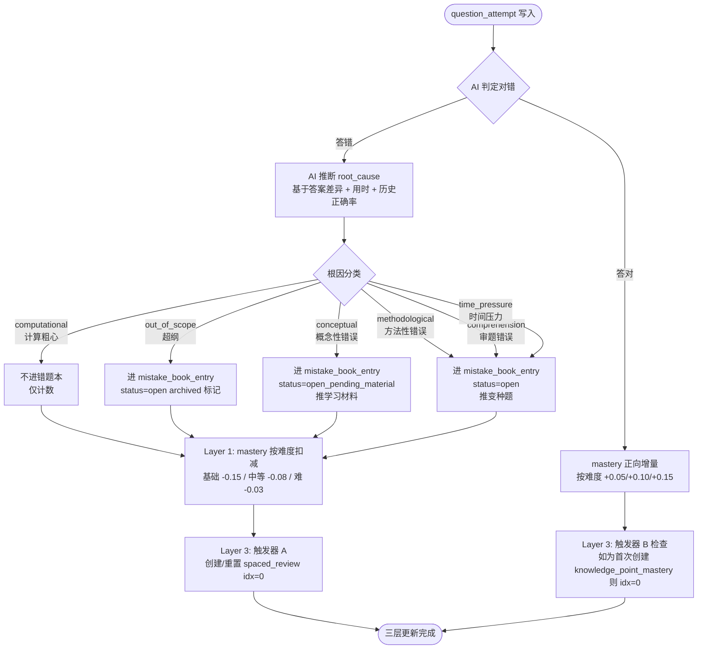

**关键约束：**

`computational` 根因不进错题本，但 mastery 照常按难度扣减。`out_of_scope` 进错题本但标记 archived，不参与后续变种题召回。`conceptual` 走两阶段：先 `open_pending_material`，推送学习材料后学生确认学完，再切为 `open` 进入变种题召回队列（[决议 D1=A]）。

AI 推断根因准确率预期 70-85%，学生可在解析页修正（`inferred_by=student_confirmed`）。一题多 KP 时，仅主 KP 进错题本，副 KP 按权重扣减 mastery（[决议 D5=a]）。Layer 3 触发器 A 在学生答错非 computational/out_of_scope 根因时触发，创建或重置 spaced_review idx=0（[决议 S2 触发器A]）。

**C4 待澄清**：不同根因的 mastery 扣减系数是否应区分（如 comprehension / time_pressure 属于"临场失误"而非"知识缺漏"，是否弱扣或不扣 KP mastery），当前 MVP 版本各根因同等扣分，待 §9 进一步澄清并决策。

---

## §7.4 错题修复流程

```mermaid
flowchart TD
    A([mistake_book_entry.status = open]) --> B{根因分类}
    B -->|conceptual| C[status = open_pending_material\n推送知识点学习材料]
    C --> D{学生确认学完材料?}
    D -->|否| C
    D -->|是| E[status 切为 open\n进入变种题召回队列]
    B -->|methodological / comprehension\n/ time_pressure / out_of_scope| E
    E --> F[下一个 Session 中\n池2 error_book_variant 召回变种题]
    F --> G[学生作答变种题 #1]
    G --> H{答对?}
    H -->|答错| I[连续计数重置\n继续留在池2 队列]
    I --> F
    H -->|答对 1 次| J[连续正确计数 = 1\n继续召回变种题 #2]
    J --> K{变种题 #2 答对?}
    K -->|答错| I
    K -->|答对| L[连续正确 N=2 达标\n[决议 S2-D1 N=2]]
    L --> M[mistake_book_entry.status = resolved\nresolved_at 写入\nresolved_method = variant_done]
    M --> N([错题攻克完成])
```

**关键约束：**

错题 resolve 阈值为连续做对变种题 N=2 次（[决议 S2-D1, N=2]）。连续性指"相邻两道变种题均正确"，中间插入其他 KP 的题不中断计数，但答错同 KP 任何题目则重置计数。resolved 后永久不 reopen（[决议 D2=a]）。长期 open 的错题永久保留，不自动归档（[决议 D3=a]）。

同一 KP 有多条 open 错题时，召回顺序按根因优先级排列：conceptual > methodological > comprehension > time_pressure，同根因内按 `error_count` 倒序（[决议 D4=b+c]），确保最顽固的错误优先被处理。一题多 KP 时仅主 KP 进错题本，副 KP 按权重扣 mastery（[决议 D5=a]）。

conceptual 两阶段的学习材料由推荐引擎根据 KP 关联的知识点讲解内容推送，学生完成后手动确认"我已学完"，系统才切换 status 进入变种题队列。

---

## §7.5 间隔复习召回流程

```mermaid
flowchart TD
    A([每日 daily 扫描任务]) --> B[查询 spaced_review\nnext_review_at <= today]
    B --> C{有到期记录?}
    C -->|否| Z([无操作])
    C -->|是| D[加入下一个 Session\n池1 ebbinghaus_due 候选]
    D --> E[Session 中学生作答该 KP 题目]
    E --> F{答对?}
    F -->|答对| G[spaced_review idx + 1\n下次间隔变长\nintervals = 1/3/7/15/30/60 天]
    F -->|答错| H[spaced_review idx 重置 = 0\n下次间隔 = 1 天]
    G --> I{mastery >= 0.85\n且 idx 已达长间隔?}
    I -->|否| J[更新 next_review_at\n= today + intervals[new_idx]]
    I -->|是| K[进入 long_term 长间隔保鲜\n每 60+ 天一次 [决议 S2 触发器D]]
    H --> J
    J --> L([等待下次到期])
    K --> L
```

**关键约束：**

每个 (Student, KP) 仅维护一条 spaced_review 记录（[决议 S2-衍生3]），避免重复调度。knowledge_point_mastery 首次创建时即触发 Layer 3，创建 idx=0 的复习计划（[决议 S2-衍生1]），实现"新学保鲜"——即使学生第一次接触某 KP 就答对，也会在 1 天后被复习召回。

全局 mastery 被动衰减规则已删除（[决议 S2-衍生4]），复习保鲜完全依赖 Layer 3 主动召回驱动。这意味着学生长期不练习时 mastery 数值不会自动下降，但下次遇到该 KP 题目时若答错，mastery 会按正常扣减规则更新。

临考期（距 deadline ≤30 天）间隔缩短为 ×0.5，即 1/2/4/8/15 天（[决议 E 关键数值]）。间隔系数数组 `intervals[idx] = [1, 3, 7, 15, 30, 60]` 天，idx 上限为 5（60 天），之后进入 long_term 保鲜模式每 60+ 天一次。

---

## §7.6 讲述题流程

```mermaid
flowchart TD
    A([Session 启动时检查]) --> B[扫描候选 KP\nmastery ∈ 0.6,0.85 且距上次讲述 ≥ 7 天\n且 feynman_verified = false]
    B --> C{有候选 KP\n且非冷启动期?}
    C -->|否| Z([本 Session 不插入讲述题])
    C -->|是| D[插入 1 道讲述题\n至 Session 题目序列中]
    D --> E[学生看到讲述题\n题干："请用自己的话解释……"]
    E --> F{学生选择}
    F -->|跳过| G[跳过计数 + 1\nmastery 不变]
    F -->|作答 打字输入| H[学生提交文本\n≥ 50 字建议]
    H --> I[LLM 评判\n对比知识点 rubric 关键点清单]
    I --> J{三档评定}
    J -->|未达标\n字数 <30 或内容无关| K[不算过\n建议重讲\nmastery 不变]
    J -->|达标\n内容相关覆盖关键概念| L[算过\nmastery 维持\nfeynman_verified = true\n给出补充建议]
    J -->|优秀\n准确完整有自己表达| M[算过\nmastery + 0.18\nfeynman_verified = true\nLayer 3 idx + 1 [决议 Q3=a]]
    K --> N([返回解析页])
    L --> N
    M --> N
    G --> O{连续跳过 ≥ N 次?}
    O -->|是| P[暂停对该学生触发讲述题]
    O -->|否| N
```

**关键约束：**

讲述题作为一种题型（`ITEM_TYPE = concept_explanation`）插入主线 Session，不是独立模式。每个 Session 最多 1 道讲述题。冷启动期（第 1 周 / 前 5 个 Session）不触发讲述题（[q8 决议]），因为 mastery 数据量不足以可靠判断触发条件。

触发条件三合一：mastery ∈ [0.6, 0.85]（接近掌握但未过线）+ 距上次该 KP 讲述 ≥7 天（避免反复打扰）+ feynman_verified = false（已通过的 KP 不重复触发）。讲述达标加成 +0.18（[决议 E 关键数值]），优秀档同时推进 Layer 3 idx +1（[决议 Q3=a]），相当于讲述题"消耗"了一次间隔复习机会。

讲述内容为未成年人原创文字，需监护人同意存储，不用于 AI 训练，保留 ≤1 学年（合规约束）。MVP 输入方式为打字，语音输入列入路线图。LLM 评判 rubric 由教研老师为每个 KP 写定关键点清单（5-10 条），覆盖一半要点算达标，AI 可出 70% 草稿，剩 30% 人审。

---

## §7.7 题目下架流程（v1.5+）

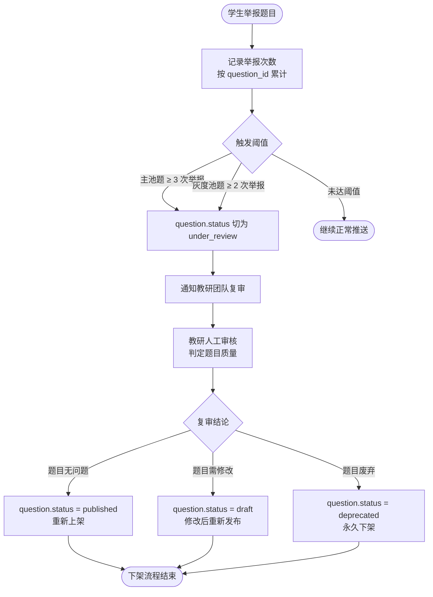

**关键约束：**

题目下架回滚事务模型（含 INVALIDATION_JOB + REPLAY_TASK 重放引擎）在 MVP 阶段不实现（[决议 S3 延后 ⏸]）。MVP 阶段 `under_review` 期间题目暂停推送，但已产生的 question_attempt 历史数据不做回滚处理，等 MVP 后收集到真实错题率数据再设计完整回滚方案。

v1.5 实装时需补充 5 种下架原因（答案错 / 题干歧义 / 解析错 / 超纲 / 其他）的分级处理规则。已分析的 5 个待决策点 D1-D5 及重放引擎方案（INVALIDATION_JOB + REPLAY_TASK）在决议 S3 中有详细记录，实装时参考。

---

> **图例说明**：矩形 `[]` = 系统/用户动作；菱形 `{}` = 判断分支；圆角 `([])` = 流程起止点。决议标签格式 `[决议 XY]` 对应 `_decisions_briefing.md` 中的具体决议编号。

## 跨流程约束

**三层更新一致性**：§7.2 Session 流程和 §7.3 诊断流程均会触发三层更新。三层独立生命周期，不互相阻塞。Layer 1 控制 KP 主状态（LOCKED → UNLOCKED_UNSEEN → LEARNING → FAMILIAR → MASTERED），Layer 2 控制单道题错误记录，Layer 3 控制复习调度。

**cold_start_mode 保护**：入驻后第 1 周（或前 5 个 Session）处于 cold_start_mode，期间不触发讲述题（§7.6）、不推综合题，仅 new_knowledge 池出题，难度自适应敏感度调高（错 1 道降难度 / 对 2 道升难度）。

**knowledge_point_mastery 外键**：mastery 归属于 `student_id + knowledge_point_id`（[决议 S1]），不归属于 GoalInstance。多个 GoalInstance 共享同一套 mastery 数据，进度由运行时 `Σ(mastery × weight) / Σ(weight)` 派生计算。

**unlocked_kp_ids 边界**：七池中受约束的 5 个池（new_knowledge / error_book_variant / ebbinghaus_due / feynman / comprehensive）统一加 `kp_id ∈ unlocked_kp_ids` 过滤（[决议 S2 主决议]），未解锁 KP 的题目不会出现在任何推荐池中。


---

# §8 决策记录（Audit Trail）+ §9 待澄清问题

---

## §8 决策记录

### §8.1 已闭环决议

---

#### §8.1.1 决议 S1 — Mastery 持有者改为 (Student × KP × Subject) [✅ 闭环]

| 字段 | 内容 |
|------|------|
| 闭环日期 | 2026-06-01 |
| 原冲突 | 旧设计将 `knowledge_point_mastery` 绑定到 `goal_instance_id`，导致同一学生学同一 KP 时多个 GoalInstance 各自持有独立 mastery，互不相认，数据重复且语义混乱 |

**决议要点：**

- **外键变更**：`knowledge_point_mastery` 主键改为 `(student_id, knowledge_point_id)`，移除 `goal_instance_id` 外键
- **唯一约束**：`UNIQUE(student_id, knowledge_point_id)`，每个学生对每个 KP 仅一条 mastery 记录
- **进度派生**：GoalInstance 不持有 mastery 字段；进度在运行时派生：
  ```
  progress = Σ(mastery × weight) / Σ(weight)   for kp ∈ goal_instance.kp_scope
  ```
- **衍生 1 — 专项不降权**：专项 GoalInstance 产生的 question_attempt 不降权，仅打 `source=specialized` 标签，与普通 question_attempt 同等参与 mastery 演化
- **衍生 2 — 删除全局衰减**：paused 期间 mastery 不再被动衰减（原设计中的 §3.4 被动衰减规则删除）；mastery 维持全靠 Layer 3 间隔复习主动召回（详见 §8.1.2）

**改动文件位置：**

- ER 图：删除 `knowledge_point_mastery.goal_instance_id`，更新 PK/FK 定义
- `§4 数据模型` knowledge_point_mastery 表结构
- `§5 算法` 进度计算公式由"字段读取"改为"运行时派生"
- `§3.4` 删除被动衰减规则段落

**顺带闭环 B1**：见 §8.1.5。

---

#### §8.1.2 决议 S2 — 已学范围 + Layer 3 升级 + 三层生命周期 + mistake_book_entry 生命周期 [✅ 闭环]

| 字段 | 内容 |
|------|------|
| 闭环日期 | 2026-06-02 |
| 原冲突 | "已学范围"概念未字段化；Layer 3 仅是简单的艾宾浩斯定时器；三层（KP 状态/mistake_book_entry/spaced_review）生命周期彼此耦合；mistake_book_entry resolve 规则分散不一致 |

**主决议 — 已学范围字段化（方案 A）：**

- `student.unlocked_kp_ids[]` 字段，显式记录学生已解锁的 KP 集合
- Q7 七池中受约束的 5 个池统一在查询层加过滤条件：`kp_id ∈ student.unlocked_kp_ids`

**4 个衍生决议：**

| 编号 | 结论 | 说明 |
|------|------|------|
| 衍生 1=A | knowledge_point_mastery 首次创建即触发 Layer 3 | 触发器 B（新学保鲜），即使此时 mastery=0 也立即注册间隔复习 |
| 衍生 2=X | 同 KP 多池合并去重 | 同一天同一 KP 不从多个池各出一题，合并后只取一题 |
| 衍生 3=P | 每个 (Student, KP) 仅一条 spaced_review | 避免同 KP 多条调度记录冲突 |
| 衍生 4=N | 删除被动衰减规则 | 与 S1-衍生2 联动，q3 §3.4 被动衰减段落整体删除 |

**Layer 3 升级为"间隔复习引擎"— 4 类触发器：**

| 触发器 | 条件 | 动作 |
|--------|------|------|
| A（答错触发） | 学生答错某 KP 题，且根因非 computational / out_of_scope | 创建或重置 spaced_review，idx=0 |
| B（新学保鲜） | knowledge_point_mastery 首次创建 | 创建 spaced_review，idx=0 |
| C（讲述达标） | 讲述题评分达标 | idx +1（advance 一档） |
| D（长期保鲜） | mastery ≥ 0.85 且已到长间隔档 | 进入 long_term 模式，使用最长间隔保鲜 |

间隔系数：`intervals[idx] = [1, 3, 7, 15, 30, 60]` 天；临考期（≤30 天）× 0.5 → `[1, 2, 4, 8, 15]` 天。

**三层独立生命周期：**

| 层 | 实体 | 粒度 | 职责 |
|----|------|------|------|
| Layer 1 | KP 状态机 | Student × KP | LOCKED → UNLOCKED_UNSEEN → LEARNING → FAMILIAR → MASTERED |
| Layer 2 | mistake_book_entry | Student × question | 单题错误追踪，独立于 KP 状态 |
| Layer 3 | spaced_review | Student × KP | 间隔复习调度，独立于 KP 状态机 |

**UI/产品决策（Q1-Q3）：**

| 问题 | 结论 |
|------|------|
| Q1 mastery=0 文案 | 显示"需要加强"；区分"从未掌握"vs"曾掌握后回落"两种文案 |
| Q2 长间隔难度（MVP vs 长期） | MVP=b：低半档保稳；长期=a：匹配当前 mastery 档位，答错仅回退 1 档 |
| Q3 讲述题与 Layer 3 关系 | 讲述题通过触发器 C 消耗 Layer 3 一档 idx（advance） |

**mistake_book_entry 生命周期决策（D1-D5 + N）：**

| 决策点 | 结论 | 说明 |
|--------|------|------|
| D1 conceptual 流程 | 两阶段：`open_pending_material` → 学完材料 → `open` | conceptual 错题先推学习材料，完成后才进入可复习池 |
| D2 resolve 是否可 reopen | 永久 resolve（不 reopen） | 同一题下次答错开新条 |
| D3 长期 open 归档 | 永远保留，不自动归档 | 由学生或运营手动清理 |
| D4 同 KP 多条 open 召回顺序 | 根因优先级：conceptual > methodological > comprehension > time_pressure；同根因内按 error_count 倒序 | |
| D5 一题多 KP 入错题本 | 仅主 KP 入错题本；副 KP 按权重扣 mastery | `question.primary_kp_id` 决定归属 |
| N | N=2 连续变种做对自动 resolve | "变种"指同 KP 不同题号 |

---

#### §8.1.3 决议 C1 — EXAM_POINT vs KP 关系定为 1:N [✅ 闭环]

| 字段 | 内容 |
|------|------|
| 闭环日期 | 2026-06-02 |
| 原冲突 | 旧设计中 EP 与 KP 为 M:N（含 EXAM_POINT_MASTERY 派生表），与 q10 §3.1 的 1:N 描述矛盾，且维护两层 mastery 代价过高 |

**决议要点：**

| 决策点 | 结论 |
|--------|------|
| D1 EP-KP 关系 | 1:N；EP 持有单值外键 `kp_id` |
| D2 两层 mastery | 删除"两层 mastery"提法，仅维护 KP 粒度 mastery |
| D3 EXAM_POINT_MASTERY 表 | 删除，含派生视图一并移除 |
| 跨 KP 题目 | 通过 `question.kp_ids[]`（N:M）解决，不靠 EP 层 |
| EP 在 MVP 的价值 | 唯一保留理由：真题权重统计单元（`KP_weight = Σ EPs.weight`） |
| ER 符号 | KP-EP 关系从 `}o--o{` 改为 `\|\|--o{` |

---

#### §8.1.4 决议 C3 — Goal Template 单层重量级 + Instance override [✅ 闭环]

| 字段 | 内容 |
|------|------|
| 闭环日期 | 2026-06-02 |
| 原冲突 | GOAL_TEMPLATE 同时承担"考试要求基准"和"个性化参数载体"两种语义，且存在"多套 Template 按目标分数切换"的过度设计 |

**决议要点：**

- **D1=② 单层语义**：GOAL_TEMPLATE = ExamRequirements 重量级语义，**1 份/考试**，名称范例："2027 新课标 I 卷数学考试要求"（废弃"2026 冲刺 600 分"命名）
- **D2=(b) mastery_threshold 派生**：按 `target_score` 分档自动派生，不在 Template 显式存储：
  - target_score ≥ 600 → mastery_threshold = 0.90
  - 500 ≤ target_score < 600 → mastery_threshold = 0.85
  - target_score < 500 → mastery_threshold = 0.80
- **D3=(a) recommendation_mix_override**：MVP 仅运营可改，web端不开放
- **"多套 Template 并行按分数切换"提法废弃**

**字段变更：**

| 实体 | 操作 | 字段 |
|------|------|------|
| GOAL_TEMPLATE | 删除 | `mastery_threshold`, `recommendation_mix_override` |
| GoalInstance | 新增 | `target_score`, `mastery_threshold?`, `recommendation_mix_override?`, `daily_budget_minutes` |

---

#### §8.1.5 顺带闭环 B1 — 专项 mastery 归属 [✅ 闭环]

| 字段 | 内容 |
|------|------|
| 闭环日期 | 2026-06-01（随 S1 一并闭环） |
| 原冲突 | 专项 GoalInstance 的 question_attempt 产生的 mastery 变化应归属哪个 GoalInstance 不明确 |

**结论**：因 S1 将 mastery 提升到 Student × KP 粒度，专项 GoalInstance 的 question_attempt 与普通 question_attempt 共享同一条 knowledge_point_mastery，归属问题自然消解。question_attempt 打 `source=specialized` 标签用于日志追溯，不影响 mastery 计算权重。

---

### §8.2 延后决议

---

#### §8.2.1 决议 S3 — 题目下架回滚事务模型 [⏸ 延后]

| 字段 | 内容 |
|------|------|
| 延后日期 | 2026-06-02 |
| 延后原因 | MVP 阶段题库规模小（30-50 个 KP），题目下架场景极少，过早设计回滚引擎会增加不必要复杂度 |

**已完成分析（留存以备后续）：**

5 种下架原因及分级处理思路：

| 原因类型 | 影响 mastery | 影响 mistake_book_entry | 建议处理 |
|---------|-------------|---------------|---------|
| 答案错误 | 回滚相关 question_attempt | 相关错题 reopen | 重放演算 |
| 题干歧义 | 视严重程度 | 可选 reopen | 人工审核后决定 |
| 解析错误 | 不影响 mastery | 不影响 | 仅更新解析 |
| 超纲题目 | 相关 question_attempt 作废 | 关闭错题 | 批量作废 |
| 其他 | 不处理历史数据 | 不处理 | 软下架 |

已设计重放引擎方案要点：

- `INVALIDATION_JOB`：批量标记受影响 question_attempt
- `REPLAY_TASK`：按时间序重放剩余有效 question_attempt，重新演算 mastery

5 个待决策点（D1-D5）：事务边界 / 并发锁 / 重放性能 / 部分回滚 / 用户通知时机

**MVP 结论：不实现题目下架功能**。待错题率数据积累后（预计 v0.2 后）重新评估方案。

---

## §9 待澄清问题

### §9.1 概念跨越类

---

#### §9.1.1 C2 — Question 实体的"用户上传题"归属 [⏳ 待澄清]

**原冲突描述：**

- q10 question 实体设计为有 6 态审核工作流（`draft → under_review → approved → published → deprecated → archived`），适配运营管控的题库题目
- q5 拍照上传场景产生的"题"无 `kp_ids`、无 `difficulty`，直接塞进 question 会破坏 6 态流程的前置约束

**影响范围：**

- question 表结构与约束
- 出题池查询逻辑（需过滤 `source=user_upload` 的条目）
- 错题本归属（用户上传题能否入 mistake_book_entry）
- 内容安全/审核流程

**候选方案：**

| 方案 | 描述 | 优点 | 缺点 |
|------|------|------|------|
| (a) 独立 USER_UPLOADED_ITEM 表 | 拍照题单独建表，与 question 完全隔离 | 不污染题库主表，约束清晰 | 复用逻辑需双查询，维护两套 |
| (b) question.source=user_upload 强制 status=draft | 复用 question 表，source 字段区分，draft 状态跳过审核约束 | 结构统一，查询简单 | draft 语义污染（运营草稿 vs 用户上传混在一起） |

**建议优先级：暂搁置**（MVP 不实现拍照上传，问题不触发；v0.2 规划拍照功能时再决策）

---

#### §9.1.2 C4 — 错题根因信号丢失 [⏳ 待澄清]

**原冲突描述：**

当前 mastery 演化规则（Q3）仅将 `root_cause=computational` 作为特例（答错不扣 KP mastery），其余四类根因（`comprehension / methodological / time_pressure / conceptual`）均按同等系数扣分。这意味着：

- `time_pressure`（不是不会，是来不及）和 `comprehension`（审题失误）与真正的概念不懂 `conceptual` 扣分相同
- 信号噪声导致 mastery 被低估，触发不必要的复习任务

**影响范围：**

- mastery 演化公式（`§5 算法`）
- Layer 3 触发器 A 的触发条件（当前排除 computational，是否也排除 time_pressure）
- 复习调度频率（误扣导致 Layer 3 过早触发）

**候选方案：**

| 方案 | 描述 |
|------|------|
| (a) 按根因拆系数 | comprehension/time_pressure 扣分系数 × 0.3；methodological × 0.6；conceptual 全扣；computational 不扣 |
| (b) 仅排除 time_pressure | time_pressure 不扣 mastery 且不触发 Layer 3；其余保持现状 |
| (c) 维持现状 | 等实测数据验证 mastery 低估是否显著 |

**建议优先级：P2**（设计上明确系数表，MVP 可先用简化版（c），有数据后按（a）调整）

---

### §9.2 边界不清类

---

#### §9.2.1 B2 — 临考期触发主语 [⏳ 待澄清]

**原冲突描述：**

临考期（≤30 天 / ≤7 天）的判断主语未统一。两种候选：

- `GOAL_INSTANCE.deadline`：基于考试截止日期判断
- `PHASE_STATE.phase = sprint`：基于算法识别的冲刺阶段判断

**影响范围：**

- Layer 3 间隔系数缩短逻辑的触发入口
- 多目标场景（学生同时有数学/英语两个 GoalInstance）时：两个 deadline 不同，冲刺期叠加如何处理
- 推荐算法的 session 组题权重

**候选方案：**

| 方案 | 描述 |
|------|------|
| (a) 绑定主目标 deadline | 每个 GoalInstance 独立判断临考期；专项 GoalInstance 不触发主线临考模式 |
| (b) 绑定 PHASE_STATE.phase | 由算法综合所有目标判断，统一进入冲刺期 |

**建议优先级：P1**（影响核心调度逻辑，需在 §5 算法定稿前明确）

---

#### §9.2.2 B3 — specialized_drill 数据归属 [⏳ 待澄清]

**原冲突描述：**

Q3 §4.4 定义了次级专项练习（`specialized_drill`，每次 5 题穿插在主 session 中）。该模式在以下两个规则上存在空白：

1. specialized_drill 中答错的题，是否进入 mistake_book_entry（错题本）？
2. 是否触发 Layer 3（艾宾浩斯间隔复习）？
3. Q7 七池定义未包含 specialized_drill 来源题目

**影响范围：**

- mistake_book_entry 写入逻辑
- spaced_review 触发条件
- 七池定义完整性

**候选方案：**

| 方案 | 描述 |
|------|------|
| (a) 与普通题同等对待 | specialized_drill 答错同样进错题本 + 触发 Layer 3 |
| (b) 仅统计，不触发 | specialized_drill 结果仅记录 question_attempt，不写 mistake_book_entry，不触发 Layer 3 |

**建议优先级：P2**（MVP specialized_drill 量少，影响可控；但需在数据模型中明确 question_attempt.source 字段的处理分支）

---

#### §9.2.3 B4 — OCR 防作弊锁定后路径 [⏳ 待澄清]

**原冲突描述：**

Q4/Q5 设计了 OCR 拍照防作弊机制，但锁定触发后的后续状态未定义：

- 锁定后当前 question_attempt 的最终状态（`abandoned` / `invalid` / 保留 `in_progress`）
- 当前 session 的完成判定（锁定 1 题是否终止整个 session）
- 锁定是否影响 mastery 演化（视为答错 / 不计入 / 特殊标记）

**影响范围：**

- question_attempt 状态机定义
- SESSION 完成判定逻辑
- mastery 演化触发条件
- 用户端体验（是否给申诉入口）

**候选方案：**

| 维度 | 方案 A | 方案 B |
|------|--------|--------|
| question_attempt 状态 | → `invalid`，不计 mastery | → `suspected_cheat`，人工复审 |
| session 判定 | 跳过该题，session 正常完成 | 终止 session |
| mastery 影响 | 不影响 | 视同答错 |

**建议优先级：P1**（影响核心状态机，防作弊上线前必须明确）

---

#### §9.2.4 B5 — 冷启动期抗拒识别误识别 [⏳ 待澄清]

**原冲突描述：**

Q9 抗拒识别算法在第 1 周（冷启动期）即可触发，但此时：

- 样本量少（题型偏好、正确率基线均未稳定）
- 系统尚未适配学生节奏
- 误识别为"抗拒"可能适得其反（提前推材料或换题型，影响信任感）

**影响范围：**

- Q9 抗拒识别触发条件
- Layer 1 KP 状态机的推进速度
- 学生冷启动期体验

**候选方案：**

| 方案 | 描述 |
|------|------|
| (a) 累计阈值 | 同题型累计 N≥10 道后才启用抗拒识别 |
| (b) 冷启动结束前禁用 | 前 N 天（如 7 天）内完全不运行 Q9 逻辑 |
| (c) 降低置信度阈值 | 冷启动期识别阈值提高（更保守），减少误触 |

**建议优先级：P2**（MVP 用户少，误识别影响可接受；但应在上线前写入算法说明文档，防止被遗忘）

---

#### §9.2.5 B6 — 章节自动软推断与跳章约束矛盾 [⏳ 待澄清]

**原冲突描述：**

- q8 §3.4 描述"自动软推断章节进度"：系统可根据答题表现自动推断学生实际所在章节
- MVP 设计原则明确"不能跳章"：学生必须按顺序解锁 KP

二者逻辑自相矛盾：若软推断结果指向"学生实际已在第 5 章"，但系统不允许跳章，推断结论无法被应用。

**影响范围：**

- `student.unlocked_kp_ids` 的更新策略
- 章节解锁触发逻辑
- 入驻流程（是否有诊断测试决定起点）

**候选方案：**

| 方案 | 描述 |
|------|------|
| (a) 入驻诊断一次性推断 | 仅在入驻时做诊断测试，确定起始章节；之后严格顺序解锁 |
| (b) 保留软推断仅作提示 | 系统推断结果只做 UI 提示（"你可能已掌握 X"），不自动解锁 |
| (c) 放开跳章限制 | 取消"不能跳章"约束，允许软推断直接解锁 |

**建议优先级：P1**（直接影响 `student.unlocked_kp_ids` 写入逻辑与入驻流程设计）

---

#### §9.2.6 B7 — student.textbook_version_id 字段缺失 [⏳ 待澄清]

**原冲突描述：**

入驻流程要求学生填写省份 + 教材版本（如"人教 A 版""北师大版"），但当前 ER 图中 student 表无对应字段，`textbook_version_id` 外键缺失。

**影响范围：**

- student 表结构
- KP 与教材版本的关联（不同版本 KP 范围可能不同）
- 七池出题过滤（需按教材版本过滤 KP）

**候选方案：**

| 方案 | 描述 |
|------|------|
| (a) student 新增 textbook_version_id | 外键指向 TEXTBOOK_VERSION 表；出题时 JOIN 过滤 |
| (b) 入驻时写入 GOAL_INSTANCE | 版本信息存在 GoalInstance 层，不在 student 全局 |

**建议优先级：P1**（字段缺失导致入驻流程无法落库，必须在 ER 定稿前补全）

---

#### §9.2.7 B8 — KP 自身无版本管理 [⏳ 待澄清]

**原冲突描述：**

课标（如 2022 年新课标）改版后：

- 旧 KP 可能被拆分、合并或删除
- 已有 `knowledge_point_mastery.feynman_verified = true` 的记录如何处理
- 历史 GOAL_INSTANCE 的 `kp_scope` 指向已变更的 KP 如何迁移

当前数据模型无 KP 版本字段，无迁移策略。

**影响范围：**

- KP 表结构（是否新增 `curriculum_version` / `deprecated_at`）
- 历史 knowledge_point_mastery 数据有效性
- 历史 GOAL_INSTANCE 的 kp_scope 完整性
- 运营迁移工具

**候选方案：**

| 方案 | 描述 |
|------|------|
| (a) KP 软删除 + 新建替代 | 旧 KP 标 `deprecated`，新建新 KP；旧 mastery 不迁移，学生重新学习 |
| (b) KP 版本链 | KP 新增 `superseded_by_id`；mastery 从旧 KP 按比例迁移到新 KP |
| (c) 不处理，运营手动迁移 | MVP 阶段课标不会改，问题不紧迫；留人工处理 |

**建议优先级：P2**（MVP 题库小且课标短期不变；但 KP 表结构应预留 `deprecated_at` 字段，成本低）


---

# §10 v0.1 MVP 范围与启动条件

## §10.1 上下文

v0.1 定位为**自家亲友内测**，人数规模数人至数十人，重点验证核心学习闭环。

| 维度 | v0.1 定位 |
|---|---|
| 用户规模 | 自家亲友（数 - 数十人） |
| 平台 | Web 网页（移动友好） |
| 产品策略 | AI native 优先，AI 辅助解析、推荐、掌握度计算 |
| 题型约束 | **不收解答题**（Q2=a），仅选择题 + 填空题 |
| 题库规模 | 30-50 个 KP，每 KP 至少 5 道题 |
| UI 风格 | 现代审美，符合大众学生审美 |

---

## §10.2 必做模块（核心闭环）

> 以下 9 个模块共同构成 v0.1 最小可用产品。缺少任何一个将无法形成完整的"学 → 练 → 评 → 推荐"闭环。

| 模块 | 必做内容 | 简化版（vs 完整设计） |
|---|---|---|
| 题库 | KP 标注 + 难度 1-5 档 + 答案 + 解析 | 不做 EP/真题分析/灰度池/6 态状态机 |
| 学生入驻 | 姓名 + 年级 + 目标考试 + 监护人同意 | 不做章节进度自动同步 / 超前解锁（⏸ B6） |
| Session | 25 min 番茄钟 + 8-15 题 + 一次提交 + 解析 | 不做次级训练 / 讲述题 / 综合题 |
| 判对错 | 选择填空自动判对错 | 不收解答题（决议 Q2=a） |
| Mastery | (Student × KP) 单值 0-1 + 4 档展示 | 决议 S1 简化版；不做 GoalInstance 持有进度 |
| 推荐器 | **3 个池**：错题重做池 + 新题池 + Layer 3 复习池 | 不做 7 池完整版；3 池均加 `kp_id ∈ unlocked_kp_ids` 过滤（决议 S2-A） |
| 错题本 | 错题列表 + 重做入口 + 连续 2 次对即 resolve | 不分根因类型 / 不做变种召回 / 不做两阶段 conceptual open |
| 数据合规 | 监护人同意记录 + 不用于训练 AI + 支持删除/导出 | 合规必做，不可砍 |
| UI | 现代审美 + 移动友好 + mastery 4 档可视化 | 简洁实现，不做复杂动效 |

### Mastery 4 档展示（决议 Q1=c）

| mastery 分值 | 展示文案 |
|---|---|
| [0, 0.2) | 未开始 |
| [0.2, 0.5) | 需要加强 |
| [0.5, 0.85) | 学习中 / 熟悉 |
| [0.85, 1] | 已掌握 |

> 文案区分"从未掌握"与"曾掌握后回落"两种语境（决议 Q1=c）。

### Mastery 增减规则（v0.1 保留）

| 难度 | 答对 | 答错 |
|---|---|---|
| 基础（1-2） | +0.05 | −0.15 |
| 中等（3） | +0.10 | −0.08 |
| 难（4-5） | +0.15 | −0.03 |

---

## §10.3 砍掉的模块（v1.5+ 再做）

以下功能**不进入 v0.1**，列出以便后续版本规划参考：

- 讲述题（Feynman 题型）/ 综合题
- 拍照上传 / OCR
- 题目下架回滚事务模型（⏸ S3）
- 灰度池 / 6 态题目状态机
- 临考期切换（间隔 × 0.5 压缩逻辑）（⏸ B2）
- 画像抗拒识别（⏸ B5）
- 专项训练目标（specialized_drill）
- 阶段化配比（sprint / consolidation / exploration 相位切换）
- 章节进度自动同步 / 超前解锁（⏸ B6）
- 考点权重统计（EXAM_POINT 完整权重体系）（决议 C1）
- 课标条目映射（TEXTBOOK_VERSION / CHAPTER 多对多）
- mistake_book_entry 根因两阶段流转（D1=A，延后）
- Layer 3 讲述题触发器 C（触发器 A/B 保留，C 随讲述题一起延后）
- Goal Template 完整版（C3-D1 决议中 mastery_threshold 分档派生逻辑）

---

## §10.4 v0.1 简化版数据模型（10 张表）

> 完整数据模型见 §3（ER 图）与 q10_ops_entities_and_workflow.md。此处仅列 v0.1 最小实现所需字段。

### 表 1：student

```
student
  id                   uuid PK
  name                 text
  stage                Stage           -- enum: primary/junior/senior（v0.1 仅 senior）
  grade                Grade           -- enum: g1..g12（v0.1 注册仅 g10/g11/g12 = 高一/高二/高三）
  target_exam          text            -- 如 "高考数学 2027"
  parent_consent_at    timestamptz     -- 监护人同意时间（合规必填）
  cold_start_mode      boolean         -- 冷启动期标记
  unlocked_kp_ids      uuid[]          -- 已解锁 KP 集合（决议 S2-A）
  created_at           timestamptz
  -- 注：DB / API 层只传 enum code（如 "g10"）；中文展示标签由 packages/shared/labels/grade 集中映射
  -- 冗余字段约束：stage 与 grade 必须一致（g1-g6→primary / g7-g9→junior / g10-g12→senior），由应用层保证
```

### 表 2：subject

```
subject
  id     text PK    -- 学科 + 学段后缀，如 "math_senior"
  name   text       -- 如 "高中数学"
  stage  Stage      -- 该学科所属学段（v0.1 仅 senior）
```

### 表 3：knowledge_point

```
knowledge_point
  id          uuid PK
  name        text
  subject_id  text FK → subject.id
  chapter_no  text    -- 简化版章节号，不做完整 CHAPTER 实体
```

### 表 4：question

```
question
  id          uuid PK
  content     text
  answer      text
  solution_text text
  kp_ids      uuid[]    -- 支持一题多 KP（N:M，决议 C1）
  difficulty  int       -- 1-5
  question_type   text      -- "choice" | "fill_in"（v0.1 不收 "essay"）
```

### 表 5：learning_session

```
learning_session
  id          uuid PK
  student_id  uuid FK → student.id
  started_at  timestamptz
  ended_at    timestamptz
  status      text    -- "in_progress" | "completed" | "abandoned"
  question_ids    uuid[]  -- 本次 session 分配的题目列表
```

### 表 6：question_attempt

```
question_attempt
  id              uuid PK
  session_id      uuid FK → learning_session.id
  student_id      uuid FK → student.id
  question_id         uuid FK → question.id
  student_answer  text
  is_correct      boolean
  answered_at     timestamptz
```

### 表 7：knowledge_point_mastery

> 决议 S1 简化版：持有者为 (student_id, knowledge_point_id)，UNIQUE 约束。

```
knowledge_point_mastery
  student_id       uuid FK → student.id
  subject_id       text FK → subject.id
  kp_id            uuid FK → knowledge_point.id
  mastery_score    float    -- [0, 1]，clamp 到边界
  last_attempted_at timestamptz
  PRIMARY KEY (student_id, kp_id)
```

### 表 8：mistake_book_entry

> v0.1 简化版：不分根因类型，仅记录 open/resolved 状态。

```
mistake_book_entry
  id           uuid PK
  student_id   uuid FK → student.id
  question_id      uuid FK → question.id
  status       text    -- "open" | "resolved"
  error_count  int     -- 累计答错次数
  created_at   timestamptz
  resolved_at  timestamptz
  UNIQUE (student_id, question_id)
```

### 表 9：spaced_review

> 决议 S2 简化版：每个 (Student, KP) 仅一条记录（决议 S2-衍生3）。

```
spaced_review
  student_id    uuid FK → student.id
  kp_id         uuid FK → knowledge_point.id
  next_review_at timestamptz
  idx           int     -- 艾宾浩斯间隔索引，intervals=[1,3,7,15,30,60] 天
  PRIMARY KEY (student_id, kp_id)
```

### 表 10：audit_log

> 合规必备 + 题目状态变更统一收口。记录用户数据操作（删除/导出/同意撤回）与题目状态流转。

```
audit_log
  id          uuid PK
  actor_id    uuid
  action      text    -- "delete_student" | "export_data" | "consent_withdraw" | "question.status_change" 等
  target_type text    -- "student" | "question" | ...
  target_id   uuid
  payload     jsonb   -- 题目场景：{from_status, to_status, reason}
  created_at  timestamptz
```

---

## §10.5 启动确认事项

在 v0.1 开发启动前，需就以下事项达成确认：

| 类别 | 确认项 | 状态 |
|---|---|---|
| 题库 | 实际覆盖 KP 范围已定（30-50 个 KP） | 待确认（运营冷启动数据包） |
| 题库 | KP 表结构已定稿，可导入 | ✅ 已确认（见 [Tech Stack](../Tech_Stack_MVP_v0.1.md) M1 + admin端 PRD F4） |
| 题库 | 难度至少 3 档以上，选择+填空占比 ≥ 70% | 待确认（运营冷启动数据包） |
| 部署 | Web 部署平台 | ✅ 已确认：Vercel（D1） |
| 后端 | 后端框架选型 | ✅ 已确认：Next.js 15 Route Handlers + tRPC v11（D2/D5） |
| 数据库 | DB / 缓存 | ✅ 已确认：PostgreSQL 16（Neon）+ Redis 7（Upstash）+ Prisma 6（D3） |
| AI 服务 | LLM 服务选型 | ✅ 已确认：LLM Proxy 多 Provider（OpenAI-compatible / Google GenerateContent / Bedrock Converse），自写抽象层（D5） |
| 域名 | 学生 / 运营隔离 | ✅ 已确认：不同子域 `app.*` vs `admin.*`（D4） |
| 合规 | 监护人同意页面文案与法律审阅 | 待确认（线下流程） |
| 安全 | `LLM_PROXY_API_KEY` 轮换 | ⚠️ 待执行（旧 token 已在对话历史中暴露） |

> 完整技术栈、仓库结构、env、风险对策、交付组件清单 M0–M10 见 [`docs/Tech_Stack_MVP_v0.1.md`](../Tech_Stack_MVP_v0.1.md)。

---

## §10.6 v0.1 → v1.0 迭代节奏建议

```
v0.1  (~2-3 个月)
      核心闭环 + 自家亲友内测
      [3 池推荐 + 选填自判 + Mastery 单值 + 错题本简版]

v0.2  (+1 个月)
      错题本根因分流（conceptual/methodological/comprehension/time_pressure）
      Layer 3 完整版（触发器 A/B/D + long_term 长间隔）
      mistake_book_entry 两阶段 conceptual 流转（D1=A）

v0.5  (+2 个月)
      讲述题（Feynman 题型）+ Layer 3 触发器 C
      Goal Template 完整版（mastery_threshold 按 target_score 分档）
      EP 体系（EXAM_POINT + 权重统计）

v1.0  (+3 个月)
      开放注册
      综合题 / 解答题
      临考期模式（间隔压缩）
      画像抗拒识别
      章节进度自动同步
      运营后台完整版（7 模块）
```

---

# §11 附录

## §11.1 术语表

| 术语 | 定义 |
|---|---|
| **mastery** | 学生对某知识点的掌握度，0-1 浮点数，按 4 档展示：未开始 / 需要加强 / 熟悉 / 已掌握 |
| **KP（Knowledge Point）** | 知识点，是 mastery 追踪的最小单元，对应 knowledge_point 表 |
| **EP（Exam Point / 考点）** | 知识点在特定场景/能力下的应用考查单元，v0.1 不做，v0.5+ 用于真题权重统计 |
| **Goal Template** | 考试要求模板，语义为"这场考试对各 KP 的掌握要求"，每场考试 1 份（决议 C3-D1=②） |
| **Goal Instance** | 学生选择目标后由 Goal Template 创建的个人实例，持有 `target_score / daily_budget_minutes` 等个性化字段 |
| **Layer 1** | KP 状态机层，维护 KP 的 LOCKED → UNLOCKED_UNSEEN → LEARNING → FAMILIAR → MASTERED 生命周期 |
| **Layer 2** | 错题追踪层，维护 mistake_book_entry（per Student × question），记录错误历史与 resolve 状态 |
| **Layer 3** | 间隔复习引擎层，维护 spaced_review（per Student × KP），基于艾宾浩斯曲线安排复习时机 |
| **艾宾浩斯间隔** | Layer 3 使用的遗忘曲线间隔系数，默认 `[1, 3, 7, 15, 30, 60]` 天；v0.5+ 临考期压缩为 `[1, 2, 4, 8, 15]` 天 |
| **间隔复习** | Layer 3 的核心策略：根据 idx 和 next_review_at 主动召回需复习的 KP，替代被动 mastery 衰减（决议 S2-衍生4） |
| **讲述题（Feynman）** | 要求学生用自己语言解释知识点的主观题型，触发 Layer 3 idx +1，v0.5+ 实现 |
| **unlocked_kp_ids** | student 表字段，记录学生已解锁（可出题）的 KP 集合；推荐器 3 个池均须过滤此字段（决议 S2-A） |
| **cold_start_mode** | student 表布尔字段，标记学生是否处于冷启动期（首次使用，历史数据为空），影响初始 KP 解锁策略 |
| **Session（学习单元）** | 25 分钟番茄钟为一个 Session，分配 8-15 道题，一次性提交，结束后统一展示解析 |
| **错题本** | 基于 mistake_book_entry 的错题列表，支持重做入口；连续 2 次做对同题自动 resolve（决议 N=2） |
| **根因分类** | 错题归因类型：conceptual（概念理解）/ methodological（方法论）/ comprehension（题意理解）/ time_pressure（时间压力）；v0.1 不分根因 |
| **mastery_threshold** | GoalInstance 字段，某 KP 被判为"达标"所需的 mastery 最低值；按 target_score 分档默认：600+→0.90, 500-600→0.85, <500→0.80（决议 C3-D2） |
| **question.kp_ids[]** | 题目可关联多个 KP（N:M），答错时主 KP 入错题本，副 KP 按权重扣 mastery（决议 D5=a） |

---

## §11.2 编号映射（PRD ← session 旧文档）

| PRD 章节 | 来源文档 | 备注 |
|---|---|---|
| §3 ER 图 | entity_relationship_design.md §1-§5 | C1 决议：删除 EXAM_POINT_MASTERY 表；S1 决议：knowledge_point_mastery 外键改为 student_id+subject_id |
| §4 三层模型 | q3 §3 + q5 §2 + q7 §3.2 + review 新增 | S2 决议：Layer 3 升级为间隔复习引擎，删 q3 §3.4 被动衰减 |
| §5 Mastery 演化 | q3 §3 | S1 决议：GoalInstance 不持有 mastery，进度运行时派生 |
| §6 推荐器 | q7 | S2 决议：unlocked_kp_ids 过滤；v0.1 简化为 3 池 |
| §7.1 学生入驻 | q8 | B6 ⏸：章节进度自动同步延后 |
| §7.2-7.4 Session / 答题 / 错题 | q3 + q5 | Q2=a：v0.1 不收解答题 |
| §8 决策记录 | memory/smart-learning-assistant-open-issues.md | S1/S2/C1/C3 已闭环；S3/C2/C4/B2-B8 待澄清 |
| §10 MVP | Claude 对话 2026-06-02 | 本文件首次制定 |

---

## §11.3 改动历史

| 版本 | 日期 | 说明 |
|---|---|---|
| v1.0 | 2026-06-02 | 基于 session1 + session2 产出 + Q1-Q10 review 闭环（S1/S2/C1/C3）整合首版；新增 §10 MVP 范围与 §11 附录 |
