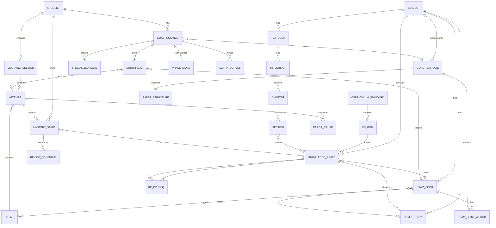
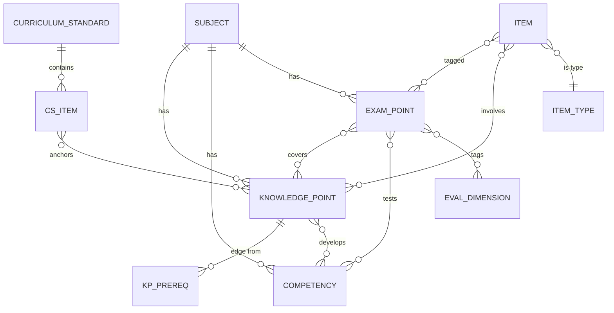
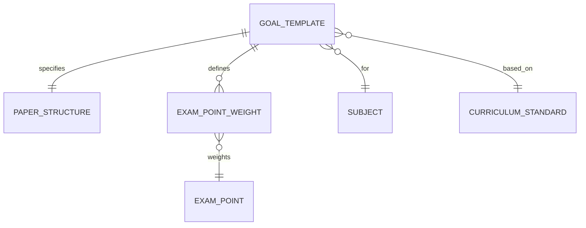
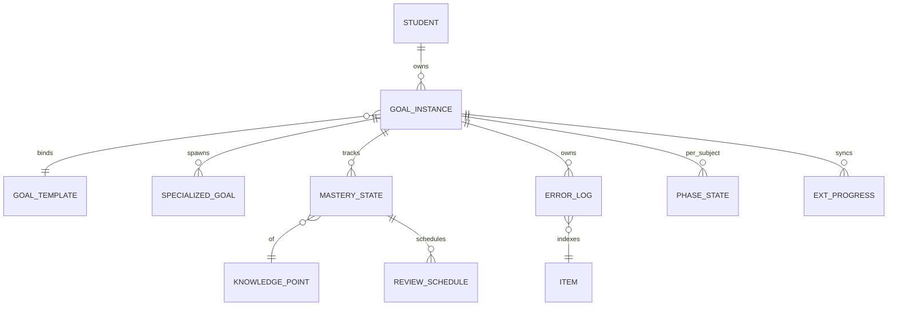
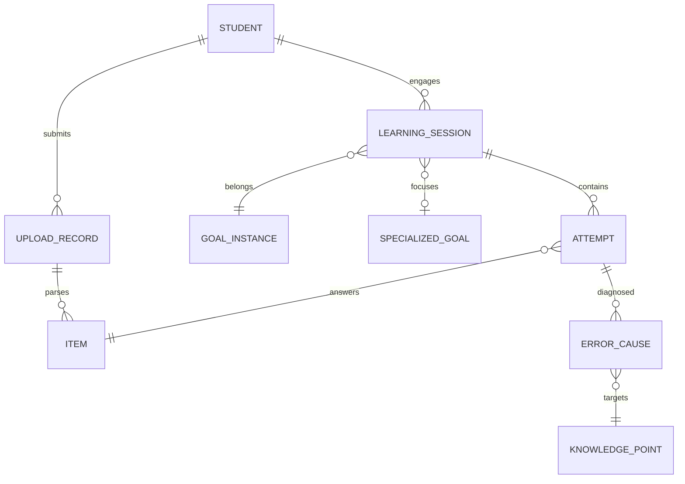

# 实体属性与关系设计文档

> 本文档定义 AI 智能助学工具的完整实体属性模型，覆盖运营端（Goal Template 域）、学生端（Goal Instance 域）和学习行为端（Session 域）。
>
> 适用范围：MVP 数学单学科，但实体设计兼容多学科 / 多学段扩展。
>
> 配套文档：`goal_template_design.md`
>
> 文档版本：v0.1（讨论稿）

---

## 0. 整体实体分组

实体按职责分三大域：

```
┌──────────────────────────────────────────────────────────────┐
│  运营端 / 教研域（Goal Template 资产）                        │
│  课标 → 知识点 → 考点 → 题目                                  │
│  教材 → 章节 → 节                                             │
│  能力点（核心素养 + 四层四翼）                                 │
└──────────────────────────────────────────────────────────────┘
                            ↕ 绑定（带版本号）
┌──────────────────────────────────────────────────────────────┐
│  学生端 / 个人数据域（Goal Instance）                         │
│  学生 → 一层目标实例 → 二层专项目标                            │
│  掌握度向量 / 错题本 / 学习进度                                │
└──────────────────────────────────────────────────────────────┘
                            ↕ 产生 / 更新
┌──────────────────────────────────────────────────────────────┐
│  行为域（学习活动）                                            │
│  学习 Session → 答题 Attempt → 错题归因 → 艾宾浩斯调度         │
│  学校进度 / 辅导班进度（外部上下文）                           │
└──────────────────────────────────────────────────────────────┘
```

---

## 1. 实体总览（ER 图）



---

## 2. 运营端实体（Goal Template 域）

### 2.1 SUBJECT（学科）

| 字段 | 类型 | 说明 |
|---|---|---|
| id | string PK | math / physics / chemistry... |
| name | string | "数学" |
| stage | enum | junior / senior |
| competency_framework_ref | string | 指向该学科的核心素养清单 |

**约束**：学科 + 学段是其他大部分实体的限定维度。

### 2.2 CURRICULUM_STANDARD（课程标准）

| 字段 | 类型 | 说明 |
|---|---|---|
| id | string PK | std_math_2017_2020 |
| subject_id | FK SUBJECT | |
| version | string | "2017 年版 2020 修订" |
| publisher | string | "教育部" |
| issued_date | date | |
| pdf_url | string | 原文 PDF 路径 |

**职责**：仅作为元信息载体，具体内容拆到 CS_ITEM。

### 2.3 CS_ITEM（课标条目）

| 字段 | 类型 | 说明 |
|---|---|---|
| id | string PK | cs_math_4_2_1 |
| standard_id | FK CURRICULUM_STANDARD | |
| theme | string | "函数概念与性质" |
| unit | string | "一次函数" |
| code | string | 课标里的编号（如 4.2.1） |
| content_text | text | 原文："理解函数的概念..." |
| academic_quality_level | string | 学业质量水平描述 |
| linked_competencies | array<FK COMPETENCY> | 关联核心素养（多对多通过下面关联表） |

**预估规模（数学）**：200-300 条。

### 2.4 COMPETENCY（能力点 / 核心素养）

直接抄课标，不要自己造。

| 字段 | 类型 | 说明 |
|---|---|---|
| id | string PK | comp_math_logic_reasoning_l2 |
| subject_id | FK SUBJECT | |
| name | string | "逻辑推理" |
| level | int | 1 / 2 / 3 |
| description | text | 课标对该水平的原文描述 |
| framework | enum | core_competency（区分于四层四翼） |

**对数学**：6 个素养 × 3 个水平 = 18 条。

**对物理 / 化学等**：每个学科独立维护一份。

### 2.5 EVAL_DIMENSION（高考评价体系维度）

新增实体，承载"一核四层四翼"。

| 字段 | 类型 | 说明 |
|---|---|---|
| id | string PK | eval_layer_key_ability |
| layer | enum | core_value / subject_literacy / key_ability / essential_knowledge（四层之一） |
| wing | enum | foundation / comprehensive / application / innovation（四翼之一） |
| description | text | 评价体系里的解读 |

**注意**：四层和四翼是两个独立维度，可以用两条 EVAL_DIMENSION 同时挂在一道题上。

### 2.6 KNOWLEDGE_POINT（知识点）

| 字段 | 类型 | 说明 |
|---|---|---|
| id | string PK | kp_math_linear_func_concept |
| subject_id | FK SUBJECT | |
| stage | enum | junior / senior |
| name | string | "一次函数的概念" |
| granularity_level | int | 1（主干）/ 2（子知识点） |
| primary_cs_item_id | FK CS_ITEM | 主关联课标条目 |
| description | text | 内涵描述（用于费曼判定 rubric） |
| typical_study_minutes | int | 15-30，用于粒度准则 |
| is_high_freq | bool | 是否高频考点 |

**预估规模（数学）**：200-400 个。

**多对多关联**：
- 一个知识点可关联多条 CS_ITEM（次要锚点）→ 走 KP_CS_LINK 关联表
- 一个知识点可关联多个 COMPETENCY → 走 KP_COMP_LINK 关联表

### 2.7 KP_PREREQ（知识点前置关系 / DAG 边）

| 字段 | 类型 | 说明 |
|---|---|---|
| id | string PK | |
| from_kp_id | FK KNOWLEDGE_POINT | 前置知识点 |
| to_kp_id | FK KNOWLEDGE_POINT | 后继知识点 |
| strength | enum | strong（必备前置） / weak（推荐前置） |
| reason | text | 依赖说明（便于人审） |

**约束**：必须无环（系统启动时做环检测，发现环报警）。

**预估规模（数学）**：400-800 条边。

### 2.8 EXAM_POINT（考点）

| 字段 | 类型 | 说明 |
|---|---|---|
| id | string PK | ep_math_recursive_seq_construct |
| subject_id | FK SUBJECT | |
| name | string | "递推数列求通项（构造法场景）" |
| primary_kp_id | FK KNOWLEDGE_POINT | 主关联知识点 |
| primary_competency_id | FK COMPETENCY | 主关联能力 |
| item_type_scenario | text | "给一阶线性递推，构造等比数列" |
| description | text | 教研老师的说明 |
| created_by | string | 教研专家 |
| approved_at | datetime | sign-off 时间 |

**多对多关联**：
- 考点 ↔ 知识点：通过 EP_KP_LINK 关联表，含 role 字段（main / aux）
- 考点 ↔ 能力点：通过 EP_COMP_LINK 关联表
- 考点 ↔ 四层四翼：通过 EP_EVAL_LINK 关联表

**预估规模（数学）**：200-400 个。

### 2.9 EXAM_POINT_WEIGHT（考点权重，模板维度）

| 字段 | 类型 | 说明 |
|---|---|---|
| id | string PK | |
| exam_point_id | FK EXAM_POINT | |
| template_id | FK GOAL_TEMPLATE | 不同模板下同一考点权重不同 |
| frequency_5y | int | 近 5 年出现频次 |
| avg_score | float | 平均分值 |
| score_ratio | float | 占总分比 |
| difficulty_distribution | json | {easy: 0.2, mid: 0.5, hard: 0.3} |

**预估规模**：模板数 × 考点数。

### 2.10 ITEM_TYPE（题型）

| 字段 | 类型 | 说明 |
|---|---|---|
| id | string PK | item_type_single_choice |
| name | string | "单选题" |
| subject_id | FK SUBJECT | |

枚举：单选 / 多选 / 填空 / 解答 / 实验题 / 作文 等。

### 2.11 PAPER_STRUCTURE（卷子结构）

| 字段 | 类型 | 说明 |
|---|---|---|
| id | string PK | |
| template_id | FK GOAL_TEMPLATE | 1:1 关系 |
| total_score | int | 150 |
| duration_minutes | int | 120 |
| calculator_allowed | bool | false |
| sections | json | [{type: 单选, count: 8, score_each: 5}, ...] |

### 2.12 ITEM（题目）

| 字段 | 类型 | 说明 |
|---|---|---|
| id | string PK | |
| subject_id | FK SUBJECT | |
| item_type_id | FK ITEM_TYPE | |
| source | enum | gaokao_real / mock / lianlao / shengji / textbook / ai_generated |
| source_year | int | 2024 |
| source_paper | string | "新课标 I 卷" |
| stem | text | 题干 |
| answer | text | 标准答案 |
| solution | text | 详细解答 |
| official_analysis | text | 来自《高考试题分析》 |
| scoring_detail | json | 步骤分拆解 |
| difficulty | float | 0-1 |
| estimated_minutes | int | 推荐用时 |
| score | int | 该题分值 |
| created_by | enum | human / ai |
| reviewed_by | string | 教研老师 ID |
| reviewed_at | datetime | |

**多对多关联**：
- 题目 ↔ 考点：通过 ITEM_EP_LINK
- 题目 ↔ 知识点：通过 ITEM_KP_LINK
- 题目 ↔ 能力点：通过 ITEM_COMP_LINK
- 题目 ↔ 四层四翼：通过 ITEM_EVAL_LINK

**预估规模（数学）**：500-1000 道（含真题 + 联考 + 质检）。

### 2.13 TEXTBOOK & TB_VERSION（教材与教材版本）

```
TEXTBOOK
  - id, name ("人教 A 版高中数学"), subject_id, stage

TB_VERSION
  - id, textbook_id
  - edition ("2019 新版" / "2003 旧版")
  - publisher
  - issued_year
```

### 2.14 CHAPTER & SECTION（章节 / 节）

```
CHAPTER
  - id, tb_version_id, order_no
  - book_name ("必修第一册" / "选择性必修第二册")
  - chapter_no, title

SECTION
  - id, chapter_id, order_no
  - section_no, title
```

**与知识点的关系**：SECTION 多对多 KNOWLEDGE_POINT，通过 SECTION_KP_LINK。

**关键认知**：教材章节是知识点 DAG 的一种**线性遍历呈现**，章节顺序不代表认知顺序。

### 2.15 GOAL_TEMPLATE（目标模板）

| 字段 | 类型 | 说明 |
|---|---|---|
| id | string PK | gt_2027_xkb1_math |
| name | string | "2027 高考新课标 I 卷数学" |
| year | int | 2027 |
| paper_type | string | "新课标 I 卷" |
| subject_id | FK SUBJECT | |
| stage | enum | senior |
| applicable_provinces | array<string> | [安徽, 山东, 广东...] |
| exam_mode | string | "3+1+2" |
| version | string | "v1.0" |
| based_on_standard_id | FK CURRICULUM_STANDARD | |
| eval_system_version | string | "2019" |
| published_at | datetime | |
| approved_by | string | 教研专家 |
| status | enum | draft / published / deprecated |

**版本管理**：模板更新走新版本号，老学生 Goal Instance 通过迁移功能升级（数据模型 MVP 必须预留版本号字段）。

### 2.16 关联表汇总（运营域）

| 表 | from | to | 含义 | 额外字段 |
|---|---|---|---|---|
| KP_CS_LINK | KP | CS_ITEM | 知识点关联课标条目 | role(main/aux) |
| KP_COMP_LINK | KP | COMPETENCY | 知识点培养能力 | weight |
| KP_PREREQ | KP | KP | DAG 边 | strength, reason |
| EP_KP_LINK | EXAM_POINT | KP | 考点涉及知识点 | role |
| EP_COMP_LINK | EXAM_POINT | COMPETENCY | 考点测能力 | |
| EP_EVAL_LINK | EXAM_POINT | EVAL_DIMENSION | 考点的四层四翼 | |
| ITEM_EP_LINK | ITEM | EXAM_POINT | 题目挂考点 | is_primary |
| ITEM_KP_LINK | ITEM | KP | 题目涉及知识点 | role |
| ITEM_COMP_LINK | ITEM | COMPETENCY | 题目测能力 | |
| ITEM_EVAL_LINK | ITEM | EVAL_DIMENSION | 题目的四层四翼 | |
| SECTION_KP_LINK | SECTION | KP | 教材节呈现的知识点 | depth(intro/main/review) |

---

## 3. 学生端实体（Goal Instance 域）

### 3.1 STUDENT（学生）

| 字段 | 类型 | 说明 |
|---|---|---|
| id | string PK | |
| name | string | |
| grade | int | 当前年级 7-12 |
| current_school | string | 学校名称 |
| province | string | 省份（决定可选模板范围） |
| birthdate | date | 用于推算年龄 |
| guardian_consent | bool | 监护人同意标记 |
| created_at | datetime | |

**未成年人合规**：监护人同意是数据收集的前置条件。

### 3.2 GOAL_INSTANCE（一层目标实例）

| 字段 | 类型 | 说明 |
|---|---|---|
| id | string PK | |
| student_id | FK STUDENT | |
| template_id | FK GOAL_TEMPLATE | |
| template_version | string | **MVP 必须预留**，用于版本迁移 |
| start_diagnosis_snapshot | json | 冷启动诊断结果快照 |
| deadline | date | 截止时间（如 2027-06-07） |
| daily_budget_minutes | int | 每日预算（AI 建议，可手改） |
| status | enum | active / paused / completed |
| created_at | datetime | |
| last_synced_version_at | datetime | 上次模板版本同步 |

**约束**：一个学生**同时只能有 1 个 active 的 GOAL_INSTANCE**。

### 3.3 SPECIALIZED_GOAL（二层专项目标）

| 字段 | 类型 | 说明 |
|---|---|---|
| id | string PK | |
| goal_instance_id | FK GOAL_INSTANCE | 必须挂在一层下 |
| name | string | "函数专攻" |
| focus_kp_ids | array<FK KP> | 聚焦的知识点（可为空） |
| focus_ep_ids | array<FK EXAM_POINT> | 聚焦的考点 |
| triggered_by | enum | student_manual / ai_recommendation |
| target_deadline | date | 强制有截止时间 |
| status | enum | active / completed / expired |
| created_at | datetime | |

**约束**：一个 GOAL_INSTANCE 下**同时只能有 1 个 active 的 SPECIALIZED_GOAL**（平行赛道但单线程）。

### 3.4 MASTERY_STATE（知识点掌握度）

> **澄清 S1（2026-06-01）**：mastery 持有者由 (GoalInstance × KP) 改为 **(Student × KP × Subject)**。理由：mastery 是学生对知识点的认知事实，应跨 GoalInstance 复用——新增/切换/暂停目标时不应重置。GoalInstance 仅作为 scope 过滤器和进度派生入口，不持有 mastery 数据。

| 字段 | 类型 | 说明 |
|---|---|---|
| id | string PK | |
| student_id | FK STUDENT | 持有者 |
| subject_id | FK SUBJECT | 学科隔离（高三数学不影响物理） |
| knowledge_point_id | FK KNOWLEDGE_POINT | |
| mastery_score | float | 0-1 连续值 |
| mastery_level | enum | not_started / learning / familiar / mastered（展示用枚举） |
| confidence_count | int | 累计答对数 |
| failure_count | int | 累计答错数 |
| last_attempted_at | datetime | |
| next_review_at | datetime | 艾宾浩斯下次复习时间 |
| feynman_verified | bool | 是否通过费曼讲述验证 |

**唯一约束**：`UNIQUE(student_id, knowledge_point_id)` —— 一个学生对一个 KP 只有一条 mastery。

**关键设计**：
- 内部存连续值，对外显示枚举
- "未掌握 → 学习中 → 熟悉 → 已掌握" 阈值在产品配置
- 衰减规则：N 天不练，mastery_score 按曲线下降（艾宾浩斯）
- **paused 期间正常衰减**（衍生决策 S1-2）：GoalInstance.status=paused 不冻结 mastery 衰减，因为人脑遗忘不会因为暂停而停止
- **专项 GoalInstance 内 ATTEMPT 等同主线**（衍生决策 S1-1）：mastery 增量不降权，仅打 `ATTEMPT.source=specialized` 标签备查

### 3.5 EXAM_POINT_MASTERY（考点掌握度，可选聚合层）

如果产品需要在考点维度展示掌握度（不只是知识点）：

| 字段 | 类型 | 说明 |
|---|---|---|
| id | string PK | |
| student_id | FK STUDENT | 同 §3.4 改持有者 |
| subject_id | FK SUBJECT | |
| exam_point_id | FK EXAM_POINT | |
| aggregated_score | float | 由关联 KP 的 mastery_score 加权 |

**取舍**：MVP 可以不建这张表，运行时计算；如果性能瓶颈再物化。

### 3.6 ERROR_LOG（错题本条目）

| 字段 | 类型 | 说明 |
|---|---|---|
| id | string PK | |
| goal_instance_id | FK GOAL_INSTANCE | |
| item_id | FK ITEM | 错的那道题 |
| first_error_at | datetime | 首次错的时间 |
| error_count | int | 累计错次数 |
| latest_attempt_id | FK ATTEMPT | 最近一次答题记录 |
| root_cause_tags | array<enum> | 根因标签（见 4.3） |
| primary_kp_id | FK KP | 主要归因知识点 |
| status | enum | open（未掌握）/ resolved（已通过变种题） |
| resolved_at | datetime | |

**关键设计**：
- **粗心错误（careless）不进 ERROR_LOG**，只计数
- 同一道题反复错 → 累加 error_count
- 变种题做对达到 N 次 → 自动 resolved

### 3.7 PHASE_STATE（学习阶段状态）

| 字段 | 类型 | 说明 |
|---|---|---|
| id | string PK | |
| goal_instance_id | FK GOAL_INSTANCE | |
| subject_id | FK SUBJECT | **学科独立** |
| phase | enum | new_term / consolidation / first_review / second_review / sprint |
| urgency_score | float | 0-1 内部连续值 |
| updated_at | datetime | |
| set_by | enum | student_manual / system_auto |

**关键设计**：阶段是 (学生 × 学科 × 目标) 维度独立的字段，不是全局开关。

### 3.8 EXT_PROGRESS（外部学习上下文）

学校进度 + 辅导班进度，作为推荐引擎的"主线驱动信号"。

| 字段 | 类型 | 说明 |
|---|---|---|
| id | string PK | |
| goal_instance_id | FK GOAL_INSTANCE | |
| source | enum | school / tutoring |
| source_name | string | "XX 中学" / "XX 辅导班" |
| subject_id | FK SUBJECT | |
| current_chapter_id | FK CHAPTER | 当前讲到的章节 |
| current_section_id | FK SECTION | 当前讲到的节 |
| last_updated_at | datetime | |
| updated_by | enum | student_manual / upload_inferred |

**冲突处理**：当 school 和 tutoring 同时存在不同进度时，按 PHASE_STATE.phase 决定：
- new_term → school 优先
- review 阶段 → 考纲权重优先（忽略二者）

---

## 4. 行为域实体（Session / Attempt）

### 4.1 LEARNING_SESSION（学习会话）

| 字段 | 类型 | 说明 |
|---|---|---|
| id | string PK | |
| student_id | FK STUDENT | |
| goal_instance_id | FK GOAL_INSTANCE | |
| specialized_goal_id | FK SPECIALIZED_GOAL | 如果是专项 session |
| mode | enum | mainline（主线番茄） / specialized（专项） / upload_analysis（上传作业分析） |
| planned_duration_minutes | int | 25（番茄）或 45-60（专项） |
| actual_duration_minutes | int | |
| started_at | datetime | |
| ended_at | datetime | |
| status | enum | running / completed / abandoned |
| item_composition | json | 题目构成快照（如：3 复习+5 主线+2 弱点） |

### 4.2 ATTEMPT（答题记录）

| 字段 | 类型 | 说明 |
|---|---|---|
| id | string PK | |
| session_id | FK LEARNING_SESSION | |
| item_id | FK ITEM | |
| student_id | FK STUDENT | |
| answer_submitted | text | 学生提交的答案 |
| answer_steps | json | 分步骤作答（如有） |
| answer_image_url | string | 拍照上传 |
| is_correct | bool | |
| partial_score | float | 0-1 |
| time_spent_seconds | int | |
| feynman_explanation | text | 费曼讲述内容（如触发） |
| feynman_score | float | AI 对讲述的打分 |
| submitted_at | datetime | |

### 4.3 ERROR_CAUSE（错题根因诊断）

枚举值定义（详见 Q5 讨论）：

| 根因 | 说明 | 后续动作 |
|---|---|---|
| conceptual | 概念性错误（知识点本身没掌握） | 回到知识点学习 |
| methodological | 方法性错误（知识会但不会用） | 变种题刷量 |
| comprehension | 审题错误 | 审题训练 |
| computational | 计算 / 书写粗心 | 仅计数，不进错题本 |
| time_pressure | 时间压力错误 | 训练答题速度 |
| out_of_scope | 超纲 / 超难 | 标记并暂时忽略 |

**数据表**：

| 字段 | 类型 | 说明 |
|---|---|---|
| id | string PK | |
| attempt_id | FK ATTEMPT | |
| cause_type | enum | 上表枚举 |
| confidence | float | AI 判断置信度 |
| evidence | text | 判断依据 |
| inferred_by | enum | ai / student_confirmed / teacher |
| target_kp_id | FK KP | 归因到具体知识点 |

### 4.4 REVIEW_SCHEDULE（艾宾浩斯调度项）

| 字段 | 类型 | 说明 |
|---|---|---|
| id | string PK | |
| goal_instance_id | FK GOAL_INSTANCE | |
| knowledge_point_id | FK KNOWLEDGE_POINT | |
| scheduled_at | datetime | 下次该复习的时间 |
| interval_days | int | 当前间隔（1/2/4/7/15/30...） |
| consecutive_success | int | 连续成功复习次数 |
| status | enum | pending / done / overdue |

**关键设计**：作为推荐引擎"必做配额"的数据源，每天到期项必须当天清。

### 4.5 UPLOAD_RECORD（上传记录）

错题 / 试卷 / 作业上传场景。

| 字段 | 类型 | 说明 |
|---|---|---|
| id | string PK | |
| student_id | FK STUDENT | |
| upload_type | enum | error_item / paper / homework / tutoring_material |
| file_url | string | |
| ocr_result | text | |
| parsed_items | array<FK ITEM> | 解析出的题目（可能新增 ITEM） |
| analysis_result | json | AI 分析结果 |
| uploaded_at | datetime | |

---

## 5. 关键关系详表

### 5.1 多对多关系（必须用关联表）

| 关系 | 关联表 | 额外字段 | 典型规模 |
|---|---|---|---|
| 知识点 ↔ 课标条目 | KP_CS_LINK | role | 200-400 |
| 知识点 ↔ 知识点（DAG） | KP_PREREQ | strength, reason | 400-800 |
| 知识点 ↔ 能力点 | KP_COMP_LINK | weight | 600-1200 |
| 考点 ↔ 知识点 | EP_KP_LINK | role | 500-1500 |
| 考点 ↔ 能力点 | EP_COMP_LINK | | 400-800 |
| 考点 ↔ 四层四翼 | EP_EVAL_LINK | | 400-1600 |
| 题目 ↔ 考点 | ITEM_EP_LINK | is_primary | 800-2000 |
| 题目 ↔ 知识点 | ITEM_KP_LINK | role | 2000-5000 |
| 题目 ↔ 能力点 | ITEM_COMP_LINK | | 1000-3000 |
| 节 ↔ 知识点 | SECTION_KP_LINK | depth | 400-800 |
| 模板 ↔ 适用省份 | TEMPLATE_PROVINCE_LINK | | 10-20 |

### 5.2 一对多关系

| 父 | 子 | 关系 |
|---|---|---|
| SUBJECT | KP / EP / COMP / TEXTBOOK | 1 学科有多 |
| CURRICULUM_STANDARD | CS_ITEM | 1 课标有多条 |
| TEXTBOOK | TB_VERSION | 1 教材多版本 |
| TB_VERSION | CHAPTER | |
| CHAPTER | SECTION | |
| GOAL_TEMPLATE | EXAM_POINT_WEIGHT | 模板下各考点权重 |
| STUDENT | GOAL_INSTANCE | 学生有 0-多个，但仅 1 个 active |
| GOAL_INSTANCE | SPECIALIZED_GOAL | 多个，但仅 1 个 active |
| STUDENT | MASTERY_STATE | 每个 KP 一条（澄清 S1，原挂 GOAL_INSTANCE） |
| GOAL_INSTANCE | ERROR_LOG | 多条 |
| GOAL_INSTANCE | PHASE_STATE | 每个 subject 一条 |
| LEARNING_SESSION | ATTEMPT | 一个 session 多次答题 |
| ATTEMPT | ERROR_CAUSE | 一次答题可能多根因 |

### 5.3 跨域关系（运营 ↔ 学生 ↔ 行为）

```
GOAL_TEMPLATE  ──版本绑定──>  GOAL_INSTANCE
                                    │
                                    ├──> ERROR_LOG      ──指向──>  ITEM
                                    └──> SPECIALIZED_GOAL ──聚焦──> KP / EXAM_POINT

STUDENT  ──持有──>  MASTERY_STATE  ──对应──>  KNOWLEDGE_POINT
                       （跨 GoalInstance 共享，澄清 S1）

GOAL_INSTANCE 进度 = Σ(mastery × weight) / Σ(weight)  for kp ∈ goal.kp_scope
                       （派生计算，不物化）

LEARNING_SESSION  ──属于──>  GOAL_INSTANCE
       │
       └──> ATTEMPT  ──答的是──>  ITEM
                │
                ├──> ERROR_CAUSE  ──归因到──>  KP
                └──> 更新  ──>  MASTERY_STATE (by student_id + kp_id)
```

---

## 6. 关键设计决策与原则

### 6.1 模板与实例分离

**Goal Template 是运营资产，Goal Instance 是学生数据。** 二者通过 template_id + template_version 绑定。MVP 必须预留版本号字段，迁移功能可以后做但数据模型不能后改。

### 6.2 知识点用 DAG 不用树

一个知识点可有多个前置，前置关系跨章节、跨年级。教材章节是 DAG 的一种线性遍历呈现，不能反过来当主结构。

### 6.3 考点是 N × M × K 的组合

考点 = 知识点 × 能力要求 × 题型场景。
- 知识点和考点是**多对多**
- 一道题可挂多个考点

### 6.4 能力点分两层框架

| 框架 | 来源 | 用途 |
|---|---|---|
| 核心素养 + 水平 | 课程标准 | 教学侧，挂在 KP 和 EP 上 |
| 一核四层四翼 | 高考评价体系 | 命题侧，挂在 EP 和 ITEM 上 |

不要混为一谈，两套并行。

### 6.5 阶段是学科独立字段

PHASE_STATE 按 (学生 × 学科 × 目标实例) 维度独立。数学进入二轮复习不影响物理仍在新学期。

### 6.6 错题本不收粗心错误

ERROR_CAUSE = computational 时**只计数不入库**。否则错题本会被粗心错误淹没，丧失诊断价值。

### 6.7 掌握度内部连续外部枚举

MASTERY_STATE 内部存 0-1 连续值用于算法决策，对学生展示 4 档枚举（未开始 / 学习中 / 熟悉 / 已掌握），二者通过阈值互转。

### 6.8 题目来源多样化

ITEM.source 支持 6 种来源：真题 / 模拟 / 联考 / 省质检 / 教材 / AI 生成。AI 生成的题必须有 reviewed_by 字段，未审核不进推荐池。

### 6.9 学校与辅导班作为外部上下文

EXT_PROGRESS 不影响 Goal Template，只作为推荐引擎的辅助信号。学生没报辅导班的学科，这张表对应 source=tutoring 的记录为空。

### 6.10 平行赛道但单线程

SPECIALIZED_GOAL 与 GOAL_INSTANCE 并行存在，但同时只能 1 个 active。这是为了避免学生面板上挂一堆未完成专项造成心理负担。

---

## 7. 未来扩展预留

### 7.1 多教材版本支持

数据模型已支持（TB_VERSION + SECTION_KP_LINK），MVP 阶段只录入人教版即可。

### 7.2 多学科扩展

每个新学科需要补全：
- SUBJECT 记录
- 该学科的 CURRICULUM_STANDARD + CS_ITEM
- COMPETENCY 体系（每学科独立）
- KP / EP / ITEM 全套
- 教材 / 章节
- 各省卷子结构（理科再选科目省命题，工作量翻倍）

### 7.3 教师 / 家长角色

预留两张未建表：
- TEACHER（关联学生，查看进度，添加干预）
- GUARDIAN（监护人，监督 + 接收报告）

需要扩展权限模型，**不在 MVP 范围**。

### 7.4 班级 / 学校组织维度

预留 ORGANIZATION 实体，支持未来 B2B2C 场景。**不在 MVP 范围**。

### 7.5 学习 / 时间规划

未来如果引入 LearningPlan（学习计划）和 TimeBlock（时间块），可挂在 GOAL_INSTANCE 下，与 LEARNING_SESSION 协同。

---

## 8. 实体数量级速查

| 域 | 实体类 | MVP 数学规模 |
|---|---|---|
| 运营 | SUBJECT | 1 |
| 运营 | CURRICULUM_STANDARD | 1 |
| 运营 | CS_ITEM | 200-300 |
| 运营 | COMPETENCY | 18 |
| 运营 | EVAL_DIMENSION | 8（4 层 + 4 翼） |
| 运营 | KNOWLEDGE_POINT | 200-400 |
| 运营 | KP_PREREQ | 400-800 |
| 运营 | EXAM_POINT | 200-400 |
| 运营 | ITEM | 500-1000 |
| 运营 | TEXTBOOK / TB_VERSION | 1 / 1 |
| 运营 | CHAPTER | ~30 |
| 运营 | SECTION | ~150 |
| 运营 | GOAL_TEMPLATE | 1（MVP）|
| 学生 | STUDENT | 取决于业务 |
| 学生 | GOAL_INSTANCE | ~= 学生数 |
| 学生 | MASTERY_STATE | 学生数 × KP 数 |
| 学生 | ERROR_LOG | 学生数 × 累积错题 |
| 行为 | LEARNING_SESSION | 学生数 × 日均 session |
| 行为 | ATTEMPT | session 数 × 平均题数 |
| 行为 | REVIEW_SCHEDULE | 学生数 × 已掌握 KP 数 |

---

## 附录 A：ER 图（细化版，按域分块）

### 运营域核心



### 模板域



### 学生域



### 行为域



---

## 附录 B：MVP 必须先建的表（最小子集）

按依赖顺序：

1. SUBJECT
2. CURRICULUM_STANDARD + CS_ITEM
3. COMPETENCY + EVAL_DIMENSION
4. KNOWLEDGE_POINT + KP_PREREQ
5. EXAM_POINT + EXAM_POINT_WEIGHT
6. ITEM + ITEM_TYPE + 所有 ITEM_* 关联表
7. TEXTBOOK + TB_VERSION + CHAPTER + SECTION + SECTION_KP_LINK
8. GOAL_TEMPLATE + PAPER_STRUCTURE
9. STUDENT
10. GOAL_INSTANCE
11. MASTERY_STATE
12. ERROR_LOG + ERROR_CAUSE
13. LEARNING_SESSION + ATTEMPT
14. REVIEW_SCHEDULE
15. PHASE_STATE + EXT_PROGRESS（可延后）
16. SPECIALIZED_GOAL（可延后）
17. UPLOAD_RECORD（可延后）

**MVP 最小可跑通闭环**：1-13 必须，14-17 可以二期。
