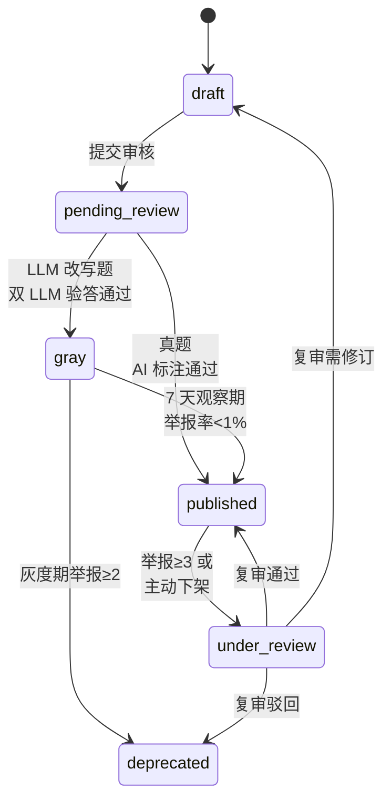

# Q10 运营侧逻辑实体与工作流

> 重新聚焦为"系统要支持哪些运营实体、状态机、工作流"。不谈人员 / 费用 / 审批。无论将来 AI 自动跑还是 1 人跑还是 10 人跑，系统后台都长成同一套。

## 1. 范围与原则

**纳入**：

- 题目 / KP / 章节 / 举报 / 工作流 / Goal Template 的实体与状态机
- 系统需要提供的运营后台界面（MVP 范围）
- AI 自审与人工介入点的工作流引擎设计

**不纳入**：

- 教研团队规模 / 招聘节奏
- 审批流程 / 等待 SLA
- 人员成本

## 2. 题目实体状态机（Q10.1）

### 2.1 ITEM 状态枚举（6 状态）

```
draft         草稿，编辑中
pending_review 待审核（AI 标注完待验或教研编辑完待审）
gray          灰度池（仅 LLM 改写题）
published     主池，推荐引擎从这里取
under_review  复审中（被举报或主动下架）
deprecated    弃用
```

### 2.2 状态流转图



### 2.3 关键设计

- **必须有 ITEM_AUDIT_LOG**：记录每次状态变更（who / when / why / from_status / to_status），MVP 阶段 who 多为 system
- **下架题的历史 attempts**：标 `invalidated = true`，**不真删**，保留审计与可能的恢复能力
- **下架题对学生数据的回滚**：mastery 演化回退，错题本标 invalidated 不计入统计

### 2.4 表结构概要

```
ITEM
  - id, content, answer, solution_text
  - kp_ids[], exam_point_ids[]
  - difficulty, item_type, scenario_tags[]
  - expected_time_sec, source, source_year, source_region
  - status, version
  - created_at, updated_at

ITEM_AUDIT_LOG
  - id, item_id, from_status, to_status
  - actor_type (system/human), actor_id
  - reason, payload (JSON)
  - created_at
```

## 3. KP / 考点 / 章节体系（Q10.2）

### 3.1 实体模型

```
KNOWLEDGE_POINT
  - id, name, subject, grade
  - description
  - feynman_rubric (JSON 关键点清单)
  - chapter_refs[] (多对多)
  - prereq_kp_ids[] (v1.5)
  - status

EXAM_POINT
  - id, kp_id, ability_tag, scenario_tag
  - difficulty_range (min, max)
  - description

CHAPTER
  - id, textbook_version_id, chapter_no, section_no
  - title, parent_chapter_id (支持章 + 节)
  - kp_ids[] (多对多)

TEXTBOOK_VERSION
  - id, publisher (人教/北师/苏教/...)
  - subject, grade
  - effective_year
```

### 3.2 关键设计决策

- **KP 与 EXAM_POINT 分两层**：KP 是"概念"，EXAM_POINT 是"概念在某场景下的具体应用"。一个 KP 可派生 3-10 个考点
- **CHAPTER ↔ KP 多对多**：一个 KP 可能在多章节出现（如"导数"在选修出现后到压轴题章节再复习）
- **TEXTBOOK_VERSION 独立实体**：未来扩展北师 / 苏教等更方便
- **AI 仅辅助标注，不允许自动增删 KP 体系**：保持骨架稳定

### 3.3 MVP 数据规模目标

- 人教版高中数学：**200-300 个 KP** / **500-800 个 EXAM_POINT**
- 章节数：约 60-80 章节（含节级）

## 4. 举报实体与工作流（Q10.3）

### 4.1 表结构

```
ITEM_REPORT
  - id, item_id, student_id
  - report_type (题干歧义/答案错/解析错/超纲/其他)
  - report_text (学生备注)
  - status (pending/processed/dismissed)
  - reported_at, processed_at
  - decision (valid/invalid/partial)
  - resolution_note (复审备注，回传学生)

ITEM_REVIEW_QUEUE
  - id, item_id
  - trigger_reason (举报达阈值/主动下架/抽检)
  - queue_entered_at
  - resolved_at
  - resolution (fix/deprecate/keep)
  - reviewer (system/human user)
```

### 4.2 关键规则

- **同一学生对同一题仅计 1 次举报**：防恶意刷举报
- **达阈值后先下架再审**：教育产品保守优先
  - 主池：3 次举报自动下架
  - 灰度池：2 次举报自动下架
- **复审完成后通过 App 推送告知举报学生**：信任修复
- **高频举报学生标记**：单日 ≥ 5 次举报触发审查标记

## 5. 运营后台模块（Q10.4）

### 5.1 MVP 必做的 7 个后台

| 模块 | 用途 |
|---|---|
| 题目管理后台 | 题目 CRUD / 状态切换 / 标注编辑 / 批量导入 |
| KP / 考点管理后台 | KP 树形结构 / 章节绑定 / rubric 编辑 |
| 章节-KP 映射后台 | 拖拽式绑定 / 教材版本切换 |
| 举报队列后台 | 待处理举报列表 / 复审操作 / 决议记录 |
| AI 自审监控后台 | AI 标注 / 双 LLM 验答的实时面板 / 准确率统计 |
| **Goal Template 管理后台** | 目标模板 CRUD / KP 集绑定 / 配比策略覆盖 |
| **推荐配比配置后台** | YAML 表达式可视化编辑（Q7.2） |

### 5.2 v1.5+ 后台

- 学生 / 班级管理后台
- 数据分析后台（留存 / mastery 分布 / 错题热点）

### 5.3 不做

- 运营审批工作流（已明确不考虑）

## 6. Goal Template 实体（补充 Q10.4 新增）

### 6.1 表结构

```
GOAL_TEMPLATE
  - id, name (如 "2026 人教版高考数学冲刺 600 分")
  - subject, target_exam, target_year
  - applicable_grade[], applicable_textbook_version_id
  - kp_ids[] (关联的 KP 集合)
  - mastery_threshold (每个 KP 默认要求达到的 mastery，默认 0.85)
  - recommendation_mix_override (JSON，可选，覆盖默认配比)
  - description
  - status (draft/published/archived)
  - version

GOAL_INSTANCE (学生侧实例)
  - id, student_id, goal_template_id, template_version
  - created_at, target_date
  - status (active/paused/completed/abandoned)
  - kp_scope_ids[]  (从 Template 复制的 KP 集合)
  - kp_weight_map   (从 EXAM_POINT_WEIGHT 派生)
  # 澄清 S1（2026-06-01）：以下两字段删除，改为运行时派生
  # - completed_kp_ids[]  → 删，由 MASTERY_STATE 聚合得出
  # - progress_pct        → 删，progress = Σ(mastery × weight) / Σ(weight) for kp ∈ kp_scope
  # 理由：mastery 持有者改为 (Student × KP)，GoalInstance 不再持有进度物化字段
```

### 6.2 关键设计

- **Template 可版本化**：教材改版 / 课标调整时发新版，老学生继续用老版本
- **Template 改动不影响已创建的 Goal Instance**：学生进度不受运营改动干扰
- **学生入驻时**：选目标 → 系统按 Template 创建 Goal Instance
- **Template 可多套并行**：不同年级 / 不同目标分数可共存

## 7. AI 自审 + 人工介入工作流引擎（Q10.5）

### 7.1 MVP 设计原则

- **硬编码 2 套工作流**，不做动态可配置
- **不引入工作流引擎**（Temporal / Camunda 等），自研轻量状态机
- **分支只在题型层支持**（客观 / 解答），其他不分支

### 7.2 MVP 两套工作流

**工作流 1：真题 / 模拟题直接入库**

```
draft → AI 标注 KP/难度/scenario → AI 自验答案 → published
```

**工作流 2：LLM 参数改写题**

```
draft → LLM 改写参数 → 双 LLM 交叉验答 → 答案一致 → gray (7 天观察)
                                            ↓ 不一致
                                          deprecated
gray (7天，举报<1%) → published
gray (举报≥2) → deprecated
```

### 7.3 v1.5+ 升级方向

- 引入可配置工作流（如 Temporal）
- 增加"教研抽检"节点（不强制审批，仅采样）
- 增加"灰度组动态分配"节点

### 7.4 留出的扩展点

虽然 MVP 硬编码，但代码中要为以下场景留接口：

- 工作流步骤的 `executor_type`（"ai" / "human" / "either"）
- 步骤间的 `on_pass` / `on_fail` 分支
- 操作日志统一格式（ITEM_AUDIT_LOG）

这样未来切换到可配置工作流引擎时不需要大改。

## 8. 决议速查

1. 题目 6 状态枚举
2. ITEM_AUDIT_LOG 必须有，记录每次状态变更
3. 下架题历史 attempts 标 invalidated，不真删
4. KP / EXAM_POINT 分两层
5. CHAPTER ↔ KP 多对多
6. TEXTBOOK_VERSION 独立实体
7. AI 仅辅助标注，不能自动增删 KP 体系
8. MVP KP 数 200-300 / EXAM_POINT 500-800
9. 同一学生对同一题计 1 次举报
10. 举报达阈值先下架再审
11. 复审结果推送告知学生
12. MVP 7 个运营后台模块
13. 不做运营审批工作流
14. Goal Template 可版本化，改动不影响已有 Instance
15. MVP 硬编码 2 套工作流（真题入库 / LLM 改写）
16. 不引入工作流引擎，自研轻量状态机
17. 代码留扩展点（executor_type / 分支）

## 9. 与其他 Q 的耦合

| 实体 | 依赖 |
|---|---|
| ITEM 状态机 | Q6 题目正确性边界（灰度池规则）/ Q6 举报阈值 |
| KP / EXAM_POINT | Q5 错题归因 / Q7 推荐池召回 / Q3 mastery 维度 |
| Goal Template | Q7 推荐配比覆盖 / Q8 入驻流程 |
| 工作流引擎 | Q6 双 LLM 验答 / Q3 讲述题 rubric |
| 举报队列 | Q6.4 学生举报规则 / Q3 mastery 回滚 |
