# 出题引擎思维导图

> 把 Q3 / Q5 / Q6 / Q7 攒下来的所有决策装配成一个完整的"出题流水线"。一图看清：有几个池、每个池怎么读、每个池怎么产生。

## 1. 顶层结构（俯瞰）

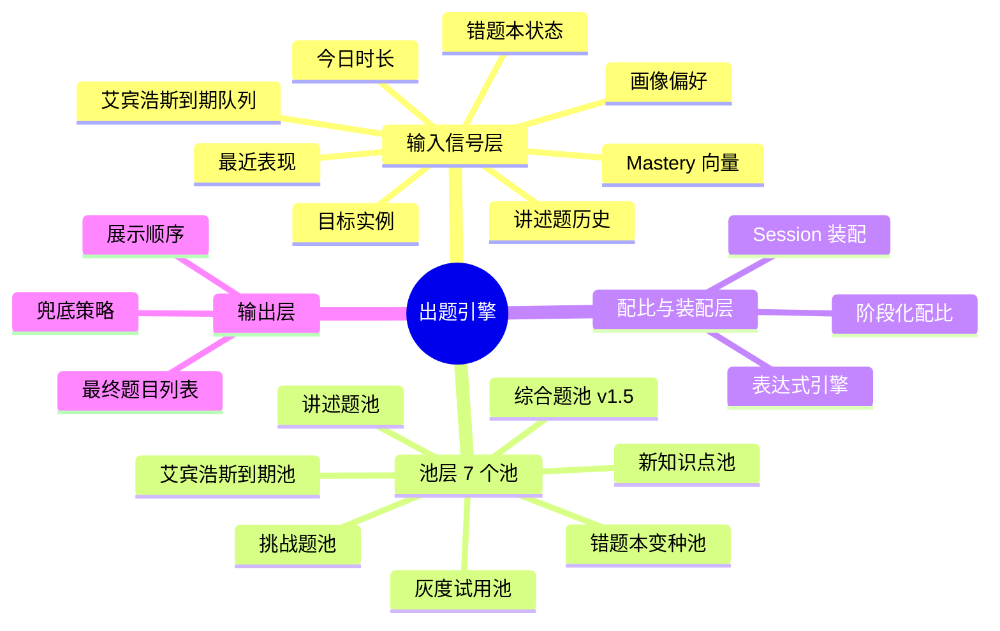

## 2. 输入信号层（推荐前要读什么）

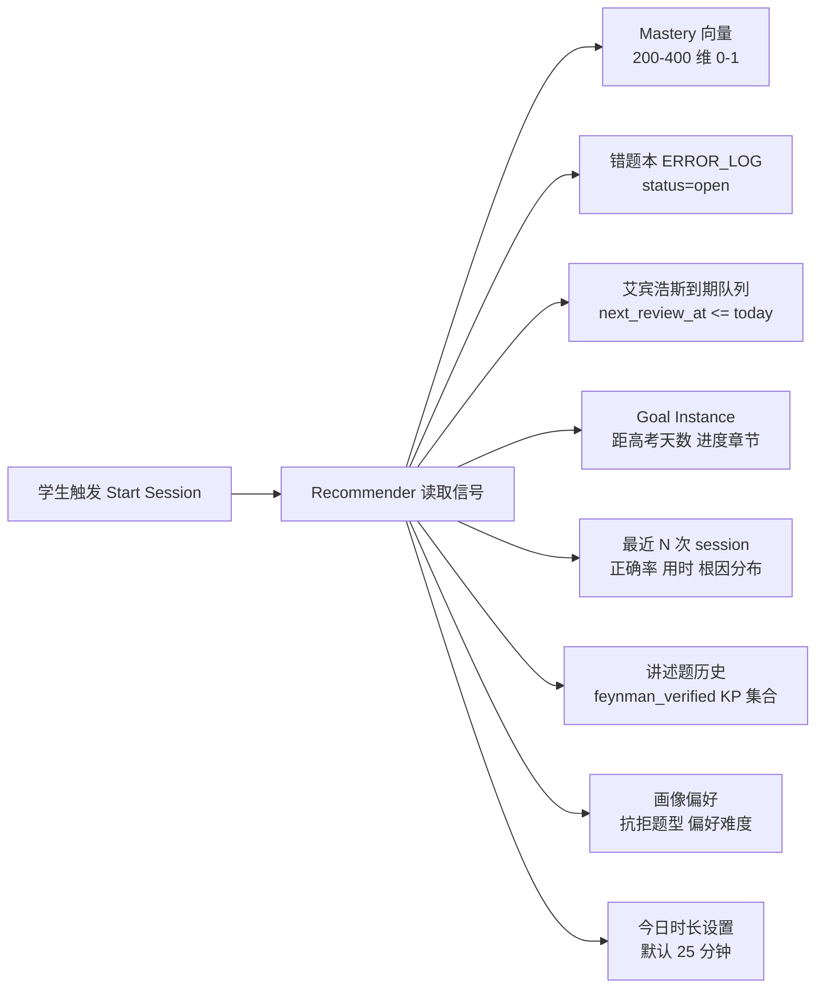

**信号到决策的对应关系**：

| 信号 | 影响哪个池 / 决策 |
|---|---|
| Mastery 向量 | 决定推什么难度 / 哪些知识点已掌握不再推 / 综合题触发 |
| 错题本 | 错题本变种池的输入 |
| 艾宾浩斯队列 | 艾宾浩斯到期池的输入 |
| Goal Instance | 决定新知识点池推哪个章节 / 是否进入临考模式 |
| 最近表现 | 调节难度（连续失败降难度）+ 触发疲劳保护 |
| 讲述题历史 | 讲述题池触发条件 |
| 画像偏好 | 在召回内做二次筛选（如学生抗拒拍照题，降权） |
| 今日时长 | 决定总题量（25min ≈ 10-15 道，15min ≈ 6-8 道） |

## 3. 池层详细展开（7 个池）

### 3.1 池总览表

| # | 池名 | 内部 ID | 优先级 | 触发条件 | MVP 是否做 |
|---|---|---|---|---|---|
| 1 | 艾宾浩斯到期池 | `ebbinghaus_due` | 最高 | 总有 | 是 |
| 2 | 错题本变种池 | `error_book_variant` | 高 | open 错题 > 0 | 是 |
| 3 | 新知识点池 | `new_knowledge` | 中 | 还有未覆盖知识点 | 是 |
| 4 | 讲述题池 | `feynman` | 中（按触发条件） | 见 3.4 | 是 |
| 5 | 综合题池 | `comprehensive` | 中-低 | mastery 阈值 + 临考期 | **否（v1.5）** |
| 6 | 挑战题池 | `challenge` | 选用 | 学生提前做完 | 是 |
| 7 | 灰度试用池 | `gray_pool` | 横向叠加 | 新改写题 7 天观察期 | 是 |

---

### 3.2 池 1：艾宾浩斯到期池 `ebbinghaus_due`

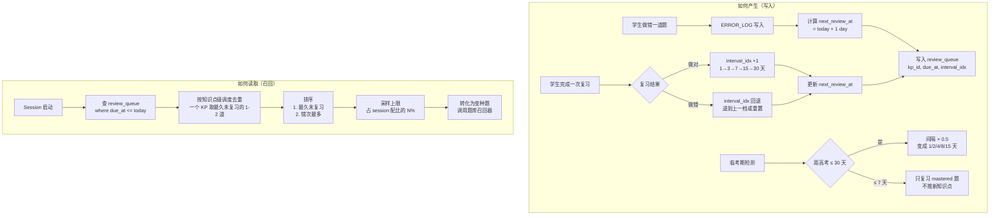

**关键规则**：

- **粒度**：知识点级调度（一个 KP 一个时间表），避免学生被同 KP 多道错题轰炸
- **错过处理**：
  - 错过 1 天：复习题顺延到次日，曲线不重置
  - 错过 ≥ 3 天：mastery 按曲线衰减，下次复习题难度降一档
  - 错过 ≥ 7 天：该 KP 状态降级（已掌握 → 熟悉），重进活跃复习池
- **临考压缩**：距高考 ≤ 30 天间隔 × 0.5；≤ 7 天只复习 mastered 题

---

### 3.3 池 2：错题本变种池 `error_book_variant`

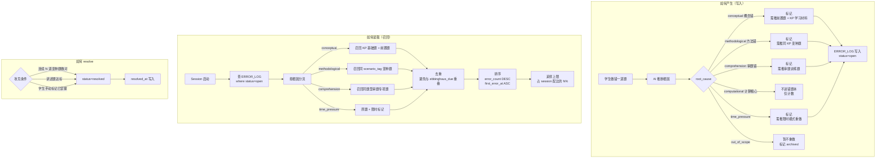

**关键规则**：

- 6 类根因按 Q5 决议，不同根因走不同召回链路
- `computational` 错误不进错题本，避免污染推荐
- 变种题不是原题重做（防背答案），是同 `scenario_tag` 的同类题

---

### 3.4 池 3：新知识点池 `new_knowledge`

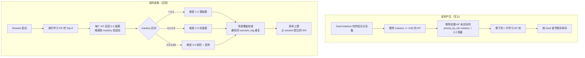

**关键规则**：

- **前置阻塞**：v1.5 字段 `prereq_kp_ids` 启用后才生效；MVP 简化为按章节顺序推
- **难度自适应**：mastery 越高，推越难的题，逐步把学生推过 0.85 阈值
- **场景覆盖**：同一 KP 内多种 scenario_tag 都要覆盖（如等差数列要覆盖"求通项""求和""综合应用"三种场景）

---

### 3.5 池 4：讲述题池 `feynman`

```mermaid
flowchart TB
    subgraph 触发["触发条件（三同时满足）"]
        F1[该 KP mastery 在 0.6-0.85]
        F2[距上次该 KP 讲述 >= M 天<br/>默认 7 天]
        F3[该 KP 未 feynman_verified]
        F1 --> FY[触发候选]
        F2 --> FY
        F3 --> FY
    end

    subgraph 读取["如何读取"]
        FR1[Session 启动] --> FR2[扫描候选 KP 集合]
        FR2 --> FR3{候选数量}
        FR3 -->|0| FR4[本次 session 不插讲述题]
        FR3 -->|>=1| FR5[选 mastery 最高的 1 个 KP]
        FR5 --> FR6[生成讲述题<br/>题面 请用自己的话讲解 XX]
        FR6 --> FR7[附加 rubric<br/>5-10 个关键点清单]
    end

    subgraph 判定["AI 三档判定"]
        J1[学生提交讲述文字] --> J2[LLM 对照 rubric 评判]
        J2 --> J3{覆盖率}
        J3 -->|<30 字 or 无关| J4[未达标<br/>mastery 不变 建议重讲]
        J3 -->|覆盖一半+| J5[达标<br/>mastery +0.15<br/>feynman_verified=true]
        J3 -->|准确完整| J6[优秀<br/>mastery +0.20<br/>feynman_verified=true]
    end

    subgraph 产生["如何产生（rubric 来源）"]
        P1[新 KP 入库] --> P2[AI 生成关键点草稿<br/>5-10 条]
        P2 --> P3[教研老师审核修订]
        P3 --> P4[写入 KP.feynman_rubric]
        P3 -.->|教研未到位时| PA[AI 草稿直接使用<br/>v1 风险方案]
    end
```

**关键规则**：

- **每 session 最多 1 道讲述题**（避免打扰）
- **学生可拒**：连续跳过 N 次后系统暂停对该学生触发讲述题
- **rubric MVP 兜底**：教研未到位时 AI 草稿直接用，列入风险（与 Q6 校验风险并列）

---

### 3.6 池 5：综合题池 `comprehensive`（v1.5）

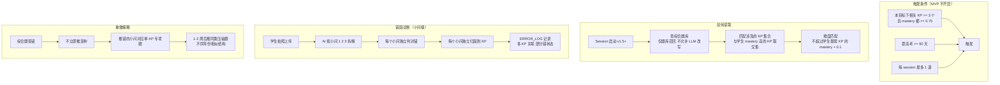

---

### 3.7 池 6：挑战题池 `challenge`

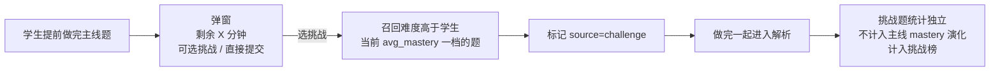

**关键规则**：

- 不计入 mastery 演化（保护主线数据纯净）
- 但答题数据 / 错题进独立的 `challenge_stats` 表，用于个性化推荐
- 用于满足学有余力学生的进阶需求

---

### 3.8 池 7：灰度试用池 `gray_pool`

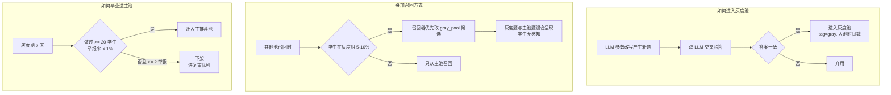

**关键规则**：

- **横向叠加池**，不在主配比里占独立份额
- 灰度组学生比例可配置（默认 5-10%）
- MVP 阶段是质量校验的核心兜底

## 4. 配比与装配层

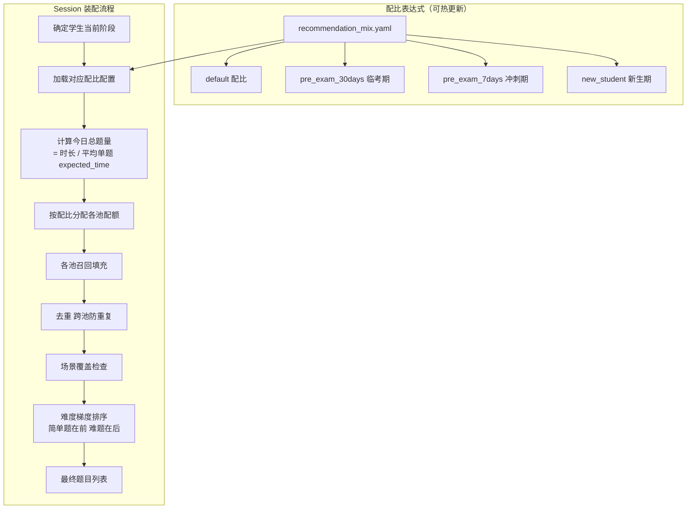

**表达式引擎示例**（CEL 风格）：

```yaml
recommendation_mix:
  default:
    - pool: ebbinghaus_due
      target_ratio: "min(0.4, due_count * 1.0 / total_quota)"
      max_items: 6
    - pool: error_book_variant
      target_ratio: "0.3"
      max_items: 5
    - pool: new_knowledge
      target_ratio: "0.3"
      min_items: 2
    - pool: feynman
      target_ratio: "if(feynman_candidates > 0, 1, 0)"
      max_items: 1

  pre_exam_30days:  # 距高考 <= 30 天
    - pool: ebbinghaus_due
      target_ratio: "0.6"
    - pool: error_book_variant
      target_ratio: "0.3"
    - pool: new_knowledge
      target_ratio: "0.1"

  pre_exam_7days:  # 冲刺
    - pool: ebbinghaus_due
      target_ratio: "1.0"
      filter: "mastery >= 0.85"  # 只复习已掌握
```

## 5. 输出层

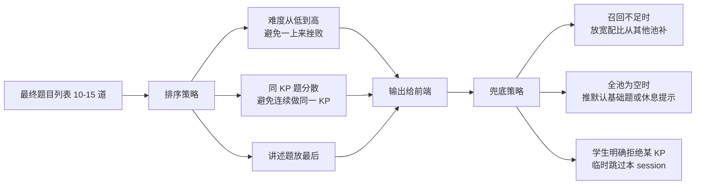

## 6. 完整数据流（一次 session 的端到端）

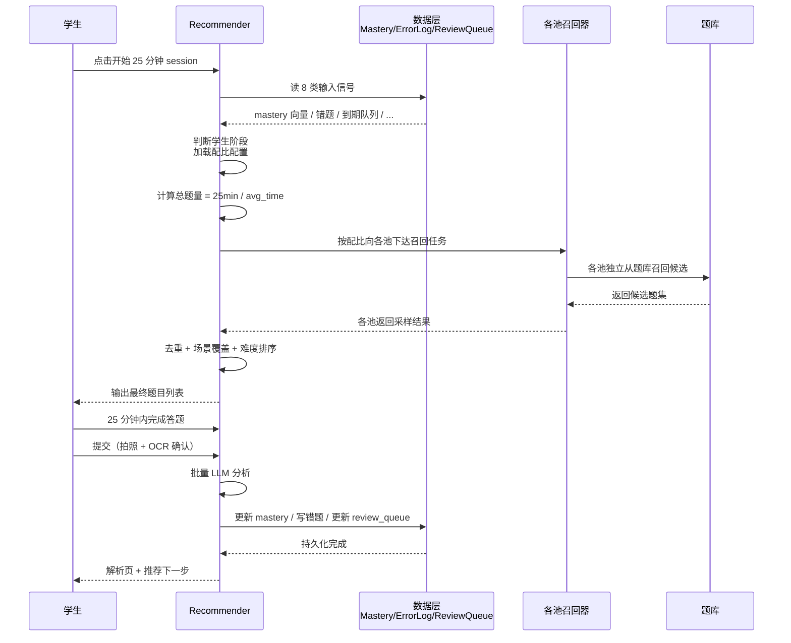

## 7. 决策矩阵速查

| 学生状态 | 主导池 | 配比示例 |
|---|---|---|
| 新生第一周 | 见 Q8（冷启动）| - |
| 正常学习期 | new_knowledge + error_book | 30/30/30/10 |
| 临考期 ≤ 30 天 | ebbinghaus + error_book | 60/30/10 |
| 冲刺期 ≤ 7 天 | ebbinghaus only（mastered） | 100/0/0 |
| 学生有 ≥ 5 道 open 错题 | error_book 提到 40% | 30/40/20/10 |
| 学生 avg_mastery ≥ 0.7 + 临考期 | 加 comprehensive（v1.5） | 40/30/20/10 |

## 8. 关键耦合点

| 引擎组件 | 依赖的其他 Q 决议 |
|---|---|
| 输入信号层 | Q3 mastery 模型 / Q5 错题字段 / Q4 番茄钟时长 |
| 艾宾浩斯池 | Q3 衰减规则 / Q5 错题归因 |
| 错题本变种池 | Q5 根因 6 类 / Q5 攻克条件 |
| 讲述题池 | Q3 三档判定 / Q3 触发条件 |
| 灰度池 | Q6 校验链路 / Q6 学生举报 |
| 综合题池 | Q6 不允许 LLM 改写 / Q5 ERROR_LOG 小问级支持 |
